# 问题记录

## 缩小swap分区的空间

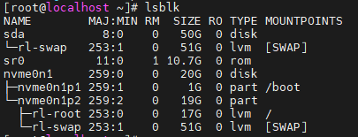


```shell
[root@localhost ~]# lvreduce -L 2G /dev/rl/swap
  File system swap found on rl/swap.
  File system device usage is not available from libblkid.
# 如果逻辑卷被分配给了swap分区，是无法缩小这个逻辑卷的，所以只能删掉这个逻辑卷，再重建swap分区

# 先关闭swap分区
swapoff -a

# 删除分区后再新建一个，并格式化为swap分区，最后再启动
lvremove /dev/rl/swap
lvcreate -L 2G -n swap rl
mkswap /dev/rl/swap
swapon /dev/rl/swap
free -h   # 现在 swap 大小应该变为 2G

# 查看swap分区的UUID
blkid /dev/rl/swap
vim /etc/fstab
	# 将原来的关于swap分区的挂载信息修改为使用UUID的
	#UUID=fee2acab-2ab7-49d7-9bd8-5ae5e28db210 none swap defaults 0 0
# 重新加载信息
systemctl daemon-reexec
dracut -f

lvextend -l +100%FREE /dev/rl/root
xfs_growfs /

```

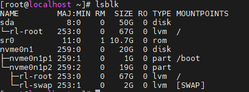

## 浏览器拒绝访问HTTPS网站

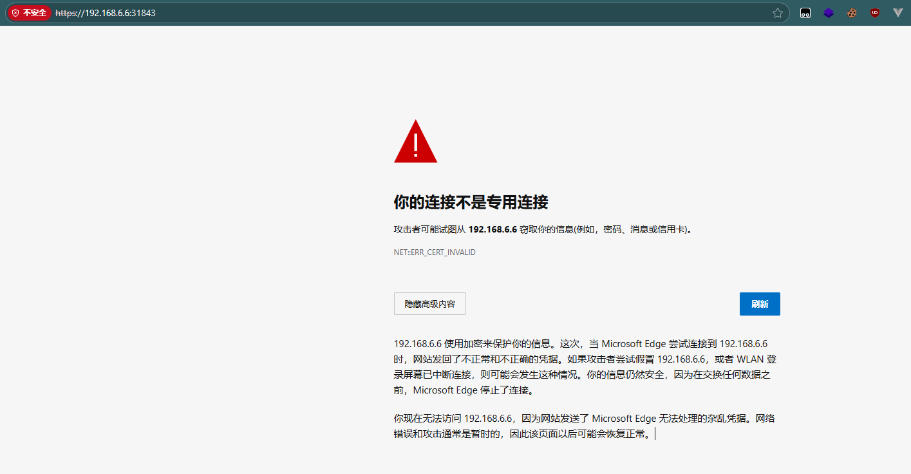

这里浏览器没有给出继续访问的选项，可以切换到英文输入模式直接输入`thisisunsafe`继续访问，算是浏览器的一个小彩蛋


# Linux系统使用的注意事项

- 安装Linux时最好选择安装图形化界面,不止是有图形化界面,还会安装很多常用的命令,否则在后面经常发现一些命令没有安装
- 系统使用时时常拍摄快照备份,防止出现误操作导致系统崩溃只能重新安装系统的局面

# Linux和Windows对比

1. Linux的文件命名是**严格区分大小写**的,而Windows是不区分的;
2. Linux不以文件的后缀决定处理文件的方式,文件的后缀是给系统的使用人员看的;

   - 在Windows中,双击一个文件,文件的后缀会影响Windows对其的处理方式
   - 在Linux中,文件怎么处理取决于你用什么命令去执行这个文件,以及文件的权限,和后缀无关
3. Windows的命名相对来说没有很强的规律,而Linux的命名有不那么清晰的规则：

     - 极少出现大写字母,基本上都是小写,多个单词间有时用 - 或 _ 隔开,很多时候会不分割,根据使用习惯自己猜测该怎么分割
     - 长度不能超过255个字符,除了字符"/",所有的字符都可以使用,但是不建议使用"<、>、?、*"等特殊字符
     - 单词缩写用得极多,而且经常多个缩写全部小写连在一起,能不能看懂看个人经验和英语水平
     - 结合第二点,文件的后缀常用来区分文件的类型和功能,而且经常不止一个后缀
       - systemctl：system control
       - yum.repos.d： yum repositories director  yum仓库目录,说明这个目录中有多个yum源配置
       - httpd sshd systemd dockerd ：后面的d都表示deamon,守护进程,也就是后台进程
4. Linux的文件系统没有盘符,根目录是/,下有多个文件夹;

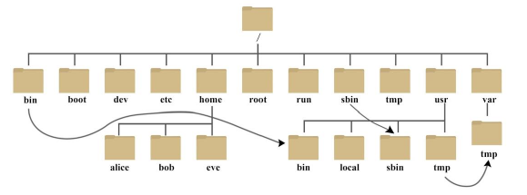	


- bin：binary 二进制文件,常用的命令所在的目录

- dev：device 设备目录,硬件设备以文件的形式存在系统中

- etc：etcetera 配置目录,大部分的服务的配置都在这里,非常常用

- usr：unix shared resources 共享资源目录,应用程序常安装在此

- home root：用户的家目录

- var： 经常变化的文件常放在这,比如日志

  每个目录有自己的用途,这是约定俗成的,当然也可以不这么做,但最好还是遵守这种规范

5. Linux中一切皆文件（设计哲学）,哪怕是内存都在文件系统中有映射(/proc目录)


# Linux基础


## 终端提示符

	

root：用户名

@：分割符

localhost：主机名

~：用户所在路径,也叫做工作目录,~表示用户的家目录

\#：用户的权限,#表示超级用户,$表示普通用户

## 什么是命令

命令其实就是可执行程序,命令全局配置过,所以可以在任意路径直接执行,虽然Linux有图形化界面,不过还是以命令操作为主

命令的格式： 命令名 [子命令] \[-短选项] [选项参数] \[ --长选项] [命令参数]

短选项：一般是一个字母,可以多个字母连在一起表示同时使用多个选项

长选项：一般是一个单词,只能单个使用

参数：一般是命令操作的对象所在的路径

- 路径分为两种,绝对路径和相对路径
- 绝对路径以 / 开始,表示根目录,无论在哪里使用效果都是一样的
- 相对路径是以工作目录为开始, ./ 表示工作目录(可以省略), ../ 表示父目录,可以多个一起使用,相对路径的指代取决于工作目录,同一个相对路径在不同的工作目录中指代不同,所以叫相对路径

注意命令格式的空格,各项之间**需要有空格**,一个还是多个不影响,但是如果某个选项需要参数,那么这个选项**紧接着的整个单词(以非空格的字符开始,到遇到空格的部分,所以这个参数前不使用空格也没有影响)都会被当做参数传递给这个选项**,所以在使用**多个短选项组合时,需要参数的命令要放在最后面**,否则就会将其后的选项当做参数从而导致语法错误

- tar -tf test.tar #正常使用
- tar -ft test.tar #t被当做f的参数,找不到t这个tar包,会报错,而且缺少了t这个选项,只有-f一个选项,也会报错,最后这个参数也成为了莫名其妙的参数
- tar -tftest.tar #不加空格也可以,不过为了可读性没谁会这么写
- ll | cut -d' ' -f1#本应该是这样的：ll | cut -d ' ' -f 1 ,省略了两个空格,一般在参数只有一个字符的情况下才会省略

**选项和参数的位置没有特别要求,有的命令选项必须要在前面,也有的不需要**

## 命令帮助

- 命令自动补全：输入命令的一部分后,按下Tab,会自动补全,不止命令,包括参数,选项等也可以,反正不清楚就按Tab试试吧

- 列出可用命令：输入命令的一部分后,连按2下Tab,会将匹配的所有命令输出

- 命令的类型：

  - 内置命令：Linux内核自带的命令

  - 外部命令：其他程序安装的命令,大部分命令都是外部命令

  - 查看命令类型的方法： type 命令名

    - xx is a shell builtin        如果出现这种描述,说明是内置命令,否则一般是外部命令

    - 有的命令是别名,通过type可以查看到

      [root@localhost ~]# type ll
      ll is aliased to `ls -l --color=auto'

- 查看命令的帮助文档

  - 外部命令使用 --help长选项查看
  - 内置命令使用 help 命令查看
  - 使用man命令查看,无论是内置命令还是外部命令都行,这个算是文档了,非常详细,不止可以查看命令,应用程序的配置文件也可以

## 基础命令

### 查看系统信息：`uname`

- 示例：
  - uname -a #查看所有信息,如内核版本,内核名字,架构,用户名,发布时间等

### 终端清屏：`clear`

使用Ctrl+l组合键也可以

### 查看当前登录用户：`whoami`


### 登录用户：`who`

### 重启服务器：`reboot`

### 关闭服务器：`shutdown`

poweroff和init 0也表示关机

- 示例：
  - shutdown #60s后关机
  - shutdown now #马上关机
  - shutdown -h 20 #20分钟后关机
  - shutdown -c #取消关机


### 查看历史命令：`history`


### 主机名配置： `hostnamectl`

主机名用于在多台主机的环境下标识主机的身份，方便开发者以及软件服务区分主机

- 静态主机名（static hostname）：系统永久使用的主机名，存储在`/etc/hostname`文件中

  配置方法：`hostnamectl set-hostname HOSTNAME`

- 


# Linux目录作用汇总

## 服务配置

| 路径                             | 描述                              |
| -------------------------------- | --------------------------------- |
| ~/.ssh/know_hosts                | 通过ssh连接过本服务器的服务器列表 |
| ~/.ssh/authorized_keys           | 存放客户端ssh登录公钥的文件       |
| /etc/ssh/sshd_config             | ssh服务端的主配置文件             |
| /etc/dhcp/dhcpd.conf             | DHCP服务的主配置文件              |
| /etc/rsyncd.conf                 | rsync服务的主配置文件             |
| /etc/named.conf                  | DNS服务的主配置文件               |
| /etc/nginx/nginx.conf            | yum安装的nginx主配置文件          |
| /usr/local/nginx/conf/nginx.conf | 源码安装的nginx主配置文件         |
| /etc/cron.allow                  | 定时任务的用户白名单              |
| /etc/cron.deny                   | 定时任务的用户黑名单              |

## 系统配置

| 路径                                       | 描述                                  |
| ------------------------------------------ | ------------------------------------- |
| /etc/resolv.conf                           | 网络管理服务自动生成的DNS解析配置文件 |
| /etc/passwd                                | 系统中所有用户的信息                  |
| /etc/group                                 | 系统中所有用户组的信息                |
| /etc/sysconfig/network-scripts/ifcfg-ens33 | 网络配置                              |
| /etc/rc.d/rc.local                         | 系统开机时自动执行的脚本              |
| /etc/fstab                                 | 系统开机时自动挂载的脚本              |
| /etc/hosts                                 | IP地址到域名的映射                    |
|                                            |                                       |


# Linux文件管理


## 查看工作目录：pwd

- 全称：print working directory

## 查看文件属性：ls

在有些发行版中,ll 是 ls -l 的别名

- 全称：list


- 常用选项：

  - -l：以列表的形式展示文件属性


​	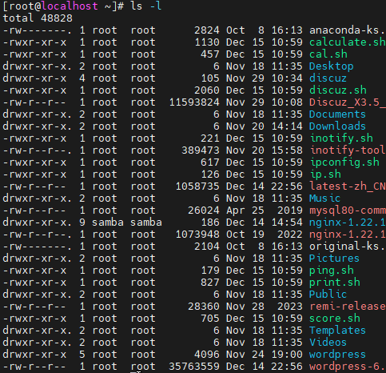	

每一行的内容以空格为分割符分为7部分,每一部分作用分别是：

- -rw-------. 第一个字符表示文件的类型, - 表示普通文件,d表示目录,还有其他很多类型的文件

  后面的9个字符,每三个为一组,分别表示所有者,所属组,其他人对这个文件的权限,rwx表示read,write,execute,读,写,执行权限,最后这个 . 和selinux有关

- 两个root分别表示文件的所有者和所属组

- 紧跟着的数字表示文件大小,单位：byte

- Oct ......   这部分表示文件的最后修改时间

- 最后这部分表示文件名

- -a：all 展示所有文件,包括隐藏文件

  - 隐藏文件： .开头的文件


​		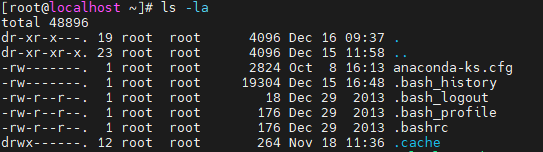		

这里可以看到,有两个特殊的目录,叫做 . 和 .. ,在每个目录中都有

. 是当前目录,而 .. 是父目录,这也是能使用相对路径的原因,相对路径的 ./ 和 ../ 就是用了这两个目录

- -h：human-readable 以易读的形式展示文件的大小
  - 没有加这个选项单位都是byte,加了后是会使用最适合描述文件大小的单位,如Kb,Mb,Gb等

- -R：recursive 以递归的形式输出目录的内容,会将目录的子目录的内容也输出

- -i：inode 额外输出inode号


- 示例：

  - ls #直接使用展示工作目录的内容的文件名,不展示隐藏内容
  - ls /root /var #使用参数可以展示指定路径的内容,可以使用多个参数
  - ls -lahRi #参数可以随意组合使用

## 创建目录：mkdir 

- 全称：**m**a**k**e **dir**ectory


- 常用选项： 
  - -p：parents 如果父目录不存在，将父目录也一并创建
  - -v：verbose 将创建目录的信息输出,这个选项在其它命令中也常用,将命令执行的信息输出
- 示例：
  - mkdir -pv /test/dir1/dir2
  - mkdir dir1 dir2 /dir3 #可以输入多个参数,同时创建多个目录

## 删除空目录：rmdir

- 全称：**r**emove **dir**ectory
- 常用选项：
  - -p：parents 从右往左依次删除参数中整个路径的空目录,遇到非空目录停止
- 示例：
  - rmdir -p /test/a/b/c #从目录c开始依次删除路径中的目录

## 切换目录：cd

- 全称：change directory
- 示例：
  - cd # 切换到当前用户的家目录, cd ~ 也是一样的效果
  - cd - # 切换到上一次的目录,可以在两个目录来回切换
  - cd /root # 切换到指定目录

## 创建文件：touch

## 删除文件：rm

- 全称：remove
- 常用选项：
  - -r：recursive 递归地删除,对于目录,要先删除其中的文件再删除目录
  - -f：force 强制删除,不询问,如果不用这个选项每删除一个文件就要确认一次
- 示例：
  - #rm -rf / 删除系统中所有没有被占用的文件,系统报废
  - #rm -rf / test 本来是删除/test目录,中间多加了个空格,就变成删除根目录和工作目录的test目录
  - rm file # 不加-r选项只能删除文件
  - rm -rf test/* # 删除test目录下所有内容,不删除目录本身

## 移动文件：mv

- 全称：move
- 示例：
  - mv source /test/ #移动文件到其它路径,第一个参数是需要移动的文件路径
  - mv file1 file2 #**移动时可以给文件指定新的名字,如果不改变文件的路径,那就相当于重命名**
  - mv test/* /target/ #将目录中所有文件移动到目标目录

## 复制文件：cp

- \cp # 在命令前加一个 `\`，表示**忽略 alias 和 shell 内置命令**，直接执行 **真正的二进制命令**。
- 全称：copy
- 常用选项：
  - -r -R：recursive 递归地复制,针对目录
  - -p：preserve 保留文件的属性,如：权限,所有者,用户组,修改时间等
- 示例：
  - cp source /root/destination #将指定的文件复制到其它路径
  - cp src /root/dest/new-name #复制时对文件重命名,和mv一样,多个层级的路径前面的路径必须是目录,最后一个路径可以是目录也可以是不存在,如果是存在的目录则将文件放到这个目录中,如果不存在这个目录,则将这个文件重命名为这个路径
  - cp -r dir01 test/dir02/ #复制目录使用-r

## Shell 扩展符（Globbing）

1. 通配符： * 在路径中表示匹配目录中所有内容,在字符串表示任意字符串
2. ? ： 表示任意字符
3. []：匹配[]内的任一字符
4. {}的用法：
   1. {}表示括号外的内容共用,括号内的内容按照一定格式与其它内容进行组合使用
   2. 如果括号内的内容使用 , 隔开,则是每个 , 间隔的内容依次取出与其它内容组合进行使用
   3. 括号内可以使用 .. ,表示从x开始每次递增一个单位直到y(可以是数字也可以是字母)
5. 示例：
   - touch {a..c}.txt #创建a.txt,b.txt,c.txt三个文件
   - touch {a,b,c}.txt #创建a.txt,b.txt,c.txt三个文件
   - rm -rf {1..4}.txt 
   - mkdir /root/dir{1..6} #在/root目录下创建多个目录
   - touch {1..3}.{txt,text} #如果有多个{},各个括号的内容进行组合使用
   - rm -rf *.txt # \* 可以匹配任意字符串,这里表示以.txt结尾的文件

## 压缩文件：tar

使用tar命令对文件进行压缩,不能直接压缩目录,而是需要将文件放在特定格式的包中,这个过程叫**归档**,就是将文件和目录放在一个档案中

- 常用选项：

  - -c：create 创建一个档案,档案以.tar结尾
  - -C：directory 解压缩到指定目录
  - -f：filename 指定档案的文件名,一般必须要使用这个选项,因为这个选项需要参数,所以和其他短选项一起使用时**必须放在最后**,否则会将后面的选项当作参数
  - -v：verbose 显示归档的过程
  - -u：update 更新档案,往档案中加入新的文件
  - -t：list 列出档案中的内容

- 压缩选项：进行归档时,通常也会进行压缩以节省空间,压缩选项有多个,它们使用的压缩算法不同,压缩速度,使用的CPU资源,压缩比不一样

  - -z：使用gzip压缩算法,压缩包以.gz结尾,这个最常见
  - -j：使用bzip2压缩算法,压缩包以.bz2结尾
  - -J：使用xz压缩算法,压缩包以.xz结尾

  压缩速度：gzip > bzip2 > xz

  压缩比：gzip < bzip2 < xz

  压缩比越大,压缩包占用的空间越小,压缩和解压缩的速度越慢,使用的CPU资源越多


​	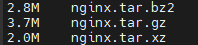		

- 解压缩：

  - 使用选项-x(extract),tar命令可以自动识别压缩包的类型,使用正确的解压缩算法
  - 可以使用上述的压缩选项手动指定解压缩的算法,这样可能会避免一些解压缩的错误

- 示例：

  - tar -cvf test.tar dir01 file01 file02 #将这几个文件归档,并没有压缩
  - tar -zcvf test.tar dir01 file01 file02 #归档并压缩,压缩必须要结合-c选项使用,不能先归档然后直接压缩
  - tar -xf test.tar.gz #解压缩,可以不指定解压缩的算法
  - tar -zxf test.tar.gz #指定解压缩的算法,如果指定了就必须是对的,否则报错
  - tar -xf video.tar.gz -C test #将解压缩后的文件放到指定目录
  - tar -uf test.tar file01 #往档案中加入文件
  - tar -tf test.tar.gz #查看压缩包或者档案中的内容

## 压缩文件：zip

zip命令压缩文件时不需要进行归档,直接选择多个文件就能进行压缩,使用起来比tar命令方便,但是在Linux一般使用tar命令

- 常用选项：
  - -r：recursive 递归地压缩,针对目录
  - -d：delete 删除压缩包中的文件
- 解压缩：unzip
  - 常用选项：
    - -l：list 查看压缩包的内容
    - -d：directory 将压缩包解压缩到指定目录,**注意zip的-d选项和unzip的含义不一样**
- 示例：
  - zip file.zip file1 file2 file3 #压缩多个文件
  - zip -r dir.zip dir01 dir02 #**压缩目录需要使用-r选项,否则只会压缩目录,目录中的内容会被忽略**
  - zip -d file.zip file1 #删除压缩包中的内容
  - unzip file.zip -d /root #将压缩包解压缩到指定的目录
  - zip file.zip file4 #如果已经指定的压缩包已经存在,就会将问价添加到这个压缩包
  - unzip -l file.zip #列出压缩包中的内容
  - unzip file.zip #解压缩

## vim 编辑器

- vi 概述
  vi(visual editor)编辑器通常被简称为 vi,它是 Linux 和 Unix 系统上最基本的文本编辑器,类似于 Windows 系统下的 notepad(记事本)编辑器。

- vim 编辑器
  Vim(Vi improved)是 vi 编辑器的加强版,比 vi 更容易使用。vi 的命令几乎全部都可以在 vim 上使用。

- vim 编辑器的四种模式
  1. 命令模式：
     进入vim时,默认处于命令模式;在该模式下可以移动光标位置,可以通过快捷键对文件内容进行复制、粘贴、删除等操作
  2. 编辑模式：
     在该模式下可以对文件的内容进行编辑
  3. 末行模式：
     在该模式下可以对文件进行查找、替换、保存、退出等操作
  4. 可视化模式：
     在该模式下,可以移动光标选中内容,对内容进行批量处理

- 四种模式的切换

  - 在任何模式中,最多连按两下Esc键即可进入命令模式

  - 在命令模式中：

    - 按下 ： 进入末行模式

    - 按下v,V或者Ctrl+v进入可视化模式（列选择模式）

      进入可视化模式后,会以光标的初始位置作为起点来选中内容

      - v 选中光标和初始位置之间所有字符
      - V 选中初始位置和光标之间的所有行
      - Ctrl+v 选中初始位置和光标之间的所有行中的初始位置和光标之间的所有列

    - 按下a,A,i,I,o,O都可以进入编辑模式

      - i(insert) 光标不会移动,即当前选择字符前插入
      - I 光标移动到行首,即行首插入
      - a(append) 光标会往后移动一个字符,即当前选择字符后插入
      - A 光标移动到行尾,即行尾插入
      - o 在光标所在行的下一行插入一个新行,光标移动到行首,即下一行行首插入
      - O 在光标所在行的上一行插入一个新行,光标移动到行首,即上一行行首插入

- 命令模式可用的命令

- 末行模式可用的命令

- 使用技巧

  - 直接输入vim或者vi,可以进入编辑器的一个空白页面,并正常编辑内容,但是内容无法保存,个人认为是用于练习操作
  - 

## 输出文件内容：cat

- 常用选项：
  - -n：number 显示行号
  - -b： 显示行号,但是空行不计算在内
  - -s： 压缩空行,如果连续有多个空行,只输出一个

## 倒序输出文件内容：tac

## 输出文件内容前几行：head

- 常用选项：
  - -c：bytes 后跟一个数字作为参数,输出前几个字节的数据,一般用于查看二进制文件的内容
  - -n:lines 后跟一个数字作为参数,输出前几行的内容,如果没有指定这个选项,默认输出前10行,使用这个选项时,可以**以 -5 这种方式使用,和 -n 5等效** 

## 输出文件内容最后几行:tail

常用选项和上述head命令一样

## 管道符 | 的使用

管道符用于将前一个命令的输出作为后一个命令的输入

- 示例:
  - cat --help | grep -e -n #如下图所示,将cat的帮助信息作为输入给grep命令进行过滤,将含有 -n 的行过滤出来

​	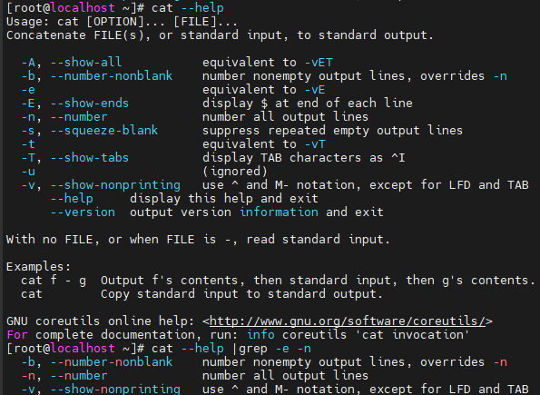	

## head和tail结合使用

将head和tail结合使用,可以准确地输出文件中连续的某几行

- 示例:
  - head -3 test.txt|tail -1 #输出文件的第3行
  - tail -3 test.txt | head -1 #输出文件的倒数第3行
  - head -15 test.txt | tail -5 #输出文件的第11至第15行

## 交互式阅读器：more

## 交互式阅读器：less

## 统计文件内容：wc

## 统计文件占用磁盘大小：du

ll的文件占用是逻辑大小，而du的是实际占用磁盘空间

## 查看文件类型：file

## 查看文件编码：od

## 搜索文件：find

## 搜索文件内容：grep

## 在终端输出内容：echo

## 重定向

## 建立链接：ln

### dd命令


# Linux用户管理

## 用户


## 用户组


## 用户切换：su


## 用户查询：id


## 修改/设置密码：passwd


## wheel用户组


# Linux权限管理


## 设置权限：chmod


## 修改文件所有者：chown


## 修改文件所属组：chgrp


## 特殊权限：suid


## 特殊权限：sgid


## 特殊权限：sticky


## ACL


### 查看ACL权限：getfacl


### 设置ACL权限：setfacl


## umask


## 隐藏权限


# Linux网络管理

## 查看网络配置：ifconfig

## 查看网络配置：ip


## 修改网络配置

/etc/sysconfig/network-scripts/ifcfg-ens33


# Linux服务管理

## 服务管理：systemctl

cat

## 时间同步服务：ntp

### 手动时间同步：ntpdate

### 服务同步时间：ntpd

## Linux运行级别：init


# Linux包管理

## 下载：wget

## 下载：curl

## 包管理：rpm

## yum安装

主配置文件：/etc/yum.conf

仓库配置文件：/etc/yum.repo.d/

配置yum源

自建yum仓库


# Linux进程管理

## 静态查看进程信息：ps

## 动态查看进程信息：top

## 查看进程的网络信息：netstat和ss

## 查看内存使用：free

## 杀死进程：kill、pkill、killall

## 设置线程优先级


# Linux磁盘管理

## 查看磁盘使用情况：df

## 查看挂载情况：lsblk

## MRR分区：fdisk

## GPT分区：parted

## 逻辑卷管理


# 防火墙


# 计划任务


## 定时任务：crontab


## 一次性任务：at


# SSH

- 概述:ssh(Secure Shell) 是一种用于安全访问远程服务器的协议,也是一个服务,它可以通过加密的方式来管理连接服务,使登录服务器更加安全
- 服务名:sshd
- 默认使用端口:22

## 加密算法的类型

- 对称加密:只有一个密钥,加密和解密都使用这个密钥进行
- 非对称加密:密钥分为私钥和公钥,公钥可以公开,私钥不能公开,使用公钥进行加密,只有使用私钥才能进行解密
- 两种加密算法的对比:
  - 对称加密加密速度快,但是安全性比较低,因为解密需要密钥,容易出现密钥泄漏的情况
  - 非对称加密加密速度远慢于对称加密,但是安全性高,私钥不需要暴露出去,除了用于加密,还可以用于**数字签名**

## SSH的两种登录方式

1. 用户名密码登录

   - 登录流程(使用**非对称加密**的方式加密密码)

     1. 客户端向服务器发送一个请求,服务器将公钥发送给客户端
     2. 客户端将输入的密码使用公钥加密后,将用户名和加密后的密码发送给服务器
     3. 服务器使用私钥解密,并验证账户,将登录结果返回给客户端
     4. 如果登录成功,服务器会返回**随机会话口令**,用于**对称加密**后续传输的数据

   - 注意事项

     如果是第一次通过ssh连接服务器,会出现如下提醒,确认后会将这个服务器记录在~/.ssh/know_hosts文件中,之后连接这个服务器不需要经过确认

​		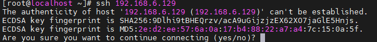			

2. 密钥登录
   - 登录流程
     1. 在客户端生成密钥对,并将公钥发送至服务端
        - 如果是客户端是Linux系统,生成密钥对使用ssh-keygen命令,发送公钥使用ssh-copy-id,如下所示:
          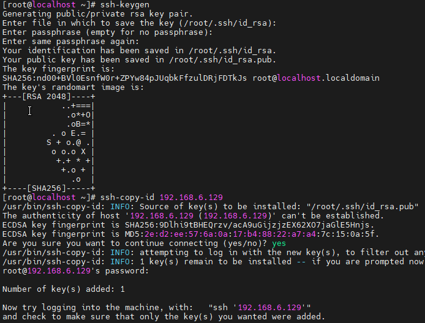
        - 如果客户端是Windows系统,使用ssh连接工具,一般会有生成密钥对的工具,手动将**公钥追加到服务端`~/.ssh/authorized_keys`**文件中
     2. 客户端发起免密登录请求,携带公钥指纹,服务端根据这个公钥指纹从authorized_keys文件中找到对应的公钥
     3. 服务端生成一个随机字符串,用公钥对其加密并发送给客户端
     4. 客户端用自己的私钥进行解密,将解密后的字符串发送给服务端
     5. 服务端将这个字符串进行对比,验证是否一致,最后返回登录结果
     6. 登录成功后的流程和密码登录一致

## 配置SSH服务

- 配置文件路径:/etc/ssh/sshd_config
- 主要的配置项:
  - PasswordAuthentication 是否允许密码验证(yes 允许、no 不允许)
  - Port 连接端口,默认22,更改端口会**受到SELinux的限制**,需要先关闭它
  - AuthorizedKeysFile 存储客户端公钥的文件,默认是`~/.ssh/authorized_keys`
  - UseDNS 是否开启 SSH 登录时的 DNS 解析(默认 yes)

## SSH服务相关的常用命令

### 远程连接其它服务器:ssh

- 示例:
  - ssh 192.168.6.120 #参数就是服务器的ip,如果做了域名解析也可以用域名,不指定用户默认使用root,执行后需要输入该用户的密码
  - ssh -p 222 root@192.168.6.128 #如果服务端的ssh服务改变了端口,需要使用-p选项指定,指定登录的用户使用@符号后加在前面

### 生成密钥对:ssh-keygen

gen:generate

- 常用选项:
  - -t:指定加密算法,默认是rsa
  - -b:bits 指定密钥长度,默认2048
- 示例:
  - ssh-keygen #不使用选项直接使用,需要指定密钥文件存放的路径和密钥文件的密码,全部按回车跳过,路径使用默认的,不设置密码
  - ssh-keygen -b 4096 -t dsa 

### 发送公钥到服务端:ssh-copy-id

- 示例:	
  - ssh-copy-id fei@192.168.6.128 #将公钥追加到指定用户家目录下的.ssh/authorized_keys文件中

### 远程传输文件:scp

scp是基于ssh协议的远程传输文件的命令,可以上传也可以下载

- 全称:secure copy
- 常用选项:
  - -r:递归,针对目录
  - -p:preserve 保留文件的属性
  - **-P**:port 如果服务端更改了ssh服务的端口,需要用此选项指定
- 示例:
  - scp /root/file 192.168.6.128:/root 
  - scp -r /192.168.6.128:/root/dir01 /root/dir02/ #第一个参数是源文件,第二个是目标地址,所以第一个是本地地址,就是上传,否则就是下载

## 增强ssh服务安全性的措施

- 更改默认的端口
- 禁止密码登录,只允许使用密钥登录,密钥登录的安全性更高,更难破解
- 通过防火墙限制访问ssh服务
- 限制ssh登录用户
- 限制登录尝试次数,防止暴力破解


# DHCP服务

- DHCP概述:DHCP(Dynamic Host Configuration Protocol)是动态主机配置协议,通过它可以动态地给主机分配IP地址等网络资源
- 客户端:dhclient
- 服务端:dhcp*
  - 服务名:dhcpd
  - 主配置文件:/etc/dhcp/dhcpd.conf(**服务刚下载时,该配置文件没有内容**)
  - 占用端口:67

## 主机通过DHCP获得IP的流程

1. 发现阶段(DHCP Discover):当一个设备(如计算机或手机)首次加入网络时,它会通过广播发送一个DHCP Discover消息,以寻找可用的DHCP服务器。这个消息包含一个空的或临时的IP地址 ,以及其他选项,以指示它需要DHCP服务。
2. 提供阶段(DHCP Offer):DHCP服务器接收到客户端的Discover消息后,会通过广播或者单播回应一个DHCP Offer消息,其中包含可用的IP地址、子网掩码、网关、DNS服务器等网络配置信息。如果有多个DHCP服务器可用,客户端可以接收多个offer,但通常会根据一些规则（如先到先得或者基于服务器优先级等）选择其中一个。
3. 请求阶段(DHCP Request):客户端选择好一个DHCP服务器提供的配置后,通过广播发送一个DHCP Request消息,向对应DHCP服务器请求分配该配置,同时告诉其它DHCP服务器收回分配的IP地址。
4. 确认阶段(DHCP Acknowledge):DHCP服务器收到客户端的Request后,确认分配给客户端的IP地址和其他配置信息,并通过DHCP Acknowledge消息通知客户端。
5. 配置生效:客户端接收到DHCP Acknowledge后,会配置自己的网络接口,使用分配的IP地址和其他配置信息。此时,客户端可以开始正常的网络通信。
6. 租约和续约:DHCP分配的IP地址通常有一个租约期限,客户端在租约到期前需要续约。在租约到期前,客户端可以选择继续使用分配的IP地址,或者请求新的分配。
   - 自动续租（T1 时刻）:在 DHCP 租约时间达到 T1 时刻（通常是租约期限的 50% 左右，这个比例可以由 DHCP 服务器配置）时,客户端会以单播的方式向为其分配 IP 地址的原 DHCP 服务器发送 DHCP Request 消息,请求续租;
     如果服务器收到续租请求并且同意续租，它会向客户端发送 DHCP Acknowledge 消息，其中包含更新后的租约期限等信息。这样，客户端就成功续租了 IP 地址
   - 重新绑定（T2 时刻）:当租约时间达到 T2 时刻（通常是租约期限的 87.5% 左右）,如果客户端在 T1 时刻发起的续租请求没有得到服务器的回应（可能是服务器故障或者网络问题等原因），客户端会进入重新绑定阶段;
     客户端会以广播的方式发送 DHCP Request 消息,因为在这个阶段，客户端不确定原 DHCP 服务器是否还能正常提供服务，所以通过广播的方式向所有可用的 DHCP 服务器请求续租当前的 IP 地址;
     网络中的任何 DHCP 服务器收到这个广播的续租请求后，如果能够识别这个 IP 地址并且同意续租，会向客户端发送 DHCP Acknowledge 消息，完成续租过程。如果没有服务器响应这个请求，当租约到期后，客户端将不得不停止使用当前的 IP 地址，并重新开始 DHCP 获取 IP 地址的四个基本阶段（发现、提供、请求、确认）。
7. 释放:当设备不再需要网络配置时,它可以向DHCP服务器发送一个Release消息,以释放分配的IP地址,使其可供其他设备使用

## DHCP服务的配置

- 配置文件示例:
  default-lease-time 43200;

  max-lease-time 86400;

  log-facility local7;
  shared-network shared{ subnet 192.168.6.0 netmask 255.255.255.0 {

    range dynamic-bootp 192.168.6.11 192.168.6.100;
    range dynamic-bootp 192.168.6.110 192.168.6.250;

    option routers 192.168.6.2;

    option broadcast-address 192.168.6.255; } }

  host u1{ hardware ethernet 00:0c:29:28:71:67; fixed-address 192.168.6.111; }

- 重要配置项解析:
  - default-lease-time 默认租约时限,也就是上述的T1时刻,在这个时刻客户端如果需要继续使用这个IP,会向服务端发送DHCP Request请求续租
  - max-lease-time 最大租约时限,如果客户端一直没有续租成功,最多多久就需要释放这个IP
  - subnet 子网IP,要与本机网卡匹配,分配的是这个子网下的IP
  - range dynamic-bootp 可以分配的IP的范围,可以有多个配置项
  - host u1{ hardware ethernet 00:0c:29:28:71:67; fixed-address 192.168.6.111; } 为某个主机定制一个配置,这里是通过MAC地址来识别主机,绑定一个固定的IP给这个主机使用

## DHCP客户端的使用

需要使用DHCP服务来动态获取IP地址,需要先将网络的配置改为使用DHCP的方式

使用dhclient命令来自动获取IP,因为是使用广播的方式获取,所以也不需要配置DHCP服务端的信息

- -d 选项可以显示获取IP的过程


# 文件共享服务Samba

- 概述:Samba 是一个在 Unix（包括 Linux、BSD 等）和类 Unix 系统上实现 SMB（Server Message Block）/CIFS（Common Internet File System）协议的开源软件套件。SMB/CIFS 协议主要用于在网络中实现文件和打印机共享等功能，使得不同操作系统（如 Windows、Linux、macOS）之间能够方便地共享文件和打印机资源。

- 包名:samba

- 服务名:smb,nmb

- 主配置文件:/etc/samba/smb.conf

- 访问方式:

  	

- samba服务配置

  - 设置匿名用户访问

    - 编辑配置文件,在标签中加入或修改这些配置项

      [global] #全局配置,对所有标签都生效

      map to guest = Bad User  #将不存在的用户映射为匿名账户(游客),存在的用户密码错误是登录失败

    - [pub]     #标签,名称可以自定义,一般一个标签对应一个共享目录,配置只对当前标签中的目录生效

      browseable = Yes  #允许网络邻居浏览
      read only = Yes   #设置只读共享权限,如果没有给写权限,就是只读的,给了写权限后这个设置无效
      inherit  acls = Yes  #允许权限继承

      path = /pub #设置共享目录路径
      guest ok = Yes   #允许匿名访问
      guest account = nobody #设置匿名账户的用户名为nobody

      writeable = Yes #设置写权限

    -  通过以上配置,相当于用nobody这个不存在的账户来访问文件系统,需要给这个账户权限                  

      setfacl -m u:nobody:rwx /pub

  - 设置本地用户访问
    - [global]
      #设置验证方式,user表示samba用户本地验证,系统中存在的用户才能添加为samba服务的用户,但是验证使用的密码不一定是登录系统的密码
      security = user 
      passdb backend = tdbsam # 设置:samba的用户口令验证的后台为tdbsam数据库文件
    - [pub]
      guest ok = No #禁止匿名访问
    - 本地用户管理:
      - smbpasswd -a root #添加系统中用户为本地用户
      - smbpasswd -x root #删除本地用户
      - pdbedit -Lw #查看本地用户信息

- 注意事项

  - 用户在访问共享文件夹时,权限由文件系统和samba服务的配置共同决定,哪怕是root用户也会受限
  - 用户访问共享文件夹时,可以访问到属于该用户的家目录,并且samba不会限制其权限
  - 清除Windows保存的用户:net use * /delete


# 文件传输服务：FTP


# 远程同步:Rsync

- 概述:rsync(remote sync)是一个功能强大的文件同步和备份工具,它支持本地和远程文件复制,特别适用于需要**增量备份或高效传输大型目录**的场景。

- rsync 特点:
  - 增量传输:rsync 通过比较源文件和目标文件的差异,只传输有变动的部分,从而节省带宽和时间
  - 网络支持:rsync 默认使用 SSH协议,也可以使用其它其他协议
  - 强大的功能:rsync 提供了广泛的选项来定制同步过程,包括控制文件权限、所有者、时间戳,处理符号链接,排除特定文件或目录等
  - 匿名传输:支持匿名传输,方便进行网站镜像等操作
- 常用选项:
  - -v:verbose 输出详细信息
  - -a:archive 归档模式,equals -rlptgoD (no -H,-A,-X),基本上可以保留所有属性
  - -c:checknum 打开校验开关,强制对文件传输进行校验。
  - -r:recursive 递归拷贝目录
  - -l:links 保留软链接
  - -p:preserve 保留原有权限
  - -t:time 保留原有的时间
  - -g:group 保留所属组
  - -o:ower 保留所有者
  - -D: 表示支持 b,c,s 等类型的文件
  - -R:relative 保留相对路径
  - -H:hard 保留硬链接
  - -A:access 保留 ACL 策略
  - -e: 指定要执行的远程shell命令
  - -E: 保留可执行权限
  - -X: 保留扩展属性信息 a 属性
  - --delete: 删除目标目录中在源目录中不存在的文件
- 示例:语法和scp命令一致
  - #因为rsync默认使用ssh协议,所以需要通过ssh命令连接到服务端,如果服务端的配置改变,需要**使用-e选项来修改连接服务端ssh的配置**
    rsync -ave "ssh -p 23"  dir 192.168.6.129:/tmp  
  - rsync  /root/discuz/ 192.168.6.129:/tmp -avR #这样做会将源文件参数中的路径保留下来,自动创建路径中的目录
  - rsync命令有些特殊,大部分命令对于目录,无论是不是以 / 结尾,处理方式都是一样的,但是rsync的处理方式不一样
    - rsync dir/ 192.168.6.129:/tmp #**目录后以/结尾,不会拷贝dir这个目录**,而是将这个目录中的所有内容拷贝过去
    - rsync dir 192.168.6.129:/tmp #不带/才会拷贝整个目录
  - rsync --delete -av  discuz 192.168.6.129:/tmp #如果目标目录存在源目录不存在的内容,会被删除
- 将rsync作为服务使用
  将rsync配置为服务使用,就可以配置本地想要让其它服务器同步的文件,从而方便其它服务器同步本地文件
  - 服务名:rsyncd
  - 监听端口:873
  - 配置文件:/etc/rsyncd.conf
    [app]   #标签,名称自定义,其它服务器查询有哪些文件可以同步时,查询到的就是这个标签名
    path= /app/java #让其它服务器同步的文件路径
    log file = /var/log/rsync.log
  - 查询可以同步的文件:rsync root@192.168.6.130**::**
  - 示例:rsync -av root@192.168.6.130**::app** /tmp #使用两个冒号加上标签名
  - 配置服务的本地用户:
    auth users = user1,user2 #允许使用服务的用户,其他用户将无法使用该服务
    secrets file = /etc/rsync.secrets #用户的密码文件路径
    - 密码文件格式:**将密码文件权限设置为700,防止非root用户操作这个文件**
      user1:123
      user2:123
- rsync的实际应用场景:
  -  inotify实时更新


# Shell

- 概述:Shell 是一类用C语言编写的命令行解释器程序的统称,同时也是一个脚本编程语言
- 常见的Shell:sh,dash,csh,tcsh,bash(最常用)
- 对Shell的操作:

  - chsh(change shell)
    - 常用选项:
      - -l:list-shells 列出系统中可用的Shell
      - -s:shell 更改当前用户的登录shell
    - 示例:
      - chsh -s /bin/sh #指定shell要使用绝对路径
      - chsh #直接使用命令是以交互式的方式设置登录shell
  - 调用shell来执行命令或脚本:
    - bash -c date
    - sh -c ./hello.sh
  - shell脚本第一行指定执行该脚本的shell:  #!/bin/bash
    如果没有指定,会用默认的shell去执行这个脚本
- shell变量

  - 变量命名规范:由字母,数字,下划线组成,不能以数字开头,不能是关键字,见名知意
  - 引用方式:$变量名 或 ${变量名}
  - 数组变量的使用方式:
    - 定义数组:
      - name=(tom amy sb)
      - name[3]=jim
  
    - 查看数组:
      - echo $arr #查看的是数组第一个元素
      - echo ${name[2]} #这里必须要加{}
      - echo ${!name[@]} #查看数组的下标,**在shell中,数组的下标可以是不连续的**
      -  echo ${name[*]} #遍历数组
      -  echo ${#name[@]} 或 echo ${#name[*]} #查看数组的长度
  
    - 删除数组:
      - unset name[索引] #删除指定索引的元素
      - unset arr #删除整个数组
  
- 变量的类型:
  - 本地变量:当前进程中定义的临时变量,进程销毁即失效,只在当前的进程中有效,比如在bash中定义的本地变量,执行shell脚本时无法访问,在shell脚本中定义的变量就是本地变量
    - 定义方式:变量名="变量值"
    - 查看方式:
      - set #查看所有本地变量和环境变量
      - echo $变量名
    - 删除方式:unset 变量名
  - 环境变量:shell从配置文件中读取的变量,在当前shell进程及其子进程有效,在shell脚本中可以访问
    - 定义方式:export 变量名="变量值"  #定义一个本地变量,同时将其定义为**临时的环境变量**,需要永久定义环境变量需要更改配置文件
    - 查看方式:
      - env #查看所有环境变量
      - set
  - 内置变量:系统变量,shell本身已经固定好了它的名字和作用。
    - $?:上一条命令执行后返回的状态,当返回状态值为0时表示执行正常,非0值表示执行异常或出错
    - $$:当前所在进程的进程号
    - $!:后台运行的最后一个进程号 (当前终端)
    - !$:调用最后一条命令历史中的参数
    - !!:调用最后一条命令历史
    - $#:脚本后面接的参数的个数
    - $*:脚本后面所有参数,参数当成一个整体输出,每一个变量参数之间以空格隔开
    - $@:脚本后面所有参数,参数是独立的,也是全部输出
    - $0:当前执行的进程/程序名 echo $0
    - $1~$9:位置参数变量
    - ${10}~${n} 扩展位置参数变量 第10个位置变量必须用{}大括号括起来
- 创建进程的内核函数
  - fork():创建子进程,复制父进程空间(如:环境变量,运行用户,运行组用户 ...)
    - 示例:
      - bash test.sh 
      - ./test.sh 或 /root/test.sh (需要执行权限)
  - vfork():创建子进程,共用父进程空间
    - 示例:
      - source test.sh 
      - . test.sh (注意   .   后面有个空格)
  - exec():不创建子进程,清空父进程的数据,仅保留PID和环境变量
    - 示例:
      - exec ./test/sh (需要执行权限)
      - exec /root/test.sh (需要执行权限)
- 特殊符号
  - 完全引用:echo '$hello' #原样输出,不解析变量
  - 部分引用:echo "$hello" #hello会当作变量解析

## Shell计算

## Shell条件判断

## Shell命令的类型

Shell中的命令有两种类型：内建命令和外部命令，通过`type`命令可以查看命令的类型。


内建命令常是高频使用的命令，是跟随Shell进程一起加载到内存中的，而外部命令本质上是磁盘上的可执行文件，执行内建命令就像是调用Shell中的函数，而执行外部命令需要先从磁盘中读取文件，再创建新的进程去执行命令，所以同样的操作如果使用内建命令和Shell特性去完成，通常要比使用外部命令去完成要快得多，这也算是一个优化Shell性能的点（虽然影响很微小）。

有的命令**同时是内建命令和外部命令**，内建命令有最快的性能，但是升级扩展不方便，只能随Shell升级；而外部命令可以方便地进行扩展，可以更多地兼容`POSIX`规范。


Shell会对当前进程已使用过的外部命令进行缓存，避免每次都要从`$PATH`中去搜索命令的路径

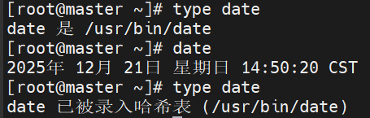


## Shell编程指南

这部分内容是我个人认为在Shell中很有用的一些建议、用法和规范。

### `Shebang`的用法

建议在每个脚本的首行（一定要是首行，不加任何内容），使用`Shebang`来声明该脚本使用什么解释器执行，用法如下：

```shell
#!/bin/bash
# 使用bash来执行该脚本，最常用
```

```shell
#!/bin/python3
# 使用Python来执行该脚本，解释器不一定要是Shell解释器，任何程序都可以，只要和脚本匹配即可
```

想要`Shebang`发挥作用，要通过绝对路径或者相对路径去执行（所以该脚本必须要有执行权限），如果在命令行中指定了解释器，则不会发挥作用，如下所示：

```cmd
sh test.sh
source test.sh
# 命令行中已经指定了解释器，Shebang会被忽略

./test.sh
/home/test.sh
# 这样执行则会使用Shebang指定的解释器去执行
```

> 如果使用错误的解释器去执行脚本，可能会因为特性不兼容导致执行出错，如使用 sh 去执行 bash 脚本，bash 的很多特性是 sh 不兼容的，不过现在很多系统都会把 sh 当做 bash 的软连接

通过`Shebang`可以在脚本中指定执行脚本的解释器，但是解释器的路径并不是不变的，不同系统也有差异，要解决这个问题，可以使用`env`命令，该命令会在`$PATH`中搜索命令的路径并执行

```shell
#!/usr/bin/env bash
```

> 如果使用上述写法，那么`env`的路径又如何保证不变呢？`env`的路径是`POSIX`制定的规范之一，规定`env`的路径必须是`/usr/bin/env`

### `env`的用法

1. 直接使用：查看当前进程环境变量；

2. 在`$PATH`中搜索命令并执行；

   ```shell
   #!/usr/bin/env bash
   ```

3. 清空环境变量执行命令

   ```shell
   env -i bash
   ```

### 设置临时环境变量

```shell
VAR=value command
# 该环境变量只在执行后续命令时有效，不污染全局的环境变量

A=1 B=2 C=3 command
# 可以同时设置多个环境变量
```

### 命令替换`$()`

命令替换的作用是创建一个子进程来执行命令，并捕获命令的**标准输出**（stdout）用来替换整个表达式，命令替换会**优先执行**。

```shell
echo $(cd $(dirname $0);pwd)
# 获取当前脚本所在目录的绝对路径
# 命令替换可以进行嵌套
```

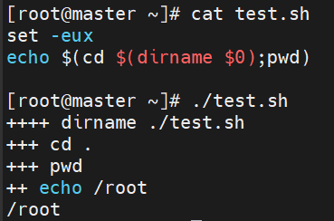

命令替换还有另一种写法 `` ，但是这种写法已经被弃用，因为可读性差且难以进行嵌套

```shell
echo `ls \`pwd\``
# 被嵌套的反引号要进行转义
```

### `local`用法

Shell中声明的所有变量都是全局的，如果想要局限在当前作用域，使用`local`进行声明，防止污染全局变量，造成错误结果。

```shell
function fun(){
  local var=1
  echo ${var}
}
```

> `local`只能用于函数中，表示变量的作用域仅为当前函数，不能直接用在函数外（如果用在函数外，那作用域不就是全局吗？`local`白用了），否则会执行错误。

注意，`local`本身也算是一条命令，如果使用`local`声明变量时，同时右侧使用命令对该变量进行赋值，紧接着使用`$?`总是会查询到`local`的返回值（也就是0，`local`不会执行失败），因为`local`是在赋值命令执行后才会执行的，赋值命令的返回值被覆盖了，类似的命令也是一样的，如：`readonly`和`declare`。

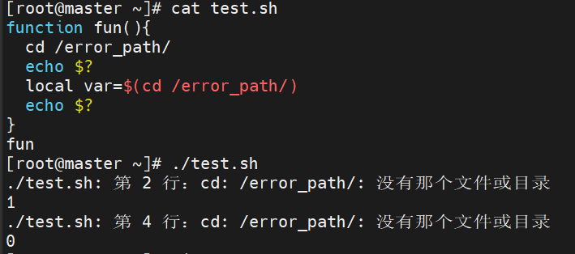

正确写法：

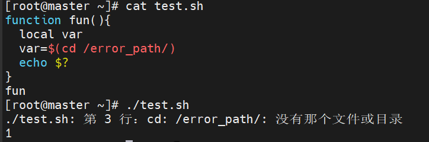

### Shell常量

常量就是不可修改的变量，在Shell中有几种实现方式：

```shell
# 1. 使用 readonly 命令声明变量
readonly var=hello
# 先声明变量，再使用 readonly 也有效
var=hello
readonly var

# 2. 使用 declare -r 声明变量，用法和 readonly 一样，只设置只读建议使用 readonly ，更语义化

# 3. 变量名使用大写字母，单词间用下划线分隔，算是一种约定俗成的编程规范，没有强制效果
FIRST_NAME=name
```

### `declare`命令

`declare`命令用于给变量设置属性，改变变量的行为

声明整数：

```shell
declare -i int=1
int+=1
echo int
# 设置为整数后可以更方便地进行计算，不依赖于原先的Shell特性
```

声明数组和关联数组：

```shell
declare -a arr=(a b c)

# 关联数组，在其它语言中叫做哈希表
declare -A map=([key1]=value1 [key2]=value2)
echo ${map[key1]}
```

声明只读变量：

```shell
declare -r PI=3.14
# 和 readonly 用法一致，但 readonly 是 POSIX 标准，而 declare 是 bash 内置命令
```

设置环境变量：

```shell
declare -x PATH=/opt/bin:$PATH
# 和 export 用法一致
```

查看变量属性：

```shell
declare -p VAR
# 通过 declare 和 readonly 声明的变量属性都可以查看到
```


# Shell辅助命令

## 输出内容：echo


## 输入输出重定向


## 根据字段排序：sort

直接使用时,按照**字典顺序**对字符串进行排序

- 常用选项:
  - -n:numeric-sort 按照**数值大小**排序,仅能识别整数和小数,对字符串没什么意义
  - **-g:general-numeric-sort 与-n一样根据数值大小进行排序,支持的数值格式更多,比如科学计数法**
  - -r:reverse 降序排序,默认是升序
  - -f:忽略大小写
  - **-k:key 进行排序的字段**
  - -t:field-separator 字段分割符,默认是空白符
  - -u:unique 去重
  - -o:output 将标准输出(终端)重定向到文件中
  - -b:ignore-leading-blanks 忽略前导空白


## 对连续重复的行去重:uniq

- 全称:unique
- 常用选项:
  - -c:count 每行前面加上这行出现的次数。
  - -d:仅显示重复的行。
  - -u:unique 仅显示不重复的行。


## 统计文件内容:wc

- 常用选项:
  - -c:统计字节数
  - -m:统计字符数,如果是内容是英文那么和字节数是一样的,如果有中文,占据的字节数是英文的3倍
  - -l:lines 统计行数
  - -L:输出字符最多的行中的字符数
  - -w:words 统计单词数,以空白符分割的每个字符都算一个单词


## 切割字符串:cut

- 常用选项:
  - -d:--delimiter=DELIM 自定义分隔符,需使用单引号或双引号,使用-f选项时默认分隔符是水平制表符(Tab)
  - -f:--fields=LIST 按字段进行选择,承认分隔符,以分隔符区分字段
  - -s:不打印没有包含分隔符的行,默认情况下没有分隔符将打印整行                                    
  - -c:--characters=LIST 按字符进行选择,不承认分隔符                            
  - -b:--bytes=LIST 按字节进行选择,不承认分隔符
  - -n:补全选中的<字节、字符、字段>
  - --output-delimiter=TRING 使用指定的字符串作为输出分界符,默认采用输入的分界符

## 获取用户输入：read

## 删除或替换字符：tr

## sleep和wait

## 同时输出到标准输出和文件：tee

## 监控命令执行：watch

## 控制命令执行时间：timeout

## 获取目录名：basename

## 获取父目录路径：dirname


# 正则表达式


## 正则表达式的匹配模式

- 贪婪匹配（Greedy Matching）: 贪婪匹配是正则表达式的默认行为，意思是尽可能多地匹配字符，直到整个模式无法继续匹配为止。
- 懒惰匹配（Lazy Matching）:  懒惰匹配（也叫做非贪婪匹配）是指尽可能少地匹配字符，直到满足后面的部分为止。它会比贪婪匹配更早地停止。
  - **语法**：在量词后添加一个 `?`，如 `*?`, `+?`, `??`, `{n,m}?`。


## 基本正则表达式（Basic Regular Expressions，BRE）

- ^	匹配行首,**零宽**,如果当独使用`^`,表示匹配任意字符串,如: ^abc     #以abc开头的字符串
- $        匹配行尾,**零宽**,如: abc$     #以abc结尾的字符串
- .         匹配任意字符,如: a.c    # .表示任意字符
- \*        匹配前一个元素任意次,如:  .*  #表示任意字符串
- []        匹配括号内任意字符,如:  [abc]  
- [-]       匹配括号范围内任意字符,**范围的确定取决于ASCII编码中的顺序**,如:[0-9],[a-Z]    #分别表示任意一个数字和任意一个字母
- [^]      匹配括号内以外的内容,如:[^0-9\] #除了数字都匹配
- \s       匹配空白字符,包括空格,水平和垂直制表符,换行符,回车符等
- \S       匹配非空白字符
- \w      匹配字母、数字、下划线的字符
- \W      匹配非字母、非数字、非下划线的字符,基本上就是匹配除`_`之外的特殊符号
- \b       匹配单词边界,即如:\bword\b   只能匹配word,不能匹配wwordd,\b匹配单词边界,不能匹配字母,**零宽**
  - 实际上和\W匹配的字符基本上一致,区别在于\b是零宽,仅做条件判断,不会消耗字符
  - \\<  \\>与之类似,也是表示单词边界,不过不如\b通用,主要在类Unix系统中使用,这对符号区分左右,一个只能用在左边一个只能用在右边


基本正则并不是不能使用扩展正则的模式,但是要用\将特殊字符转义才能发挥作用,否则是直接匹配特殊字符


## 扩展正则表达式（Extended Regular Expressions，ERE）

在基本正则的基础上,额外增加了对更多模式的支持

- \+	匹配前一个元素一次或多次
- ?        匹配前一个元素零次或一次
- |        逻辑或,表示匹配左边或右边的表达式
- ()        定义捕获组,将一个模式分为多个部分,精准地对每一个部分进行操作
  - 组当做一个整体来进行处理:  (abc|def)a  匹配abca或defa
  - 捕获组的反向引用:   ([a-z]+)\1    \1表示引用第1个捕获组,引用:**匹配和捕获组相同的内容**
    - abc   无法匹配,捕获组无论如何匹配,引用都无法匹配到和捕获组相同的内容
    - abab   可以匹配,捕获组匹配ab,引用也匹配ab
    - aaaaa 可以匹配,捕获组匹配aa,引用也匹配aa,第一个捕获组可以匹配整个字符串,但是考虑到要让后面的引用匹配一样的字符串,所以匹配aa
- {}       匹配前一个元素出现一定次数
  - {n}	匹配前一个元素出现n次
  - {n,}       匹配前一个元素最少出现n次
  - {,n}       匹配前一个元素最多出现n次
  - {n,m}    匹配前一个元素出现次数在n-m之间


## Perl 兼容正则表达式（Perl Compatible Regular Expressions，PCRE）

在扩展正则的基础上,额外增加了更多功能,支持更多模式

- \d	匹配数字

- \D        匹配非数字

- 断言

  - 零宽正向前瞻（Positive Lookahead）：`(?=pattern)`用来确保某个模式**后面跟着**另一个模式
  - 零宽反向前瞻（Negative Lookahead）：`(?!pattern)`用来确保某个模式**后面不跟着**另一个模式
  - 零宽正向后瞻（Positive Lookbehind）：`(?<=pattern)`用来确保某个模式**前面跟着**另一个模式
  - 零宽反向后瞻（Negative Lookbehind ）：`(?<!pattern)`用来确保某个模式**前面不跟着**另一个模式

  零宽:仅用作条件判断,匹配的结果不占据实际的宽度,不消耗字符

  - 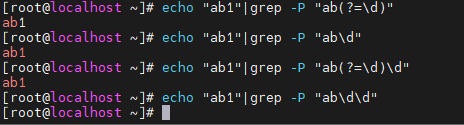	

    可以看到上述结果中,用断言去匹配,仅做条件判断,匹配的结果没有占据实际的宽度,后面的模式可以重新匹配这些字符

- 捕获组命名


# 过滤出特定内容:grep

- 作用:将文本中符合条件的内容过滤出来,默认使用基本正则
- 语法:grep [OPTIONS] [PATTERN] [FILE...]
- 注意事项:
  - FILE部分不是必需的,如果不加,就从标准输入读取内容,可以用于直接输入内容测试
  - PATTERN 部分最好用引号包围,否则可能出现意想不到的结果
    - grep .* test 和 grep ".*" test 
    - grep \s test和 grep "\s" test
- 常用选项:
  - -i:忽略大小写
  - -E:启用<扩展正则>
  - -P:启用<Perl正则>
  - -r:recursive 递归操作,针对需要过滤整个目录所有文件的内容时
  - -l:输出包含匹配内容的<文件名>
  - -o:only-matching 仅输出<匹配内容本身>,默认情况下输出包含匹配内容的行
  - -q:quiet 不输出,静默操作,通常用于条件判断
  - -v:invert-match 输出<不匹配的行>
  - -c:count 输出含有匹配内容的<行数>


# 文本行流编辑器:sed

- 全称:Stream Editor
- 工作原理:sed命令将逐行读取文件或者标准输入的内容,根据**地址**来判断是否进行编辑**操作**
- 优点:
  1. 每次仅读取一行,不会出现内存不足的情况
  2. sed是非交互式编辑器,可以很方便地用于脚本中
  3. 不是直接对输入源进行修改,可以使用 -i 选项来决定是否修改输入源

- 常用选项:

  - -r:启用扩展正则表达式,默认使用基本正则

  - -n:禁止默认输出,默认情况下会输出所有处理过的内容,使用此选项后只有在`p`命令被显示调用时才输出

  - -i:修改源文件,而不是将处理结果输出到标准输出

  - -e:expression 指定多个处理的脚本,也可以直接使用`;`或者换行来分隔多个脚本

    以下三者效果是一样的:

    - `sed -e 's/foo/bar/' -e '/baz/d' input.txt`
    - `sed 's/foo/bar/; /baz/d' input.txt`
    - ``sed 's/foo/bar/
      /baz/d' input.txt`

  - -f:file 指定脚本文件,不直接在命令行中写脚本命令

- 子命令:

  - p:print 仅输出指定的行,一般和`-n`选项一起使用

    选择行的方式(**地址的语法**)如下,以`p`作为示例

    - sed -n '/apple/p' input.txt   #打印包含apple的行,使用正则表达式来匹配行
    - sed -n '3p' file  #打印第 3 行
    - sed -n '2p; 5p; 8p' file  #打印第 2 行、第 5 行和第 8 行
    - sed -n '1,5p' input.txt  #打印第1至第5行
    - sed -n '1,+3p' input.txt  #打印第1行及后面3行
    - sed -n '3,/pattern/p' file  #从第 3 行开始打印，直到匹配到 `pattern` 的行为止
    - sed -n '$p' input.txt  #打印最后一行
    - sed -n '1~2p' input.txt  #打印第1行,每2行打印一次,即打印奇数行
    - sed  'p' /etc/passwd  #重复打印所有行1次,如果没有使用-n选项,那么所有行都会被打印,匹配`p`条件的会额外打印1次

  - d:delete 删除特定的行
  - i:insert 在某行前插入行
    需要输入文本内容时,可以使用以下方式:
    - sed '3i insert' /etc/passwd
    - sed '3iinsert' /etc/passwd  #可以不加入空白符直接将字符串加在后面,但是为了可读性一般会加上空白符
    - sed '3i\insert' /etc/passwd
    - sed '3i \
      line1\
      line2' /etc/passwd  #如果需要换行,在每一行末尾加上`\`

  - a:append 在某行后追加行
  - c:change 替换整行
  - s:substitute 替换匹配到的内容
    - 语法:`sed '地址s/被替换的内容/替换以后的内容/[修饰符]' 文件名`
    - 修饰符:
      - g:global 全局替换,默认是替换每行第一个匹配项
      - i:ignore case 匹配时忽略大小写
      - 数字(n):仅对每行的第n个匹配项进行替换
    - 示例:
      - sed 's/root/ROOT/' /etc/passwd  # 将每行的第1个root替换为ROOT
      - sed 's/root/ROOT/g' /etc/passwd  # 将每行的所有root替换成ROOT
      - sed '1s/root/admin/3' /etc/passwd  #将第1行出现的第3个root换成admin
      - sed 's/root/&aaa/g' /etc/passwd  #**`&`表示对匹配内容的引用**,这里匹配的是root,表示将root替换成rootaaa
      - sed -n '/root/s/root/admin/p' /etc/passwd  #仅打印被修改过的行
  - N:将当前行和下一行合并
    - sed = /etc/passwd | sed 'N;s/\n/\t/'  #实现类似cat -n的效果

- 其它用法:
  - 命令块:`{}`将相关的命令进行分组,比只使用`;`分隔命令有更强的可读性
  - 否定匹配:`!`对不匹配的内容进行操作
    - sed '/root/!d' /etc/passwd  #删除所有不包含 root的行
  - 行号条件:`=`打印行号
    - sed '=' /etc/passwd  #每一行前插入一行,内容为该行行号
    - sed -n '/root/{=; p}' /etc/passwd  #打印包含root的行号和内容


# 文本编辑器:awk

- 执行流程:首先执行**BEGIN块**中的操作,然后逐行读取输入内容并执行操作(**主体块**),最后执行**END块**中的操作
- 语法:`awk [option] 'pattern{action}' [filename]`
- 常用选项:
  - -F:自定义字段分割符,默认是空白符
  - -v:variable 定义变量并赋值
- 内部变量:
  - $0:当前行
  - $n:行中的某个字段,n>0
  - NF:Number of Fields 当前行字段数
  - $NF:最后一列,$(NF-1)表示倒数第二列,以此类推
  - FNR/NR:File Record Number 行号
  - FS:Field Separator 字段分割符,除了可以通过-F选项设置,也可以通过这个内部变量设置
  - OFS:Output Field Separator 输出字段分割符,输出多个字段时使用的分割符,默认是空格
  - RS:Record Separator 记录(行)分割符,默认是换行符,一般不更改
  - ORS:Output Record Separator 记录输出分割符,默认是换行符,一般不更改
- 操作:
  - print:打印,没有指定打印的内容就是打印整行
- BEGIN块和END块
  - BEGIN:一般用于打印表头、初始化分割符
    - awk 'BEGIN{FS=":";print "user shell"} {print $1,$NF}' /etc/passwd  #打印了一行表头,并且指定了`:`作为字段分割符,**如果要打印字符串,需要使用`""`**
      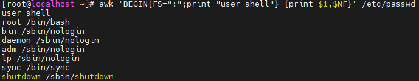	
  - END :一般用于汇总数据
    - awk 'END{print NR}' /etc/passwd  #统计了这个文件的行数
      
- 示例:
  - awk '{print}' /etc/passwd  #原样输出
  - awk 'NR==3{print $0}' /etc/passwd  #输出第三行
  - awk 'NR==3,NR==10{print}'  /etc/passwd  #输出3至10行
  - awk 'NR==3;NR==10{print}'  /etc/passwd  #输出第3行和第10行
  - awk '/^root/{print $0}' /etc/passwd  #输出以root开头的行,支持扩展正则
  - awk -F : '$3>1000{print $0}' /etc/passwd  #输出uid大于1000的用户信息
  - awk -F ":" 'NR==1{print $1}' /etc/passwd  #输出第1行第1列
  - awk -F ":" '{print $1,$7 }' /etc/passwd  #输出第1列和第7列
  - awk -F: '$7!~ /nologin/ {print $1, $7}' /etc/passwd #输出**不匹配**`nologin`模式的行的第一和第七个字段


# DNS服务

DNS概述:Domain Name System 域名系统,应用层协议,它作为将域名和IP地址相互映射的一个分布式数据库,能够使人更方便地访问互联网

使用软件:BIND (Bekerley Internet Name Domain)

服务名:named

占用端口:53/tcp,53/udp

## 域名的结构

域名从右往左看,依次是根域名`.`,顶级域名,二级域名,三级域名……主机,每个域名用`.`分割,一个全称域名一般是3-4个层次

- 根域名:最右边的`.`就是根域名,平常使用时一般不会出现,常见于DNS的配置文件中

- 顶级域名:这部分域名是固定的,顶级域名一定程度说明网站的性质,常见的有:com,cn,org,net等

- 二级域名:自定义,一般表示公司或机构,如:baidu,tencent,bytedance等
- 主机名:域名最左边表示主机名,一个二级域名下往往有多个站点,所以会有多个主机名来区分,最常见的就是`www`

- 全称域名(Fully Qualified Domain Name，FQDN):也称为完全限定域名，是指在域名系统中，能够完整地标识出一个网络资源（如服务器、计算机等）在网络中的位置的域名。它包含了从根域名开始到该主机名的完整路径，具有唯一性和精确性,如www.qq.com

## 域名解析的过程

- 域名查询的两种类型:

  - 迭代查询:服务器仅查询本服务器已有的信息,不会向其它服务器发起查询,而是将本服务器查询到的信息直接返回给查询者,让查询者自己去查询,**服务端之间的查询一般是迭代查询**
  - 递归查询:服务器会根据其它服务器返回的信息一直查询下去,直到查找到目标信息返回给查询者,这样查询者只需要**一次查询就能完成域名解析**,**客户端向服务端发起的查询一般是递归查询**
- 域名解析的过程:

  1. **用户输入域名**
     用户在浏览器中输入域名（如www.example.com）。
  2. **查询本地缓存**
     浏览器首先检查本地缓存，查看是否有该域名对应的IP地址。如果有，直接使用；如果没有，继续下一步。
  3. **查询操作系统缓存**
     操作系统检查其缓存（如Windows的hosts文件），若有对应IP则返回；若无，继续查询。
  4. **查询本地DNS服务器(递归查询)**
     请求发送到本地DNS服务器（通常由ISP提供）。若服务器缓存中有对应IP，则返回；若无，继续向根DNS服务器查询。
  5. **查询根DNS服务器**
     本地DNS服务器向根DNS服务器查询，根DNS服务器返回负责顶级域（如.com）的顶级域DNS服务器地址。
  6. **查询顶级域DNS服务器**
     本地DNS服务器向顶级域DNS服务器查询，服务器返回负责该域名的权威DNS服务器地址。
  7. **查询权威DNS服务器**
     本地DNS服务器向权威DNS服务器查询，获取域名对应的IP地址。
  8. **返回IP地址**
     本地DNS服务器将IP地址返回给操作系统，操作系统再传递给浏览器。

## 记录的类型

| 记录类型 | 全称                      | 解释                                                         |
| -------- | ------------------------- | :----------------------------------------------------------- |
| A        | Address Record            | 将域名映射到 IPv4 地址。当用户访问域名时，DNS 服务器通过 A 记录将域名解析为对应的 IPv4 地址，以便客户端与服务器建立连接。 |
| AAAA     | IPv6 Address Record       | 类似于 A 记录，但用于将域名映射到 IPv6 地址，以支持 IPv6 网络环境。 |
| CNAME    | Canonical Name Record     | 创建域名的别名。它将一个域名（别名）指向另一个规范域名，当用户访问别名域名时，DNS 服务器会将请求重定向到规范域名的解析结果。 |
| MX       | Mail Exchange Record      | 指定负责处理该域名电子邮件的邮件服务器。MX 记录包含邮件服务器的主机名和优先级，**数字越小优先级越高**，发件服务器会优先将邮件发送到优先级高的邮件服务器。 |
| NS       | Name Server Record        | 指定负责该域名的权威 DNS 服务器。当 DNS 解析器需要查询该域名的相关记录时，会向这些权威 DNS 服务器发起查询。 |
| TXT      | Text Record               | 可以用于存储任意文本信息，常用于各种验证、声明或配置信息。例如，SPF（Sender Policy Framework）记录就通过 TXT 记录来指定允许发送该域名邮件的 IP 地址范围。 |
| PTR      | Pointer Record            | 与 A 或 AAAA 记录相反，用于将 IP 地址反向解析为域名。常用于邮件服务器的反向 DNS 验证等场景。 |
| SRV      | Service Record            | 用于指定提供特定服务的服务器信息，包括服务器的主机名、端口号和优先级等。常用于一些需要动态发现服务位置的协议，如 SIP、XMPP 等。 |
| SOA      | Start of Authority Record | 标识区域的开始，并指定该区域的权威信息，是每个 DNS 区域文件中**必须存在的首条记录**。它包含了区域的基本信息，如主要域名服务器、管理员邮箱、序列号、刷新时间、重试时间、过期时间和最小 TTL 等，这些信息对于 DNS 服务器之间的区域传输和数据同步非常重要。 |

## 配置文件解析

- 主配置文件: /etc/named.conf

  ```conf
  options {
          listen-on port 53 { any; };		//监听任意ip的53端口,如果将any替换成127.0.0.1就是只监听本地的端口,要监听多个ip,使用;隔开
          directory       "/var/named";	//区域文件目录
          allow-query     { any; };		//允许查询的ip
  		allow-transfer	{ 192.168.10.9; }; //只允许192.168.10.9的主机同步数据
  };
  
  zone "test.com" IN {					//定义一个正向解析区域,test.com,IN表示这个区域类型是最常见的Internet类	
          type master;					//master类型表示该DNS服务器是这个区域的主要管理者,可以修改其中的记录
          file "zone.test.com";			//区域文件名,和上面的区域文件目录结合就是完整路径
          allow-update { none; };			//是否允许客户端(如DHCP服务)动态更新该区域的记录,none表示禁止,如果写入ip表示允许该客户端更新
  };
  
  zone "6.168.192.in-addr.arpa" IN {		//定义一个反向解析区域,ip地址需要反写,实际上为192.168.6网段的地址解析
          type master;
          file "zone.6.168.192";
          allow-update { none; };
  };
  
  include "/etc/named.rfc1912.zones";		//包含的文件,将部分配置拆分到其它文件中方便管理,在被包含的文件中做的配置和写在这个配置文件中是等效的
  include "/etc/named.root.key";
  ```

- 区域文件: 路径和主配置文件指定的路径保持一致

  - 正向解析配置

    ```conf
    $TTL 1D		;Time-To-Live生存时间,即DNS记录的默认缓存时间
    @       IN SOA  dns01.test.com. 1935846027.qq.com.  (	
    ; @表示当前域,IN表示记录类别,其中的域名表示该区域的主域名服务器,其后的内容为邮箱地址(@用.代替)
                                            0       ; serial,序列号,从服务器通过对比序列号来决定是否更新
                                            1D      ; refresh,刷新时间,1天,从服务器时隔多久向主服务器发起一次查询来更新数据
                                            1H      ; retry,重试时间,1小时,从服务器如果向主服务器发起的查询失败,时隔多久再次查询
                                            1W      ; expire,过期时间,1周,从服务器在多长时间内没有成功从主服务器获取到区域文件更新后，数据不可用
                                            3H )    ; minimum,最小缓存时间,3小时,如果前面的TTL值或者某条记录的缓冲时间低于这个值,则使用当前值
    @       NS      dns01.test.com.	; 指定该域名的权威DNS服务器,注意区域文件的域名末尾要加 . ,表示根域名
    dns01   A       192.168.6.130	; dns01是简写,末尾自动加上当前域,即dns01.test.com
    xxx 	CNAME   www				; 为别名设置规范名称,前面的是别名,访问别名等同于访问规范名称
    www     A       183.2.172.42	
    www     A       127.0.0.1
    *       A       127.0.0.1		; 设置泛域名匹配,访问的主机如果没有其他匹配,就映射到这个ip
    @       A       127.0.0.1		; 设置当前域匹配
    @       MX 10   mailsrv1		; 邮件记录优先使用优先级高(数字小)的
    @       MX 20   mailsrv2
    mailsrv1 A      192.168.10.8
    mailsrv2 A      192.168.10.10
    ```

  - 反向解析配置

    ```conf
    $TTL 1D
    @       IN SOA  dns01.test.com. 1935846027.qq.com.  (
                                            0       ; serial
                                            1D      ; refresh
                                            1H      ; retry
                                            1W      ; expire
                                            3H )    ; minimum
    @                               NS      dns01.test.com.
    130                             PTR     local.test.com.	; 简写,根据当前网段补全
    129.6.168.192.in-addr.arpa.     PTR     mail.test.com.	; 完整写法
    ```

## 主从复制

1. 在从服务器的主配置文件增加如下内容:
   ```conf
   zone "test.com" IN {
           type slave;
           masters { 192.168.6.130; };
           file "slaves/zone.test.com.slave";
   };
   ```

   此时,从服务器已经生效,但是如果主服务器更新了信息,从服务器还无法实时更新,只能等refresh时间到了后才会拉取主服务器的信息

2. 从服务器实时获取主服务器最新的配置,在主服务器的区域文件增添如下配置:

   ```conf
   @       NS      dns02.test.com. ; 添加从服务器为该域的权威服务器,因为主服务器的type是master,其它的自然就是slave,这样主服务器更新信息后会通知其它的从服务器
   dns02   A       192.168.6.129
   ```

   **数据更新的依据是序列号的变化,所以,如果想让从服务器更新数据,务必手动增大序列号**

3. 限制可以同步数据的服务器:

   ```conf
   options {
   		allow-transfer	{ 192.168.10.9; }; //只允许192.168.10.9的主机同步数据,如果为none,则是禁止同步数据,默认没有这个配置,则是any
   };
   ```

   从服务器获取到的数据虽然是加密过的,但是如果任何服务器都可以同步数据,还是没有安全性可言,所以需要加以限制

## 相关命令

- rndc

  - `reload`：重新加载配置文件和区域文件。
  - `status`：显示服务器状态。
  - `stop`：停止DNS服务器。
  - `querylog on/off`：启用或禁用查询日志。
  - `flush`：清空服务器的缓存。

- named-checkconf

  `named-checkconf /etc/named.conf`:检查主配置文件的语法

- named-checkzone

  `named-checkzone example.com /var/named/example.com.zone`:检查区域文件的语法

- dig（Domain Information Groper）
  - 语法:`dig [@服务器] [域名] [记录类型] [选项]`
  - 常用选项
    - `+short`：只显示简短的查询结果。
    - `+trace`：跟踪 DNS 查询的完整过程（从根服务器开始）。
    - `-x <IP>`：反向查询 IP 地址对应的域名。
    - `+noall +answer`：仅显示查询结果部分。
    - `-t`:type 指定要查询的DNS记录类型,如果没有指定类型,默认查询A记录;除了上述表格中的记录,还有`axfr`,代表 “Authoritative Zone Transfer”，即权威区域传输。它用于请求获取指定域名区域的完整 DNS 记录集，这意味着该查询会尝试从目标 DNS 服务器获取 域名区域内的所有 DNS 记录

- nslookup（Name Server Lookup）
  - 语法:`nslookup [域名] [DNS服务器]`
  - 该命令可以使用交互的方式运行,常用命令：
    - `server <DNS服务器>`：指定查询的 DNS 服务器。
    - `set type=<记录类型>`：设置查询的记录类型（如 A、MX、NS 等）。
    - `exit`：退出交互模式。

- host
  - 语法:`host [选项] [域名] [DNS服务器]`
  - 常用选项
    - `-t <记录类型>`：指定查询的记录类型（如 A、MX、NS 等）。
    - `-a`：显示所有可用信息。
    - `-4`：仅使用 IPv4 查询。
    - `-6`：仅使用 IPv6 查询。

# Nginx服务器

Nginx是一个开源、轻量级和高性能的 Web 服务器

## Nginx安装

- yum安装：`yum install -y epel-release nginx`

- 源码安装：

  ```cmd
  # 1. 获取源码：
  wget http://nginx.org/download/nginx-1.19.7.tar.gz
  
  tar -axf nginx-1.19.7.tar.gz 
  cd ~/nginx-1.19.7
  
  # 2. 配置Nginx的编译参数
  # 创建Nginx运行使用的用户和用户组
  useradd -M -s /sbin/nologin nginx
  # 安装编译所需的工具
  yum install -y gcc pcre-devel zlib-devel
  # 配置编译参数
  ./configure --prefix=/usr/local/nginx --user=nginx --group=nginx
  
  # 3. 编译并安装，编译后在当前目录生成一个 objs 目录，安装就是将目录中的内容复制到指定路径
  make && make install
  
  # 4. 全局配置Nginx命令，方便使用
  cat >/etc/profile.d/nginx.sh<<EOF
  export PATH="/usr/local/nginx/sbin:$PATH"
  EOF
  source /etc/profile
  ```

## Nginx升级

```cmd
# SSL模块需要的依赖
yum install -y openssl openssl-devel
# 新增了SSL模块，最后一个参数作用是忽略高版本openssl的弃用警告
./configure --prefix=/usr/local/nginx --user=nginx --group=nginx --with-http_ssl_module \
--with-cc-opt='-Wno-deprecated-declarations'
# 重新进行编译，注意：不能使用 make install，否则会覆盖原先的配置
make
# 备份老版本nginx，用新的二进制文件替换
mv /usr/local/nginx/sbin/nginx /usr/local/nginx/sbin/nginx.bak
mv objs/nginx /usr/local/nginx/sbin/nginx
# 使用nginx提供的脚本，可以优雅关闭老版本的nginx（不中断已有的连接），并启动新版本的nginx
make upgrade
```


## Nginx命令

- **常用选项**:

  - **无选项**: 启动 Nginx 服务。

    - 说明: 默认加载 `/etc/nginx/nginx.conf` 配置文件。

  - **-t**: 不启动nginx,测试配置文件的语法是否正确。

  - **-s signal**: 向 Nginx 主进程发送信号，控制服务行为。

    - 示例:
      - `nginx -s reload`: 重新加载配置文件，不重启服务。
      - `nginx -s stop`: 快速停止 Nginx 服务。
      - `nginx -s quit`: 优雅停止 Nginx 服务（处理完当前请求后停止）。
      - `nginx -s reopen`: 重新打开日志文件（用于日志切割后）。

  - **-c file**: 指定使用的配置文件路径。

    - 示例: `nginx -c /path/to/nginx.conf`

  - **-p prefix**: 指定 Nginx 的运行目录（前缀路径）。

    - 示例: `nginx -p /path/to/nginx/`
    - 说明: 运行目录包含配置文件、日志文件等。

  - **-g directives**: 在命令行中设置全局指令，覆盖配置文件中的设置。

    - 示例: `nginx -g "worker_processes 4;"`
    - 说明: 动态设置全局配置，如工作进程数。

  - **-v**: 显示 Nginx 的版本信息。

    - 示例: `nginx -v`
    - 输出示例: `nginx version: nginx/1.20.1`

  - **-V**: 显示 Nginx 的版本信息以及编译时使用的配置选项。

    - 示例: `nginx -V`

    - 输出示例:

      ```
      nginx version: nginx/1.20.1
      built by gcc 9.3.0 (Ubuntu 9.3.0-17ubuntu1~20.04)
      configure arguments: --prefix=/etc/nginx --sbin-path=/usr/sbin/nginx ...
      ```

  - **-h**: 显示帮助信息，列出所有支持的选项。

## 常用指令

- 根目录和默认索引文件

  ```nginx.conf
  location /test {
  	root html;	#相对路径以nginx.conf文件所在目录的父目录为起点
  	index index.html;
  }
  ```

  根目录是查找文件时的起点,将整个路径追加在末尾进行查找;当查找到的文件为目录时,使用该目录中指定的默认索引文件进行响应

  如访问`http://192.168.6.130/test1/test2`,查找的路径为`html/test1/test2`,如果该路径为文件,则直接响应该文件,如果为目录,则使用目录中的`index.html`文件

- 路径别名:`alias`

  ```nginx.conf
  location /test1 {
  	alias html;
  }
  ```

  `alias`是给一个路径起个别名,和`root`的追加不同,`alias`是直接替换掉`location`匹配的部分，一般用于访问nginx目录外的内容

  如访问`http://192.168.6.130/test1/test2`,实际访问的路径为`html/test2`

- 匹配请求:`location`

  - 作用:根据请求的路径,来匹配请求

  - 匹配规则（从上往下依次匹配）：

    1. 精准匹配 `=` :路径完全一致则匹配,不进行后续匹配
    2. 前缀匹配 `^~和普通前缀匹配` :路径前缀一致则匹配,如有多条前缀匹配都符合,使用长度最长的规则(不会存在同样长度前缀匹配，会报错)，如果`^~`(优先前缀匹配)匹配成功,使用该规则,终止后续匹配,而如果是`普通前缀匹配`匹配成功,进行下一步
    3. 正则匹配 `~和~*` :`~*`会忽略大小写;按**书写顺序进行匹配**,匹配成功则使用;如果没有匹配成功,上一步骤有匹配成功的`普通前缀匹配`,则使用,否则进行下一步
    4. 默认匹配 `/` :没有被其它规则匹配则匹配

  - 特殊用法:用`@`作为前缀表示一个命名location,其它location可以通过这个命名将请求转发到这个location中

  - 示例:

    ```conf
            location = /t2{
                    root /www01;
                    index t2.html;
            }
            location ^~ /t1{
                    root /www01;
                    index t1.html;
            }
            # 普通前缀匹配
            location /t11 { 
                    root /www01;
                    index t3.html;
            }
            location ~* /t4 {
                    root /www01;
                    index t4.html;
            }
            location ~ /t5 {
                    root /www01;
                    index t5.html;
            }
    		location / {
                    root /www01;
                    index index.html;
            }
    		location /index/ {
    				error_page 404 @index_error;
    		}
            location @index_error {
            		.....
            }
    ```

- 通过账号限制访问

  ```nginx.conf
  auth_basic      "nginx access control"; #提示语
  auth_basic_user_file /usr/local/nginx/passwd/test_password; #账号密码文件,其中有账户名和加密过的密码
  ```

  账号密码文件使用`htpasswd`命令生成:`htpasswd -c /usr/local/nginx/passwd/test_password username`

  `-c`选项为创建新文件,如果文件已存在则覆盖,不使用该选项则会在原文件中追加账户

- 允许或拒绝IP访问

  ```nginx.conf
  allow 192.168.1.100;   # 允许 192.168.1.100 访问
  allow 10.0.0.0/8;      # 允许 10.0.0.0/8 网段访问
  deny 192.168.1.200;    # 拒绝 192.168.1.200 访问
  deny all;              # 拒绝其他所有 IP 访问
  ```

  IP按照两个指令的**顺序依次匹配**,**第一个匹配成功的规则生效**,如果没有匹配成功,则允许访问

- 重写URI:`rewrite`

  - 语法:`rewrite regex replacement [flag];`
  - `regex`：是一个正则表达式，用于匹配请求的 URI(**域名后面的路径,不包含参数**)。
  - `replacement`：重写后的 URI,如果有协议,则是跳转到外部链接,否则继续匹配
  - `flag`：是可选参数，用于指定重写的规则和行为，常见的标志有：
    - `last`：停止当前 `location` 块中的后续 `rewrite` 指令，并重新发起一个新的请求,重新进行`location`块的匹配。
    - `break`：停止当前 `location` 块中的后续 `rewrite` 指令，不再重新发起请求,继续执行当前`location`块中的指令。
    - `redirect`：返回 302 临时重定向。
    - `permanent`：返回 301 永久重定向。
    - 如果没有`flag`,会继续执行当前`location`块中的`rewrite`指令
  - 结合if使用：
    if ( !-e $request_filename ) {
      rewrite^/.* http://www.baidu.com redirect;
    }

- 压缩

  ```nginx.conf
  http {
      # 开启 gzip 压缩功能
      gzip on;
      # 设置允许压缩的最小响应体大小，小于该值的响应将不进行压缩
      gzip_min_length 1k;
      # 设置压缩缓冲区大小，以 4k 为单位
      gzip_buffers 4 16k;
      # 设置压缩级别，取值范围为 1 - 9，值越大压缩比越高，但消耗的 CPU 资源也越多，一般建议设置为 6
      gzip_comp_level 6;
      # 设置允许压缩的 MIME 类型
      gzip_types text/plain text/css application/json application/javascript text/xml application/xml application/xml+rss text/javascript;
      # 为支持 gzip 压缩的客户端添加 Vary: Accept-Encoding 响应头
      gzip_vary on;
      # 禁用对 IE6 等不支持 gzip 压缩的旧浏览器的压缩
      gzip_disable "msie6";
  }
  ```

## 虚拟主机

- 概念：一种在同一台物理服务器上托管多个网站（或服务）的技术

- 虚拟主机的三种配置方式

  1. 相同ip,不同端口
  2. 不同的ip
  3. 相同的ip和端口,不同域名

- 配置方法

  ```conf
  server {
          listen          127.0.0.1:80; # 监听的ip和端口,如果只写端口,就是监听localhost
          server_name     www.yjs.com;  # 域名,当不同的server配置中ip和端口出现冲突时,才会通过域名来区分不同的虚拟主机
  }        
  ```

  每一个`server`就是一个虚拟主机,不同的虚拟主机只需要ip,端口或者域名有一个不相同即可

## 反向代理

- 概念:客户端将请求发送给一个代理服务器,代理服务器将这个请求转发给其他服务器进行处理,再将响应返回给客户端,在此过程中,对客户端来说,**隐藏了真正的服务端**

- 正向代理:客户端将请求交由代理服务器,**由代理服务器来访问目标服务器**,代理服务器再将响应返回给客户端,在此过程中,对服务端来说,**隐藏了真正的客户端**,在使用前,客户端需要配置代理服务器的信息

- 反向代理配置

  - 在`location`指令中根据协议使用以下其中一个指令进行转发

    - https和http协议:`proxy_pass`
    - fastcgi协议:`fastcgi_pass`
    - uwsgi协议:`uwsgi_pass`
    - scgi协议:`scgi_pass`
    - memcached协议:`memcached_pass`

  - 将客户端的真实IP写入请求头:`proxy_set_header X-Real-IP \$remote_addr;`

  - 注意点

    - 目标地址需要加上协议,如:`proxy_pass http://www.baidu.com;`

    - 与`location`结合使用时,被`location`匹配的部分会被舍弃,剩余的部分拼接到目标地址末尾,在使用时要注意末尾的`/`

      - ```conf
        location /test {
                        proxy_pass http://www.baidu.com;
        }
        #这里location指令末尾没有加/,说明不会将末尾的/匹配掉,拼接的路径前面就是有/的,所以目标路径末尾不需要加/,如访问的路径为:/test/www,则转发后的路径为http://www.baidu.com/www
        ```

      - ```conf
        location /test/ {
                        proxy_pass http://www.baidu.com/;
        }
        #如果以/结尾,则目标地址也要加/
        ```

## 与PHP集成

- 配置PHP环境:`yum -y install php php-fpm php-mysqlnd php-gd php-mbstring`

  - php:PHP语言核心库                                                                        
  - php-mysqlnd:PHP MySQL 数据库驱动程序                                                   
  - php-gd:PHP 图形处理库,用于处理图像                                                                                                                                    
  - php-mbstring:PHP 多字节字符串扩展,提供了对多字节字符集的支持

- PHP-FPM的配置

  - 概述:PHP-FPM（PHP FastCGI Process Manager）是一个针对 PHP 脚本的 FastCGI 进程管理器

    - FastCGI 协议基础：FastCGI 是一种让脚本语言（如 PHP）和 Web 服务器进行通信的应用层协议。传统的 CGI（Common Gateway Interface）在处理每个请求时都会启动一个新的进程，这会带来很大的开销，而 FastCGI 则通过保持一个进程池，避免了频繁创建和销毁进程的开销。
    - PHP-FPM 的角色：PHP-FPM 实现了 FastCGI 协议，它负责管理 PHP 进程池。当 Web 服务器接收到客户端对 PHP 脚本的请求时，会将请求转发给 PHP-FPM，PHP-FPM 从进程池中选取一个空闲的 PHP 进程来处理该请求，处理完成后将结果返回给 Web 服务器，再由 Web 服务器返回给客户端。

  - 主配置文件:`/etc/php-fpm.d/www.conf`修改如下配置

    ```www.conf
    listen = /run/php-fpm/www.sock	#使用Unix 域套接字,并指定文件路径
    ;都设置为nginx是为了确保nginx服务能访问php-fpm服务
    user = nginx			#进程工作时使用的用户身份
    group = nginx			
    listen.owner = nginx	#监听套接字（socket）的所有者用户
    listen.group = nginx
    ```

- nginx的配置

  ```nginx.conf
  location ~ \.php$ {
              root           html;
              fastcgi_pass   unix:/run/php-fpm/www.sock;
              fastcgi_index  index.php;
              fastcgi_param  SCRIPT_FILENAME $document_root$fastcgi_script_name;
              include        fastcgi_params;
          }
  ```

- 使用TCP套接字跨主机与php-fpm通信

  - nginx修改配置:`fastcgi_pass   192.168.6.129:9000;`

  - php-fpm修改如下配置:

    ```www.conf
    listen = 0.0.0.0:9000			#使用TCP套接字
    ;listen.allowed_clients = 127.0.0.1 # 允许某些IP访问服务,注释掉表示允许所有访问
    ```

## 负载均衡

- 概念:负载均衡是一种将工作负载（如网络流量、计算任务等）均匀分配到多个服务器、组件或资源上，以提高系统整体性能、可靠性和可用性，避免单点过载的技术策略。

  - 四层负载均衡：基于 IP 和端口进行流量分发，工作在传输层(OSI模型第四层)，性能高但功能简单，适合对延迟敏感的场景,典型技术:LVS（Linux Virtual Server）。

  - 七层负载均衡：基于 URL、HTTP 头等应用层(OSI模型第七层)信息进行流量分发，功能丰富但性能较低，适合需要内容感知和高级路由的场景,典型技术:nginx。

- 作用：将负载分发到多个服务上，即使某个服务挂了还有其他服务能使用，实现了高可用性，并且能同时处理更多的请求，提高了系统性能，还能根据不同服务的性能来进行合理分发负载，充分利用系统资源。

- 配置七层负载均衡

  ```nginx.conf
  http {
  # 定义上游服务器组（backend）
  upstream backend {
      # 默认负载均衡算法：轮询（Round Robin）
      server 192.168.1.101 weight=3 max_conns=100;  # 最大连接数100
      server 192.168.1.102 weight=2 slow_start=30s;  # 慢启动30秒,用于控制服务器在恢复健康状态后逐渐增加负载的一个参数。
      server 192.168.1.103 backup;  # 备份服务器，仅在其他服务器不可用时启用
      server 192.168.1.104 down;  # 标记服务器为永久不可用，通常用于维护或故障排除。
      server 192.168.1.105 weight=1 max_conns=100;  # 权重的默认值是1; 最大连接数100
      # fail_timeout：失败时间窗口; max_fails：在 fail_timeout 时间内，允许的最大失败次数,达到这个次数不再给服务器发送请求,直到 fail_timeout过去。通过两个参数配合,实现一种被动的健康检查
      server 192.168.1.105 max_fails=3 fail_timeout=10s; 
      server backend.example.com resolve;  # 动态解析域名:定时获取该域名的IP,将请求转发到该IP
  
      # 负载均衡算法：
      # 1. 轮询（默认，无需显式指定）
      # 2. 加权轮询（通过 weight 参数实现）
      # 3. IP 哈希（ip_hash）
      # 4. 最少连接（least_conn）
  
      # 使用 IP 哈希算法（确保同一客户端始终访问同一服务器）
      # ip_hash;
  
      # 使用最少连接算法（将请求分发到连接数最少的服务器）
      # least_conn;
  
      # 健康检查（Nginx Plus 功能）
      health_check interval=5s fails=3 passes=2; # 检查间隔时间; 连续失败次数后标记服务器为不可用; 连续成功次数后标记服务器为可用。
  }
  server {
      listen 80;
      server_name example.com;
  
      # 根路径请求转发到上游服务器组
      location / {
          proxy_pass http://backend;  # 将请求转发到 backend 上游组
          proxy_set_header Host $host;  # 设置请求头 Host
          proxy_set_header X-Real-IP $remote_addr;  # 设置真实客户端 IP
          proxy_set_header X-Forwarded-For $proxy_add_x_forwarded_for;  # 记录客户端 IP 链
      }
  }
  }
  ```

- 配置四层负载均衡

  ```nginx.conf
  # 四层负载均衡配置,注意这里使用的是stream块,而不是http块,除了注释标注的内容,和七层负载均衡的配置基本一致
  stream {
  
      upstream backend {
      hash $remote_addr consistent;  # 基于客户端 IP 的哈希
      server 192.168.1.101:3306;
      server 192.168.1.102:3306;
  	}
  
      server {
          listen 3306;
          proxy_pass backend;  # 这里不需要加协议
      }
  }
  ```

## 常用内置变量

| **变量**                   | **描述**                                                     |
| :------------------------- | :----------------------------------------------------------- |
| **`$args`**                | 请求中的参数部分（即 `?` 后面的部分）。                      |
| **`$query_string`**        | 同 `$args`，表示请求中的查询字符串。                         |
| **`$uri`**                 | 当前请求的 URI（不包含参数）。                               |
| **`$request_uri`**         | 完整的原始请求 URI（包含参数）。                             |
| **`$scheme`**              | 请求的协议（如 `http` 或 `https`）。                         |
| **`$request_method`**      | 请求的 HTTP 方法（如 `GET`、`POST`）。                       |
| **`$remote_addr`**         | 客户端的 IP 地址。                                           |
| **`$remote_port`**         | 客户端的端口号。                                             |
| **`$server_addr`**         | 服务器的 IP 地址。                                           |
| **`$server_port`**         | 服务器的端口号。                                             |
| **`$server_name`**         | 服务器名称（即 `server_name` 指令的值）。                    |
| **`$host`**                | 请求头中的 `Host` 字段（优先级：`Host` 头 > `server_name`）。 |
| **`$http_host`**           | 同 `$host`，但包含端口号（如果请求头中有）。                 |
| **`$http_user_agent`**     | 请求头中的 `User-Agent` 字段（客户端浏览器信息）。           |
| **`$http_cookie`**         | 请求头中的 `Cookie` 字段。                                   |
| **`$content_type`**        | 请求头中的 `Content-Type` 字段（请求体类型）。               |
| **`$request_filename`**    | 当前请求的文件路径（基于 `root` 或 `alias`）。               |
| **`$document_root`**       | 当前请求的根目录（基于 `root` 或 `alias`）。                 |
| **`$document_uri`**        | 同 `$uri`，表示当前请求的 URI（不包含参数）。                |
| **`$fastcgi_script_name`** | FastCGI 脚本名称（通常用于 `fastcgi_param SCRIPT_FILENAME`）。 |
| **`$status`**              | 响应状态码（如 `200`、`404`）。                              |

## Nginx性能优化

- 调整内核参数
- 调整worker进程数量：`worker_processes auto; `# 根据CPU核数自动分配
- 调整worker进程最大连接数量：`events {worker_connections 65535;}`
- 调整与客户端的长连接保持时间：`http{keepalive_timeout 65;}`
- 调整与上游服务的最大空闲连接数量：`upstream backend {keepalive 32;  # 最多保留 32 个空闲连接用于复用}`
- 启用gzip压缩，设置合适的压缩比和最小压缩大小
- 配置静态资源缓存和上游响应缓存

## Nginx高并发模型

- 多进程+单线程模型，Master 进程管理 worker 进程，处理配置热更新、日志等，worker进程处理网络请求，每个进程单线程运行，避免了维护线程池和线程切换的开销；
- 使用Linux的I/O多路复用机制 epoll ，一个线程可以同时管理成千上万的 I/O 句柄；
- 采用事件驱动和异步非阻塞I/O，在进行I/O的时线程不会被阻塞，而是可以处理其他请求，I/O完成后再通过回调来处理结果。
- 如果想要增加并发量，要么增加线程数，要么增加线程的并发能力，增加线程数是有极限的，维护和管理线程的成本很高，而且线程切换的开销也很大，所以Nginx选择了多进程单线程的模型，增加线程的并发能力，传统的同步阻塞式IO，每个线程只能同时处理一个连接，在IO时被阻塞，所以想要增加线程的并发能力就必须要使用其他IO模型，Nginx使用的是基于事件驱动的异步非阻塞式IO模型，在IO时不会被阻塞，而是可以去完成其他任务，等IO完成后通过回调处理结果，同时还使用了IO多路复用机制epoll，让一个线程能同时持有多个IO连接的句柄，综合起来看才有了Nginx的高并发能力；与Tomcat作对比，Tomcat使用线程池来处理请求，一个线程同时只能处理一个请求，所以并发量就取决于线程数，而线程数受到硬件的限制，在软件层面没办法扩展，一般来说也就几百个线程，同时处理几百个连接，和Nginx轻松处理上万甚至10w个连接差距极大，不过这也和Nginx与Tomcat的功能有关，Nginx处理的任务是I/O密集型，只需要对请求进行NAT然后转发出去即可，大部分时间都花费在网络I/O上，而Tomcat处理的任务是业务或者说是CPU密集型，本身就需要对请求进行大量的处理，虽然说也有I/O，但是依然是CPU密集型任务，再加上异步任务编程的复杂度远远高于同步任务，Servlet API也是以同步阻塞模型来设计的，所以说Tomcat必然没办法使用Nginx这样的并发模型。


# Tomcat服务器

### Tomcat的安装

```cmd

```


# MySQL


## 事务

事务（Transaction）是数据库管理系统（DBMS）中的一个核心概念，用于确保一组操作要么全部成功，要么全部失败，从而维护数据的一致性和完整性。事务具有四大特性，通常简称为 **ACID**，分别是：**原子性（Atomicity）**、**一致性（Consistency）**、**隔离性（Isolation）** 和 **持久性（Durability）**。

| **特性**   | **描述**                                                     | **实现方式**                     |
| :--------- | :----------------------------------------------------------- | :------------------------------- |
| **原子性** | 事务是一个不可分割的操作单元，要么全部成功，要么全部失败。   | 日志记录（Undo Log）、回滚机制   |
| **一致性** | 事务执行前后，数据库必须满足预定义的业务规则和约束条件。     | 约束、触发器、应用程序逻辑       |
| **隔离性** | 多个事务并发执行时，彼此隔离，互不干扰。                     | 锁机制、多版本并发控制（MVCC）   |
| **持久性** | 事务提交后，对数据库的修改是永久性的，即使系统崩溃也不会丢失。 | 日志记录（Redo Log）、持久化存储 |

## MySQL三种安装方式对比

| **特性**       | **二进制包安装**   | **源码编译安装**     | **包管理器安装**   |
| :------------- | :----------------- | :------------------- | :----------------- |
| **安装速度**   | 快                 | 慢                   | 快                 |
| **灵活性**     | 较低               | 高                   | 较低               |
| **自定义选项** | 有限               | 完全自定义           | 有限               |
| **依赖管理**   | 手动               | 手动                 | 自动               |
| **适用场景**   | 快速部署、生产环境 | 高度定制化、开发调试 | 快速部署、通用场景 |
| **维护难度**   | 中等               | 高                   | 低                 |
| **性能优化**   | 官方优化           | 可深度优化           | 一般               |

## MySQL二进制安装

```cmd

# 安装MySQL的依赖
yum install libaio
# 系统中可能存在mariadb的配置文件，MySQL也会使用那个路径的配置，如果使用mariadb的配置文件就会出错，所以需要删掉
rm -rf /etc/my.cnf

# 创建MySQL需要使用的用户和用户组
groupadd mysql
useradd -r -g mysql -s /bin/false mysql

cd /usr/local
tar xvf mysql-8.4.6-linux-glibc2.28-x86_64.tar.xz
ln -s mysql-8.4.6-linux-glibc2.28-x86_64/ mysql
cd mysql

# 没有什么实际作用，但是目录结构需要
mkdir mysql-files
chown mysql:mysql mysql-files
chmod 750 mysql-files

# 以mysql用户进行初始化，产生的文件都是mysql作为所有者；初始化成功后看倒数第二行，有root用户的临时密码
bin/mysqld --initialize --user=mysql
# 启动MySQL
bin/mysqld_safe --user=mysql &
# 可选项，配置使用service命令管理MySQL，不推荐使用service，已经被废弃
cp support-files/mysql.server /etc/init.d/mysql.server
# 建议使用systemd来管理MySQL
cat >/etc/systemd/system/mysql.service<<EOF
[Unit]
Description=MySQL Server
After=network.target

[Service]
Type=simple
ExecStart=/usr/local/mysql/bin/mysqld_safe --defaults-file=/usr/local/mysql/my.cnf
ExecStop=/usr/local/mysql/bin/mysqladmin -u root -p shutdown
User=mysql
Group=mysql
LimitNOFILE=5000
Restart=on-failure

[Install]
WantedBy=multi-user.target
EOF
systemctl deamon-reload
systemctl start mysql

# 配置MySQL客户端作为全局命令，方便使用
cat >/etc/profile.d/mysql.sh<<'EOF'
export PATH=$PATH:/usr/local/mysql/bin
EOF
source /etc/profile.d/mysql.sh

# 修改root临时密码
mysqladmin -uroot password -p

# 进行安全配置
mysql_secure_installation
```

> 源码安装过程与二进制安装过程非常类似，不过需要先进行配置、编译，之后的步骤就和二进制安装一致了

## 忘记密码

解决思路：关闭MySQL->使用`--skip-grant-tables`参数启动`mysqld`，跳过授权表->进入MySQL客户端（输入密码时直接回车跳过->刷新授权表->修改密码->再次刷新授权表->关闭并重启MySQL

```cmd
```


## MySQL的初始化

MySQL 的初始化是指在安装完成后，对 MySQL 进行初始配置和数据目录（data目录）的准备工作。这个过程包括设置系统表、创建默认数据库（如 `mysql`、`sys` 等）、生成 root 用户及其密码等。**二进制包安装和源码编译安装都需要进行初始化**

```bash
# MySQL需要配置文件,会依次从安装目录,/etc/和/etc/mysql/寻找my.cnf文件
# 在/etc/,一般会有mariadb的配置文件,MySQL如果使用这个配置文件会导致启动失败,需要先删除掉
rm -rf /etc/my.cnf
# 添加MySQL需要使用的用户和用户组
groupadd mysql
useradd -r -g mysql -s /bin/false mysql
# 进入MySQL的安装目录
cd /usr/local/mysql
# 没有实际作用的目录,仅是配置需要,注意更改权限
mkdir mysql-files
chown mysql:mysql mysql-files
chmod 750 mysql-files
# 进行初始化
# basedir是安装目录,默认的安装目录为/usr/local/mysql,如果不是在这个目录安装需要使用该选项指定
bin/mysqld --initialize --user=mysql --basedir=/usr/local/mysql
bin/mysql_ssl_rsa_setup
bin/mysqld_safe --user=mysql &
# 配置MySQL成为服务,可以使用service命令进行管理
cp support-files/mysql.server /etc/init.d/mysql.server
```

## MySQL常用命令

**`mysql`**

- **作用**：MySQL 客户端工具，用于连接和操作 MySQL 服务器。
- **常用选项**：
  - `-u`：指定用户名（如 `-u root`）。
  - `-p`：紧跟着选项（不使用空格）可以直接在命令行输入密码（不安全，不推荐），否则是在回车后提示输入密码。
  - `-h`：指定主机地址（如 `-h 127.0.0.1`）。
  - `-P`：指定端口号（默认 3306）。
  - `-e`:  非交互式执行SQL。
  - `-S`: 指定套接字文件登录特定的MySQL实例，用于主机中有多个MySQL实例的情况
- 示例：
  - `mysql -S /mysql_3307/mysql.sock -uroot -p`
  - `mysql -u root -p mydatabase < script.sql` #在指定数据库中执行SQL脚本

**`mysqladmin`**

- 作用：执行各种管理任务，如创建/删除数据库、检查服务器状态、刷新权限等。

- 常用选项：和`mysql`基本 一致

- 子命令:

  | **子命令**         | **作用**           |
  | :----------------- | :----------------- |
  | `create`           | 创建数据库         |
  | `drop`             | 删除数据库         |
  | `status`           | 显示服务器状态     |
  | `ping`             | 检查服务器是否运行 |
  | `processlist`      | 显示当前运行的线程 |
  | `kill`             | 终止指定线程       |
  | `shutdown`         | 关闭服务器         |
  | `variables`        | 显示系统变量       |
  | `version`          | 显示版本信息       |
  | `flush-privileges` | 刷新权限表         |
  | `reload`           | 刷新授权表         |
  | `password`         | 修改密码           |
  | `start-slave`      | 启动slave          |
  | `stop-slave`       | 停止slave          |

## MySQL数据类型

### **1. 数值类型**

| **数据类型**   | **大小**         | **范围**                                                     | **用法**                                               |
| :------------- | :--------------- | :----------------------------------------------------------- | :----------------------------------------------------- |
| `TINYINT`      | 1 字节           | -128 到 127（有符号） 0 到 255（无符号）                     | 存储小范围整数，如状态码、年龄等。                     |
| `INT`          | 4 字节           | -2,147,483,648 到 2,147,483,647（有符号） 0 到 4,294,967,295（无符号） | 存储大范围整数，如主键、计数器等。                     |
| `FLOAT`        | 4 字节           | 约 -3.4E+38 到 3.4E+38                                       | 存储单精度浮点数，适合科学计算。                       |
| `DOUBLE`       | 8 字节           | 约 -1.8E+308 到 1.8E+308                                     | 存储双精度浮点数，适合高精度计算。                     |
| `DECIMAL(M,D)` | 变长（M+2 字节） | 取决于 M 和 D                                                | 存储精确小数，适合财务数据。M 是总位数，D 是小数位数。 |

------

### **2. 字符串类型**

| **数据类型** | **大小**             | **范围**                         | **用法**                                   |
| :----------- | :------------------- | :------------------------------- | :----------------------------------------- |
| `CHAR(n)`    | 固定长度（n 个字符） | 最多 255 字符                    | 存储固定长度的字符串，如国家代码、性别等。 |
| `VARCHAR(n)` | 可变长度（n 个字符） | 最多 65,535 字节（受字符集影响） | 存储可变长度的字符串，如用户名、地址等。   |
| `TEXT`       | 最多 65,535 字节     | 65,535 字节                      | 存储中等长度文本，如文章摘要、评论等。     |

------

### **3. 日期和时间类型**

| **数据类型** | **大小** | **范围**                                   | **用法**                                 |
| :----------- | :------- | :----------------------------------------- | :--------------------------------------- |
| `DATE`       | 3 字节   | 1000-01-01 到 9999-12-31                   | 存储日期，如生日、创建日期等。           |
| `TIME`       | 3 字节   | -838:59:59 到 838:59:59                    | 存储时间，如持续时间、时间间隔等。       |
| `DATETIME`   | 8 字节   | 1000-01-01 00:00:00 到 9999-12-31 23:59:59 | 存储日期和时间，如订单时间、日志时间等。 |
| `TIMESTAMP`  | 4 字节   | 1970-01-01 00:00:01 到 2038-01-19 03:14:07 | 存储时间戳，适合记录事件发生时间。       |
| `YEAR`       | 1 字节   | 1901 到 2155                               | 存储年份，如出生年份、发布年份等。       |

### **4. 枚举和集合类型**

| **数据类型** | **大小**             | **范围**             | **用法**                                             |
| :----------- | :------------------- | :------------------- | :--------------------------------------------------- |
| `ENUM`       | 1 或 2 字节          | 最多 65,535 个枚举值 | 存储枚举值，如状态（'active', 'inactive'）。         |
| `SET`        | 1、2、3、4 或 8 字节 | 最多 64 个集合值     | 存储多个值的组合，如标签（'red', 'green', 'blue'）。 |

## SQL

SQL（Structured Query Language，结构化查询语言）是用于管理和操作关系型数据库的标准语言。

### **1. 数据定义语言（DDL）**

用于定义或修改数据库/数据表结构。

#### **1.1 `CREATE`**

- **作用**：创建数据库或表。

- **示例**：

  ```sql
  -- 创建数据库
  CREATE DATABASE mydatabase;
  
  -- 创建表
  CREATE TABLE users (
      id INT PRIMARY KEY AUTO_INCREMENT,
      name VARCHAR(50) NOT NULL,
      email VARCHAR(100) UNIQUE
  );
  ```

#### **1.2 `ALTER`**

- **作用**：修改表或数据库结构。

- **示例**：

  ```sql
  -- 添加列
  ALTER TABLE users ADD COLUMN age INT;
  -- 在某列后面添加列
  ALTER TABLE users ADD COLUMN age INT AFTER Filed;
  -- 在第一列添加列
  ALTER TABLE users ADD COLUMN age INT FIRST;
  
  -- 修改列类型
  ALTER TABLE users MODIFY COLUMN name VARCHAR(100);
  -- 修改列类型和列名称
  ALTER TABLE users CHANGE username name VARCHAR(100);
  
  -- 删除列
  ALTER TABLE users DROP COLUMN age;
  
  -- 修改数据表引擎
  ALTER TABLE tb_article ENGINE=myisam;
  
  -- 修改数据表编码格式
  alter table tb_admin default charset=gbk;
  
  -- 修改数据库名称和编码，注意：在MySQL5以后的版本不再允许修改数据库名称
  alter database mydatabase default charset=utf8;
  ```

#### **1.3 `DROP`**

- **作用**：删除数据库或表。

- **示例**：

  ```sql
  -- 删除表
  DROP TABLE users;
  
  -- 删除数据库
  DROP DATABASE mydatabase;
  ```

#### **1.4 `TRUNCATE`**

- **作用**：清空表数据，保留表结构。

- **示例**：

  ```sql
  TRUNCATE TABLE users;
  ```

#### 1.5`RENAME`

- **作用**：重命名、移动表

- **示例**：

  ```sql
  -- 重命名表
  rename table tb_article to tb_news;
  
  -- 将表移动到另一个数据库并重命名
  rename table db_fq.tb_news to db_it.tb_article;
  ```

------

### **2. 数据操作语言（DML）**

用于操作表中的数据。

#### **2.1 `INSERT`**

- **作用**：插入数据。

- **示例**：

  ```sql
  -- 插入单行数据
  INSERT INTO users (name, email) VALUES ('Alice', 'alice@example.com');
  
  -- 插入多行数据
  INSERT INTO users (name, email) VALUES
      ('Bob', 'bob@example.com'),
      ('Charlie', 'charlie@example.com');
  ```
  
  > 在SQL语句中，除了数字，其他数据类型都需要使用引号引起来，否则报错

#### **2.2 `UPDATE`**

- **作用**：更新数据。

- **示例**：

  ```sql
  -- 更新单行数据
  UPDATE users SET email = 'alice_new@example.com' WHERE id = 1;
  
  -- 更新多行数据
  UPDATE users SET age = 30 WHERE name = 'Alice';
  ```

#### **2.3 `DELETE`**

- **作用**：删除数据。

- **示例**：

  ```sql
  -- 删除单行数据
  DELETE FROM users WHERE id = 1;
  
  -- 删除所有数据
  DELETE FROM users;
  ```
  
  > 更新和删除数据时一定要指定条件，否则会对所有记录执行操作

------

### **3. 数据查询语言（DQL）**

✅ CTE 写法（可读性更强）

用于查询数据。

#### **3.1 `SELECT`**

- **作用**：查询数据。

- **示例**：

  ```sql
  SELECT [DISTINCT] 列名
  FROM 表名
  [WHERE 条件]
  [GROUP BY 分组列]
  [HAVING 分组条件]
  [ORDER BY 排序列 [ASC|DESC]]
  [LIMIT 行数]或[LIMIT 偏移量 行数]
  [OFFSET 偏移量];
  ```

#### 3.2 多表查询

在多表查询中，SQL 通过连接（Join）操作将多个表中的数据组合在一起。常见的连接类型包括内连接、左连接、右连接和联合。

| **特性**           | **内连接（INNER JOIN）**                       | **左连接（LEFT JOIN）**                       | **右连接（RIGHT JOIN）**                       | 联合**（UNION）**                            |
| :----------------- | :--------------------------------------------- | :-------------------------------------------- | :--------------------------------------------- | :------------------------------------------- |
| **作用**           | 返回两个表中匹配的行                           | 返回左表的所有行，即使右表没有匹配的行        | 返回右表的所有行，即使左表没有匹配的行         | 合并多个查询的结果                           |
| **匹配条件**       | 必须满足连接条件                               | 左表的所有行 + 右表匹配的行                   | 右表的所有行 + 左表匹配的行                    | 无匹配条件，直接合并结果                     |
| **未匹配行的处理** | 不返回未匹配的行                               | 右表未匹配的列填充 `NULL`                     | 左表未匹配的列填充 `NULL`                      | 无未匹配行的概念                             |
| **结果集大小**     | 结果集 ≤ 左表和右表的最小行数                  | 结果集 = 左表的行数                           | 结果集 = 右表的行数                            | 结果集 = 所有查询结果的行数（去重后）        |
| **去重**           | 不去重                                         | 不去重                                        | 不去重                                         | 默认去重（`UNION ALL` 不去重）               |
| **适用场景**       | 查询两个表中匹配的数据                         | 查询左表的所有数据，即使右表无匹配            | 查询右表的所有数据，即使左表无匹配             | 合并多个查询的结果，分库分表                 |
| **语法示例**       | `SELECT * FROM A INNER JOIN B ON A.id = B.id;` | `SELECT * FROM A LEFT JOIN B ON A.id = B.id;` | `SELECT * FROM A RIGHT JOIN B ON A.id = B.id;` | `SELECT col FROM A UNION SELECT col FROM B;` |

#### **3.3 查询子句的执行顺序**

SQL 查询的执行顺序并不是按照书写顺序进行的，而是按照以下逻辑顺序执行：

1. **`FROM`**：确定查询的数据源（表或视图）。

2. **`JOIN`**：根据连接条件连接多个表。

3. **`WHERE`**：过滤行数据。

4. **`GROUP BY`**：对数据进行分组。

   > 在MySQL5.7以后版本中，分组字段必须出现在select后面的查询字段中

5. **`HAVING`**：过滤分组后的数据。

6. **`SELECT`**：选择要返回的列。

7. **`DISTINCT`**：去除重复行。

8. **`ORDER BY`**：对结果进行排序。

9. **`LIMIT`**：限制返回的行数。

### **4. 数据控制语言（DCL）**

用于控制数据库访问权限。

#### **4.1 `GRANT`**

- **作用**：授予权限。

- **示例**：

  ```sql
  GRANT SELECT, INSERT ON mydatabase.* TO 'username'@'localhost';
  ```

#### 4.2 `REVOKE`

- **作用**：撤销权限。

- **示例**：

  ```sql
  REVOKE INSERT ON mydatabase.* FROM 'username'@'localhost';
  ```

#### 4.3 `CREATE USER`

- **作用**：创建一个新用户。

- **示例**：

  ```sql
  CREATE USER '用户名'@'主机名' IDENTIFIED BY '密码';
  ```

#### **4.4 `DROP USER`**

- **作用**：删除用户。

  **示例**：

  ```sql
  DROP USER 'testuser'@'localhost';
  ```
  
  > 如果删除这个账号时没有指定主机，则删除该账号所有信息

#### 4.5 刷新权限

```sql
FLUSH PRIVILEGES;
```

#### **4.6 `RENAME USER`**

- **作用**:修改用户的主机权限和用户名

- **示例**：

  ```sql
  RENAME USER '旧用户名'@'旧主机名' TO '新用户名'@'新主机名';
  ```
  
  > 使用update直接修改表中数据也可以达到一样的效果

## 数据备份

| **备份方式** | **适用场景**             | **优点**                | **缺点**               |
| :----------- | :----------------------- | :---------------------- | :--------------------- |
| `mysqldump`  | 小型数据库，全量备份     | 简单易用，支持 SQL 文件 | 备份和恢复速度较慢     |
| `mysqlpump`  | 中型数据库，并行备份     | 支持并行备份，速度较快  | 需要 MySQL 5.7+        |
| 物理备份     | 大型数据库，直接备份文件 | 备份和恢复速度快        | 需要停止服务或使用工具 |
| 二进制日志   | 增量备份                 | 支持增量备份            | 需要启用二进制日志     |
| 复制         | 实时备份                 | 实时同步，高可用性      | 配置复杂               |

### `mysqldump`

- **作用**:将指定数据库或数据表的数据以SQL语句的形式导出。

- **基本语法**:

```bash
mysqldump -u 用户名 -p [选项] 数据库名 [表名] > 备份文件.sql
```

- **常用选项**:

| **选项**               | **作用**                                 |
| :--------------------- | :--------------------------------------- |
| `--databases`          | 备份多个数据库。                         |
| `--all-databases`      | 备份所有数据库。                         |
| `--tables`             | 备份指定表。                             |
| `--no-data`            | 只备份表结构，不备份数据。               |
| `--no-create-info`     | 只备份数据，不备份表结构。               |
| `--single-transaction` | 使用事务保证数据一致性，适合 InnoDB 表。 |
| `--lock-tables`        | 锁定所有表后再备份（默认启用）。         |
| `--skip-lock-tables`   | 不锁定表，可能导致备份不一致。           |
| `--where`              | 备份满足条件的数据。                     |
| `--result-file`        | 指定输出文件路径。                       |
| `--compress`           | 压缩备份文件。                           |

- **示例**：

1. **备份整个数据库**：

   ```bash
   mysqldump -u root -p mydatabase > mydatabase_backup.sql
   ```

2. **备份多个数据库**：

   ```bash
   mysqldump -u root -p --databases db1 db2 > databases_backup.sql
   ```

3. **备份所有数据库**：

   ```bash
   mysqldump -u root -p --all-databases > all_databases_backup.sql
   ```

   > 如果要进行全库备份，必须开启binlog

4. **备份单个表**：

   ```bash
   mysqldump -u root -p mydatabase mytable > mytable_backup.sql
   ```

5. **只备份表结构**：

   ```bash
   mysqldump -u root -p --no-data mydatabase > mydatabase_structure.sql
   ```

6. **只备份数据**：

   ```bash
   mysqldump -u root -p --no-create-info mydatabase > mydatabase_data.sql
   ```

### 数据恢复

```cmd
# 1. 先恢复备份好的全量备份
mysql -u root -p < /backup/backup_2025-10-06_02-00.sql

# 2. 进入MySQL客户端，查看binlog的情况
# 查看已有的binlog文件
mysql> SHOW BINARY LOGS;
# 查看当前正在使用的binlog
mysql> SHOW MASTER STATUS;

# 3. 查看全量备份中记录的binlog信息（在文件开头），从中可以看到该备份时的 binlog 文件和位置点。
cat /backup/backup_2025-10-06_02-00.sql
# 假设信息是这样的
# -- CHANGE MASTER TO MASTER_LOG_FILE='mysql-bin.000123', MASTER_LOG_POS=154;

# 4. 用mysqlbinlog恢复增量数据
# 方法一：恢复到某个时间点
mysqlbinlog --start-position=154 \
            --stop-datetime="2025-10-06 10:00:00" \
            /var/lib/mysql/mysql-bin.000123 \
            /var/lib/mysql/mysql-bin.000124 \
            /var/lib/mysql/mysql-bin.000125 \
| mysql -u root -p
# 方法二：恢复到某个位置
mysqlbinlog --start-position=154 \
            --stop-position=120380 \
            /var/lib/mysql/mysql-bin.000123 \
            /var/lib/mysql/mysql-bin.000124 \
            /var/lib/mysql/mysql-bin.000125 \
| mysql -u root -p
```

### XtraBackup

作用：XtraBackup 通过复制 InnoDB 的数据文件 + 同步 redo 日志变化，实现一致性的物理热备份。


### 数据导入与导出

#### 导出数据

**使用 `SELECT ... INTO OUTFILE`**

- **作用**：将查询结果导出到文件中，数据不是以SQL的形式导出，而是根据指定的字段和行分隔符来对数据进行分隔。

- **语法**：

  ```sql
  SELECT 列名
  INTO OUTFILE '文件路径'
  FIELDS TERMINATED BY '分隔符'
  LINES TERMINATED BY '行分隔符'
  FROM 表名;
  ```

- **注意事项**：

  - 文件路径必须是 MySQL 服务器有写权限的目录。
  - 如果启用了 `--secure-file-priv`，文件必须导出到指定目录，可以在配置文件更改`secure_file_priv`。

####  导入数据

1. **使用 `LOAD DATA INFILE`**

- **作用**：将文件中的数据导入到表中。

- **语法**：

  ```sql
  LOAD DATA INFILE '文件路径'
  INTO TABLE 表名
  FIELDS TERMINATED BY '分隔符'
  LINES TERMINATED BY '行分隔符';
  ```

2. **使用 `SOURCE` 命令**

- **作用**：在 MySQL 客户端中执行 SQL 文件。

- **语法**：

  ```
  SOURCE 文件路径;
  ```

3. **使用`mysqlimport`命令**

   ```cmd
   # 导出的文件必须何数据表名称完全一致
   mysqlimport db_fq /tmp/sqlbak/tb_student.txt -p
   ```

## 架构

### 主从复制

**数据同步过程**

1. slave端的IO线程发送请求给master端的binlog dump线程
2. master端binlog dump线程获取二进制日志信息(文件名和位置信息)发送给slave端的IO线程
3. salve端IO线程获取到的内容依次写到slave端relay log(中继日志)里,并把master端的bin-log文件名和位置记录到master.info里
4. salve端的SQL线程,检测到relay log中内容更新,就会解析relay log里更新的内容,并执行这些操作,从而达到和master数据一致

**主从复制架构搭建**

1. slave必须安装相同版本的mysql数据库软件
2. master端必须开启binlog，slave端必须开启relay log
3. master端和slave端的server-id号不能一致
4. slave端配置向master来同步数据
  - master端创建一个复制数据的用户供slave使用
  - 保证master和slave端初始数据一致
  - 配置主从复制(slave端)


**基于GTIDs的主从复制**


**半同步复制**


### MySQL高可用：MHA架构

1. 搭建好主从复制架构
2. 在所有节点安装MHA Node，在master节点额外安装MHA Master
3. 在所有主机创建一个账户用于MHA登录，并配置免密登录
4. 配置该用户的sudo权限，确保可以进行相应操作
5. 配置MHA，主要配置：各个主机的IP、mysql端口、使用的脚本、使用的用户、工作目录等
6. 检查MHA是否可用
7. 运行MHA：nohup masterha_manager --conf=/etc/mha/app1.conf --remove_dead_master_conf --ignore_last_failover &


# Redis

## Redis单机部署

## 常用数据类型

### 1. **String（字符串）**

- **描述**：最基本的数据类型，可以存储字符串、整数或浮点数。
- **常用命令**：
  - `SET key value`：设置键值对。
  - `GET key`：获取键对应的值。
  - `INCR key`：将键的值加1（适用于整数）。
  - `DECR key`：将键的值减1（适用于整数）。
  - `APPEND key value`：将值追加到键的现有值末尾。
  - `GETRANGE key start end`：获取键的子字符串。
- **使用场景**：
  - 缓存数据。
  - 计数器（如访问量、点赞数）。
  - 分布式锁。

### 2. **Hash（哈希）**

- **描述**：键值对集合，适合存储对象。
- **常用命令**：
  - `HSET key field value`：设置哈希字段的值。
  - `HGET key field`：获取哈希字段的值。
  - `HGETALL key`：获取哈希的所有字段和值。
  - `HDEL key field`：删除哈希字段。
  - `HINCRBY key field increment`：将哈希字段的值增加指定数值。
- **使用场景**：
  - 存储对象（如用户信息、商品信息）。
  - 分组数据。

### 3. **List（列表）**

- **描述**：有序的字符串列表，支持从两端插入或删除元素。
- **常用命令**：
  - `LPUSH key value`：从列表左侧插入元素。
  - `RPUSH key value`：从列表右侧插入元素。
  - `LPOP key`：从列表左侧弹出元素。
  - `RPOP key`：从列表右侧弹出元素。
  - `LRANGE key start end`：获取列表范围内的元素。
  - `LLEN key`：获取列表长度。
- **使用场景**：
  - 消息队列。
  - 最新消息列表（如最新评论）。
  - 任务队列。

### 4. **Set（集合）**

- **描述**：无序且唯一的字符串集合。
- **常用命令**：
  - `SADD key member`：向集合添加元素。
  - `SREM key member`：从集合中移除元素。
  - `SMEMBERS key`：获取集合中的所有元素。
  - `SISMEMBER key member`：检查元素是否在集合中。
  - `SINTER key1 key2`：获取多个集合的交集。
  - `SUNION key1 key2`：获取多个集合的并集。
  - `SDIFF key1 key2`：获取多个集合的差集。 
- **使用场景**：
  - 去重数据（如标签、用户ID）。
  - 集合运算（如共同好友）。

### 5. **Sorted Set（有序集合）**

- **描述**：有序且唯一的字符串集合，每个元素关联一个分数（score），用于排序。
- **常用命令**：
  - `ZADD key score member`：向有序集合添加元素。
  - `ZREM key member`：从有序集合中移除元素。
  - `ZRANGE key start end`：按分数范围获取元素。
  - `ZSCORE key member`：获取元素的分数。
  - `ZRANK key member`：获取元素的排名。
- **使用场景**：
  - 排行榜（如游戏分数、热搜榜）。
  - 范围查询（如时间范围的数据）。

## Redis持久化

## Redis架构

### 主从复制

### 哨兵集群

**哨兵的作用**：

- 监控: Sentinel会不断检查您的master和slave是否按预期工作
- 自动故障恢复: 如果master故障,Sentinel会将一个slave提升为master。当故障实例恢复后也以新的master为主
- 通知: Sentinel充当Redis客户端的服务发现来源,当集群发生故障转移时,会将最新信息推送给Redis的客户端

### 分片集群


# Zabbix

## Zabbix 核心组件

| 组件                                 | 作用                                                         | 特点                                                         |
| ------------------------------------ | ------------------------------------------------------------ | ------------------------------------------------------------ |
| **Zabbix Server**                    | 核心组件，负责收集、存储、处理监控数据和触发告警             | 需要稳定运行，通常部署在独立服务器上                         |
| **Zabbix Agent**                     | 安装在被监控主机上，负责采集本机的 CPU、内存、磁盘、进程等数据，并发送给 Server | Agent 分主动模式（主动向 Server 发送）和被动模式（Server 请求采集） |
| **Zabbix Proxy（可选）**             | 代理 Server 收集数据，适用于分布式、远程或大规模环境         | Proxy 可以缓冲数据，当网络不稳定时，保证数据不会丢失         |
| **Database（MySQL、PostgreSQL 等）** | 存储所有配置、历史数据、趋势数据                             | 由 Zabbix Server 写入，前端查询时也会访问                    |
| **Web 前端**                         | 提供 UI 界面，管理、展示监控数据和告警                       | PHP 或 Nginx/Apache 托管                                     |
| **通知/告警通道**                    | 邮件、短信、Webhook、钉钉、企业微信等                        | 由 Zabbix Server 触发                                        |

 **Zabbix 数据流逻辑**

1. **数据采集**
   - Agent 采集主机性能指标
   - SNMP、IPMI、JMX、SSH 等方式也可直接由 Server 或 Proxy 获取
2. **数据传输**
   - Agent → Server 或 Proxy
   - Proxy 可先缓存数据，再批量上传给 Server
3. **数据存储**
   - Server 将数据写入数据库
   - 历史数据和趋势数据可配置不同保留时间
4. **触发器与告警**
   - Server 根据预设的触发器规则检测异常
   - 发送告警（邮件、消息、Webhook 等）
5. **展示**
   - Web 前端查询数据库，展示图表、仪表盘、报表

## Zabbix部署


## Zabbix的使用

### zabbix_get


### 主机


### 自动发现和自动注册


### 监控项：Items


### 数据可视化


### 触发器：Triggers


### 监控模板：Templates


### 事件通知


# 计算机网络

## 网络模型

| OSI模型          | TCP/IP模型 | 主要职责                                       | 工作的设备或软件                             |
| ---------------- | ---------- | ---------------------------------------------- | -------------------------------------------- |
| 第7层 应用层     | 应用层     | 提供应用程序接口                               | 应用程序（浏览器、邮件客户端、Web服务）      |
| 第6层 表示层     | ↑          | 数据格式转换、加密解密、压缩解压               |                                              |
| 第5层 会话层     | ↑          | 管理会话（建立、维护、终止对话）               |                                              |
| 第4层 传输层     | 传输层     | 实现端到端的网络通信，具体作用取决于使用的协议 | 操作系统的传输层协议栈                       |
| 第3层 网络层     | 网络层     | 路由、逻辑地址(IP)分配、路径选择、分片/重组    | 路由器、防火墙、操作系统内核的IP协议处理模块 |
| 第2层 数据链路层 | 网络接口层 | MAC地址寻址、帧封装/解封装、差错检测           | 交换机、网卡驱动                             |
| 第1层 物理层     |            | 定义物理介质的电气/光信号传输方式，传输0/1     | 网线、光纤、网卡、电口/光口、集线器          |

OSI是理论模型，晚于TCP/IP模型出现，实际上使用的模型为TCP/IP模型，TCP/IP模型将上3层合并是因为表示层和会话层的职责与应用程序高度相关，所以应该让应用程序去实现，而不是由网络来进行抽象；将下2层合并是因为TCP/IP模型更关注实际应用，而数据链路层和物理层都是底层的细节，尤其是物理层涉及到硬件，软件开发人员不需要关注。

网络模型虽然有7层，但是实际上只有下3层才是由网络本身去实现的，有对应的网络设备专门去负责，而上4层都是由终端（PC或服务器等）去实现的，实际上并不属于网络，对于网络来说，这是边缘设备。

## IP

### IP协议

| 字段名                     | 长度     | 作用说明                                                     |
| -------------------------- | -------- | ------------------------------------------------------------ |
| Version                    | 4 bits   | 指定IP协议版本（IPv4 为4，IPv6 为6）                         |
| Header Length (IHL)        | 4 bits   | 表示IP头部的长度（单位是4字节），决定数据起始位置            |
| Type of Service (TOS)      | 8 bits   | 指定服务质量（如延迟、吞吐量优先级）——现在常用于DiffServ     |
| Total Length               | 16 bits  | 整个IP数据报的总长度（头部 + 数据）                          |
| Identification             | 16 bits  | 用于分片标识，重组时靠这个值判断属于哪一个包                 |
| Flags                      | 3 bits   | 控制分片，如：是否允许分片、是否是最后一个分片               |
| Fragment Offset            | 13 bits  | 表示该分片在原始数据包中的偏移位置（单位8字节）              |
| **Time to Live (TTL)**     | 8 bits   | 生存时间，防止数据包在网络中无限循环，值每经过一个路由器减1，为0则丢弃 |
| Protocol                   | 8 bits   | 表示数据部分使用的协议，如：TCP（6）、UDP（17）、ICMP（1）   |
| Header Checksum            | 16 bits  | IP头部的错误检测校验和（仅校验头部）                         |
| **Source IP Address**      | 32 bits  | 源IP地址                                                     |
| **Destination IP Address** | 32 bits  | 目标IP地址                                                   |
| Options（可选）            | 可变长度 | 扩展功能，如安全设置、路由记录等（很少用）                   |

### IP地址的结构

IPv4 地址是 32 位 二进制数，通常以 点分十进制 表示，共 4 个字节（4 段），每段范围 0~255。

IPv4 地址通常由两个部分组成：

- 网络号（Network ID）：标识网络
- 主机号（Host ID）：标识该网络中的设备

用子网掩码来标记网络号的长度。例如：

- IP：192.168.1.10
- 子网掩码：255.255.255.0（即前 24 位为网络号）

**主机号全部为0的IP地址是网络地址，而全部为1的IP地址是广播地址**

- 网络地址：用来表示网络本身，不表示具体的主机
- 广播地址：通过这个地址可以向整个网络所有主机发送数据

### IP地址的分类（部分）

| 类别 | 起始位   | 地址范围                    | 默认子网掩码        | 网络数  | 每网主机数 | 用途              |
| ---- | -------- | --------------------------- | ------------------- | ------- | ---------- | ----------------- |
| A    | 0xxxxxxx | 1.0.0.0 ~ 126.255.255.255   | 255.0.0.0 (/8)      | ~128    | ~1670 万   | 超大型网络        |
| B    | 10xxxxxx | 128.0.0.0 ~ 191.255.255.255 | 255.255.0.0 (/16)   | ~16,384 | ~6.5 万    | 中型网络          |
| C    | 110xxxxx | 192.0.0.0 ~ 223.255.255.255 | 255.255.255.0 (/24) | ~209 万 | 254        | 小型网络          |
| D    | 1110xxxx | 224.0.0.0 ~ 239.255.255.255 | -                   | -       | -          | 组播（Multicast） |
| E    | 1111xxxx | 240.0.0.0 ~ 255.255.255.255 | -                   | -       | -          | 保留、实验用途    |

**注意：**

- `127.0.0.1 ~ 127.255.255.255` 是保留的 **环回地址段**，不属于任何分类。
- `0.0.0.0` 表示默认路由或本地地址，不用于通信。
- A、B、C三类地址都仅能用于私网，**不能用于公网通信**。

### 子网划分

**为什么要进行子网划分：**

1. 提高地址利用率：避免地址浪费，适配不同规模的网络。
2. 增强网络管理性：每个子网可独立管理，逻辑结构更清晰。
3. 优化广播控制：广播域更小，避免大规模广播风暴。

**子网划分的方式：**

CIDR（Classless Inter-Domain Routing，无类域间路由）：CIDR 是一种打破传统 A/B/C 类地址限制的 IP 地址表示和分配方式。

- 格式：`IP地址/子网位数`（如 `192.168.1.0/26`）
- 意义：子网位数表示前几位是网络地址，剩下的是主机位。

VLSM（Variable Length Subnet Mask，可变长子网掩码）：VLSM 是 **在同一个网络中使用不同长度的子网掩码**，将一个大的网络划分为若干个小的网络。

**子网划分的示例：**

场景：将 `192.168.1.0/24` 网络划分为 4 个子网。

原来有 256 个地址（2^8），要分为 4 个子网：

- 需要多用 2 位来区分子网（2^2 = 4）
- 所以子网掩码变为 `/26`（即 255.255.255.192）

结果子网：

| 子网编号 | 子网地址         | 可用地址范围                  | 广播地址      |
| -------- | ---------------- | ----------------------------- | ------------- |
| 子网1    | 192.168.1.0/26   | 192.168.1.1 ~ 192.168.1.62    | 192.168.1.63  |
| 子网2    | 192.168.1.64/26  | 192.168.1.65 ~ 192.168.1.126  | 192.168.1.127 |
| 子网3    | 192.168.1.128/26 | 192.168.1.129 ~ 192.168.1.190 | 192.168.1.191 |
| 子网4    | 192.168.1.192/26 | 192.168.1.193 ~ 192.168.1.254 | 192.168.1.255 |

**可用主机数 = 2^(主机位数) - 2**

> 减 2 是因为要排除“全 0”主机位（网络地址）和“全 1”主机位（广播地址）


## TCP协议

### 三次握手

三次握手的目标就是要确保**网络双向连通**，假设有A、B两个服务器，由A向B建立连接：

1. 第一次握手：A向B收到一个数据包，B知道A->B可达
2. 第二次握手：B向A回包，A能收到回包，A由此知道网络是双向连通的，但是B不知道，因为B不知道回包到达了A
3. 第三次握手：A向B回包，B收到包后可得出网络是双向连通的；**如果没有第三次握手，B将不知道B->A是否可达**

> 这是从思路的角度去解释三次握手，还可以从报文的角度去解释，不过个人认为，暂时不需要太关注这种协议交互的细节

### 四次挥手


### 可靠性的实现

可靠性就是保证数据不丢、不重、不乱。

- 确认应答机制
- 超时重传
- 快速重传
- 接收方排序 + 去重（防止乱序或重复）

### 滑动窗口

### 粘包

### MSS

### 与UDP协议对比


## ICMP协议

## ARP协议

## HTTP和HTTPS协议


## 华为VRP系统


## 路由器（Router）

路由器是运行在网络层的设备，根据数据包的目的IP和自身的路由表来将数据包转发给下一个设备。

### 路由表解析

```VRP
<Huawei>display ip routing-table
Route Flags: R - relay, D - download to fib
------------------------------------------------------------------------------
Routing Tables: Public
         Destinations : 4        Routes : 4        

Destination/Mask    Proto   Pre  Cost      Flags NextHop         Interface
      127.0.0.0/8   Direct  0    0           D   127.0.0.1       InLoopBack0
```

| 字段名               | 解析                                                         |
| -------------------- | ------------------------------------------------------------ |
| **Destination/Mask** | 目标网络地址和掩码，表示路由的目标子网<br />匹配路由时，首先匹配该项，匹配的前缀越长，越精准，越优先使用 |
| **Proto**            | 协议来源，表示该路由是由哪种协议生成的，协议分类有3种：<br />Direct：直连路由，通过物理设备直接连接其它设备的接口之后自动生成的路由<br />Static：静态路由，管理员手动配置的路由<br />动态路由：通过特定的协议学习而来的路由，如OSPF |
| **Pre**              | 首选级别（Preference），决定多个路由共存时的优先级，数值越小优先级越高<br />在目标网络相同时，比较该项来决定使用哪个路由，如果还是无法决定，再比较cost<br />pre和cost的用法区别在于：pre一般是针对协议来设置的，同一种协议使用相同的pre，而cost针对单条路由，这么做的效果是，选择路由时，先看协议，再在同一种协议中选择路由<br />Pre默认值：Direct，0；Static，60；OSPF，10 |
| **Cost**             | 路由代价（Metric），用于衡量到该目的网络的路径开销，值越小越优先<br />直连路由的cost为0；静态路由的cost为0，一般没有实际意义；动态路由的cost由路由协议的算法决定，可以手动配置 |
| **Flags**            | 标志位， D 表示该路由已下载至 FIB（Forwarding Information Base，转发表），已经启用；R（relay）表示中继路由，不能直接进行数据转发，需要进行路由递归 |
| **NextHop**          | 下一跳地址，数据包转发的下一个目标 IP<br />配置路由时，下一跳地址必须在路由表中可以匹配，否则是无效路由<br />转发数据包时，当前路由不是直连路由，就会寻找匹配下一跳地址的路由，直到找到直连路由才能将数据包通过出接口转发出去，这个过程叫**路由递归**。**转发数据时，必须要通过直连路由，因为只有直连路由代表物理连接，转发逻辑必须要基于物理设备**<br />直连路由的NextHop并不是对端接口的IP，而是出接口的IP，对端接口的IP来自于路由递归过程中直连路由前一个路由的NextHop或者数据包中的目标IP（数据包的目标IP直接和直连路由匹配的情况）<br />为什么直连路由需要对端接口的IP，而不能通过接口直接转发数据？因为IP协议是第3层网络层的协议，**上层依赖下层**，必须要通过第2层数据链路层才能将数据转发出去，而数据链路层需要目的MAC地址，知道对端接口的IP才能通过ARP协议获得对方的MAC地址 |
| **Interface**        | 出接口名称，数据包从此接口发送出去<br />为什么非直连路由也有出接口?因为这是匹配这条路由的数据包最终的出接口 |

### 路由的过程

👉 **在数据包转发时，路由器只看目标IP，不看掩码。**

但：

- 路由器自己配置的每一条路由（静态路由、动态路由）都是“**网络号 + 掩码**”的形式；
- 当它收到一个包时，会拿这个目标IP去和**路由表中的所有网段（网络号+掩码）**匹配；
- 匹配方式是：**最长前缀匹配（LPM）**。

 举例说明，假设路由表如下：

| 目的网络 | 掩码          | 下一跳 |
| -------- | ------------- | ------ |
| 10.0.0.0 | 255.0.0.0     | via R1 |
| 10.1.0.0 | 255.255.0.0   | via R2 |
| 10.1.1.0 | 255.255.255.0 | via R3 |

现在收到一个目标地址为：

```
10.1.1.25
```

路由器做什么？

1. 取路由表中每一条目的网络；
2. 用掩码对目标IP做“与运算”；
3. 看是否匹配（即目标IP所在网段）；
4. 如果有多条匹配，则选“掩码最长的那条”——也就是匹配得**最具体的网段**。

🔸匹配结果：

```
10.1.1.25 & 255.255.255.0 = 10.1.1.0   ✅ 匹配 R3
10.1.1.25 & 255.255.0.0   = 10.1.0.0   ✅ 匹配 R2
10.1.1.25 & 255.0.0.0     = 10.0.0.0   ✅ 匹配 R1
```

结果：**匹配三条，但掩码最长的是 /24（R3）**，
 → 所以发往 R3。

### 静态路由

网络管理员手动配置的路由，不会自动学习和更新，适用于网络结构简单、路径明确的环境。

- 典型应用场景：小型网络环境、配合策略路由使用、配置一些特殊的路由，如：黑洞路由、缺省路由、浮动路由等

- 优点：简单直观，易于控制；安全性高，不会因动态学习而学习到错误的路径； 不占带宽，无协议通信开销；可以手动精细控制

- 缺点：完全依赖手动配置，在大型网络中难以配置和维护；无拓扑感知能力，链路出现故障或者变更不能自动适应（无法自动收敛）

- 配置语法：`[系统视图]ip route-static <目的IP> <掩码位数或子网掩码> <下一跳IP> [preference 数值]  [inherit-cost] `

  > inherit-cost作用是让配置的静态路由继承路由迭代过程其它路由的cost，防止使用默认值0，影响选择最佳的路径

- 配置示例：`ip route-static 1.1.1.1 24 1.13.1.1 preference 50 inherit-cost`

### 特殊的路由

- 等价路由：指目的IP、Pre和Cost都完全一样，即等价，但是下一跳不一样（路径不同）的路由。作用是使用多条路由的不同路径进行**负载均衡**，分散链路的压力。出接口一样，但是下一跳不同也是等价路由，虽然是从同一个接口发出数据包，但是考虑到非点对点网络存在一对多的情况，即使是同一个接口也可能对应多个设备，所以只要下一跳不同就认为是不同的路径。

  - 示例：

    ```VRP
    Destination/Mask    Proto   Pre  Cost      Flags NextHop         Interface  
          196.1.1.0/24  Static  60   0          RD   1.1.3.2         GigabitEthernet0/0/0
                        Static  60   0          RD   1.1.34.3        Serial1/0/0
    ```

  - 路由器中常见负载均衡策略：

    - 基于流的负载均衡：根据一个五元组（源目IP、源目端口、协议）来判断是否属于同一个流，同一个流的数据包会被分配到相同的路径。优点在于能保证包的有序性，**适合TCP协议**；缺点在于数据包可能不够分散，没有达到很好的负载均衡效果。

    - 基于包的负载均衡：每个数据包轮询地走不同路径。优点是负载均衡更精细，效果更好；缺点是可能造成包乱序，对于TCP协议来说乱序会造成丢包，严重影响性能，**适合UDP这种不关注顺序的协议**。

      > 华为路由器对于等价路由的负载均衡策略默认是基于流的，牺牲一些性能也要保证网络的稳定性。

- 浮动路由：目的IP一样，但是Pre或者Cost不同（使用的优先级不同），下一跳也不同的路由。作用是让低优先级的路由作为备份，如果高优先级的路由不可达，低优先级的路由会自动启用。

- 缺省路由（默认路由）：除非没有其它路由匹配，否则不会被匹配的路由（优先级最低）。

  - 示例：

    ```VRP
    Destination/Mask    Proto   Pre  Cost      Flags NextHop         Interface
            0.0.0.0/0   Static  60   0          RD   1.1.1.1         GigabitEthernet0/0/1
    ```

    0.0.0.0/0匹配所有IP，但是匹配的前缀长度是0，所以只要有其它路由可以匹配，就不会匹配到缺省路由。起到一个兜底的作用，一般用于连接公网的路由器，将所有目的IP没有被特意配置过的数据包转发到公网中。

- 黑洞路由：匹配该路由的所有报文直接被丢弃，不再进行转发，有来无回，所以叫黑洞路由。

  - 示例：

    ```VRP
    Destination/Mask    Proto   Pre  Cost      Flags NextHop         Interface
        192.168.1.0/24  Static  60   0           D   0.0.0.0         NULL0
    ```

    NULL是一个逻辑接口，被该接口处理的数据包会被直接丢弃，出接口配置为NULL就是黑洞路由。

### 路由汇聚

路由汇聚是指将**目的IP不同，但是下一跳相同**（路径相同）的路由进行汇聚，以减少路由条目的数量，方便管理且提升转发性能。本质上就是将多个小的子网汇聚成一个大的子网，缺省路由就是路由汇聚的运用，汇聚了所有网络，是最大的网络。

- 示例：将目的IP为192.168.1.0/24、192.168.2.0/24、192.168.4.0/24三条路由进行汇聚

  将IP转为二进制进行对比，易看出前面2个字节都是一样的，第3个字节不同，对比第3个字节：

  00000 001

  00000 010

  00000 100

  发现第3个字节前5位都是一样的，从第6位开始不一样，6~8共3位不一致，所以进行聚合后的子网为192.168.0.0/21，会发现聚合后的子网包含了
  192.168.0.0/24~192.168.7.0/24，并不止是上述的3个子网，这就是路由汇聚的弊端，很难做到精确的汇聚，会将不需要的子网也汇聚进来。在进行路由汇聚时不要扩大范围，尽量**以一个最小的子网来进行汇聚**。

- 精细路由（明细路由）：汇聚前的路由。

- 聚合路由（汇聚路由）：汇聚后的路由。


### ACL


### NAT


## OSPF协议

OSPF（Open Shortest Path First）是一种常见的内部网关协议（IGP），属于链路状态路由协议。

### 动态路由

动态路由是指由路由协议（如 OSPF、RIP、BGP 等）自动学习和维护路由表的机制，不需要管理员手动配置每一条路由。

- 解决了静态路由哪些痛点?

  - 动态路由是使用路由协议通过报文交流自动学习而来，不需要管理员手动配置路由，在大型网络中大大减少了人工成本。
  - 可以实时感知网络拓扑的变化，如果路径出现故障或变更可以自动及时调整路由（自动收敛）。

  - 根据算法计算每条路径的开销，对比优劣，自动选择最优路径。

- 动态路由的类型

  按工作区域分类，可以分为：IGP(Interior Gateway Protocols，内部网关协议)和EGP(Exterior Gateway Protocols，内部网关协议)

  - IGP：RIP、OSPF、IS-IS
  - EGP：BGP

  按工作机制分类，可以分为距离矢量路由协议(Distance Vector Routing Protocols)和链路状态路由协议(Link-State Routing Protocols)

  - 距离矢量路由协议：RIP
  - 链路状态路由协议：OSPF、IS-IS

### RIP协议

最早的动态路由协议之一，基于距离矢量算法，工作机制是：每间隔30秒就向所有连接的路由器广播自己的路由表，其它路由器收到路由表后将修改自己的路由表，找出可达的路径，计算其跳数，生成路由，并以跳数作为路由的开销（Cost）。因为同一个网络中所有路由器都直接或通过其它路由器间接相连，所以每个路由器的路由表都能成功传递给所有其它所有路由器。

RIP协议已经被淘汰了，为什么？

- 生成的路由跳数最多15跳，超过15跳为不可达，仅能用在小型网络中。
- 无论拓扑有没有变化，所有路由器都将定时广播自己的路由表，浪费大量带宽，容易形成广播风暴。
- 就算网络拓扑变化了，也是定时广播路由表，收敛太慢了。
- 选择路径的机制过于简单，只以跳数作为唯一依据，不考虑其它因素（如：带宽、延迟），很难选出最优的路径。
- 虽然有防环机制，但还是无法避免环路。

### OSPF相关术语

- 区域（Area）：区域是将不同设备进行分组的逻辑标识，用区域号（Area ID）来标识区域。**所有区域必须连接到骨干区域（Area 0），通过骨干区域作为中转来跨区域通信，否则无法进行跨区通信**
- Router-ID：用于在OSPF连接的网络中唯一标识一台路由器，默认值为最大回环地址，如果没有设置回环地址，就使用其它接口地址的最大值，也可以手动配置。
- 开销（Cost）：每一个加入OSPF的接口都会维护一个Cost值，缺省时的默认值是`100Mbits/接口带宽`，计算公式为`参考带宽/接口带宽`，参考带宽可以手动配置，也可以直接配置Cost值。
  - 路由的Cost值是**路径上所有出接口的Cost累加的结果，不包含最后一跳的出接口**，因为最后一跳是转发给终端，数据包到达目的地，不需要再参与路由了，所以不考虑Cost。
  - 计算Cost值只考虑出接口是因为出接口已经足够代表转发的代价，而且入接口对于路由器来说是不可控的，考虑入接口会大大增加复杂性，没有必要。
  - 因为Cost值不能为小数，根据Cost默认的计算公式，只要带宽超过100Mbps，Cost都为1（小于1取整为1），所以如果在高带宽环境下，可以将参考带宽调高，比如设置为1000或10000Mbps。
- SPF（Shortest Path First）：最短路径优先算法（Dijkstra 算法），用于计算路由。
- LSA（Link-State Advertisement）：链路状态通告，用于描述网络拓扑结构。
- LSDB（Link-State Database）：链路状态数据库，存储所有 LSA 的副本。
- ABR（Area Border Router）：区域边界路由器，连接多个 OSPF 区域，转发 Summary LSA
- ASBR（Autonomous System Boundary Router）：自治系统边界路由器，引入外部路由（非 OSPF）。

### OSPF的基本使用

### 待修改

```VRP
<R1>sys
创建（如果没有创建）并进入OSPF进程，可以不加进程标识，默认值1;还可以手动指定router-id，不指定有默认值
[R1]ospf [process-id][router-id id]
选择一个区域，可以使用点分十进制（像IP）或直接使用十进制
[R1-ospf-1]area 0
将匹配这个网段的接口都加入这个区域，第一个参数是网段，第二个参数是wildcard-mask，为1的位严格匹配，为0的位不进行匹配，如下这种情况表示子网掩码为/24的网络，与子网掩码不同，1可以不连续
[R1-ospf-1-area-0.0.0.0]network 10.1.1.0 255.255.255.0
```

以上是OSPF的基本配置，将要加入OSPF网络的路由器重复进行这个配置即可，这样OSPF已经可以自动运行了，如果是多区域的OSPF，将区域边界路由器（ABR）的不同接口分别加入不同的区域即可。

```VRP
在已经加入OSPF的接口视图配置出接口开销，取值1~65535，值越低开销越低
[R1-GigabitEthernet0/0/0]ospf cost 10
在已经加入OSPF的接口视图配置选举时的优先级，默认值1，取值范围0~255，优先级为0不参与选举
[R1-GigabitEthernet0/0/0]ospf dr-priority 10
在OSPF视图配置参考带宽，默认值是100，单位是Mbits/s（Mbps）
[R1-ospf-1]bandwidth-reference 100
```

```VRP
查询该路由器的邻居信息
<R1>display ospf peer
查询整个OSPF网络中所有LSA
<R1>display ospf lsdb
查询该设备加入了OSPF网络的接口信息
<R1>display ospf interface
```

### OSPF的工作流程

| 报文类型                           | 功能说明                    |
| ---------------------------------- | --------------------------- |
| Hello                              | 建立和维护邻居关系          |
| Database Description（DBD）        | 概要交换链路状态信息        |
| Link State Request（LSR）          | 请求具体的链路状态信息      |
| Link State Update（LSU）           | 发送具体链路状态信息（LSA） |
| Link State Acknowledgment（LSAck） | 确认收到的链路状态信息      |

1. Down 状态 → 建立邻居关系开始

   - **状态：Down**

   - **说明**：未发送/收到 Hello 报文

   - **行为**：定期发送 Hello 报文

------

2. Init 状态（收到了对方的 Hello）

   - **触发报文**：收到来自对方的 Hello 报文

   - **Hello 报文中内容**：
     - Router ID
     - Hello & Dead 时间
     - Area ID
     - 网络类型
     - **优先级（DR 选举）**
     - **已知邻居列表**

   - **状态变化**：从 Down → Init

------

3. 2-Way 状态（双向邻居确认）

   - **条件**：在对方发来的 Hello 报文中，看到了“自己”的 Router ID

   - **说明**：双向通信建立，成为邻居

   - **特殊逻辑**：
     - **广播/多播网络（如以太网）中**，此状态下会选举 DR/BDR

   - **状态变化**：Init → Two-Way

> 注：此状态是一些邻居的最终状态（非DR或BDR之间的邻居）

------

4. ExStart 状态（主从关系协商）

   - **目的**：协商主/从（Master/Slave）关系，用于后续 DBD 传输

   - **依据**：谁的 Router ID 大，谁为 Master

   - **报文使用**：DBD 报文（空的，带序列号）

   - **状态变化**：Two-Way → ExStart

------

5. Exchange 状态（DBD 数据库描述交换）

   - **作用**：通过 DBD 报文，交换彼此 LSDB 中的摘要信息（不含具体内容）

   - **DBD 内容**：每条 LSA 的 header（不含具体拓扑信息）

   - **状态变化**：ExStart → Exchange

------

6. Loading 状态（请求缺失信息）

   - **发现**：本地 LSDB 中缺失某些 LSA，需请求获取

   - **使用报文**：
     - **LSR**：请求缺失的 LSA
     - **LSU**：对方返回完整 LSA 信息
     - **LSAck**：确认收到 LSA

   - **状态变化**：Exchange → Loading

------

7. Full 状态（邻居完全建立，邻接关系）

   - **说明**：LSDB 完全同步，邻居建立完成

   - **此时**：参与路由计算（SPF）

### OSPF的网络类型

OSPF根据接口的类型设置了默认了网络类型，以太网接口（如：Ethernet和GigabitEthernet）默认是Broadcast类型，而串口（Serial）默认是P2P类型；不同的网络类型会决定是否需要选举DR/BDR，还会影响邻居的发现方式，允许多播的网络会使用多播自动发现邻居，否则要手动指定邻居。

| 网络类型（英文）        | 网络类型（中文）     | 支持广播 | 需要 DR/BDR 选举 | 邻居发现方式                  | 典型应用场景                                      | 说明与注意事项                       |
| ----------------------- | -------------------- | -------- | ---------------- | ----------------------------- | ------------------------------------------------- | ------------------------------------ |
| **Broadcast**           | 广播型网络(BMA)      | ✅ 是     | ✅ 是             | 多播自动发现邻居（224.0.0.5） | 以太网、交换机局域网环境                          | 默认类型，邻居多时需 DR/BDR 降低开销 |
| **Non-Broadcast**       | 非广播型网络（NBMA） | ❌ 否     | ✅ 是             | 手动指定邻居                  | Frame Relay、ATM、DMVPN等                         | 不支持多播，必须手动配置邻居         |
| **Point-to-Point**      | 点对点网络（P2P)     | ❌ 否     | ❌ 否             | 多播自动发现邻居              | 串口、PPP、GRE/IPSec 隧道等一对一链路             | 链路上只有两个设备，最简单、无选举   |
| **Point-to-Multipoint** | 点对多点网络(P2MP)   | ❌ 否     | ❌ 否             | 多播或手动发现邻居            | 多个远端分支通过一个接口连接（比如多个 GRE 隧道） | 接口上多个邻居但无选举，开销小       |

### DR/BDR选举

如果OSPF网络中所有设备都建立邻接关系互相通过报文来交换数据，那么邻接关系的数量为`n(n−1)/2`，随着网络变大，邻接关系的数量会迅速增长，浪费很多带宽在维护邻接关系上，而且一旦网络出现变化，收敛速度很慢。

为了解决这个问题，就引入了选举机制，选举出DR（Designated Router 指定路由器）/BDR（Backup Designated Router 备份指定路由器）作为数据中转，让**其它设备（DROther）只和DR以及BDR建立邻接关系，DROther之间不再建立邻接关系（状态停留在`2-way`，不交换路由信息）**，这样能显著减少邻接关系的数量（`2(n-1)`），在大型网络中效果尤其明显。

- 选举过程：
  1. 在进入`2-way`状态后，路由器相互之间都建立了邻居关系，互相知道对方的Router-ID和选举的优先级，这时候进行选举，**优先级为0的设备不参与选举**；
  2. 选举BDR：先比较优先级，优先级最高的获选，优先级比不出来再比较Router-ID，最大的获选；
  3. 选举DR：重复上一个过程，在剩下的设备中选出DR；
  4. DR和BDR主动去和DROther建立邻接关系，进行`2-way`之后的过程，DROther之间保持`2-way`的状态。

> 选举是**非抢占式**的，也就是说DR/BDR被选举出来后就算是修改了路由器的优先级或者新加入优先级更高的路由器也不会进行重新选举，以网络稳定性为优先，除非是**重启或 DR 断联** 才会触发重新选举。

### LSA详解

LSA 是 OSPF 用来通告网络拓扑信息的基本单元，包括路由器接口、网络连接、成本、邻居关系等，嵌套在LSU中，每一条LSU中可以包含多条LSA。通过交换 LSA，每台路由器构建完整的链路状态数据库（LSDB）。

- LSA的类型

| 类型    | 名称                | 说明                                               |
| ------- | ------------------- | -------------------------------------------------- |
| 1       | Router LSA          | 描述本路由器的所有链路状态（P2P/广播等）           |
| 2       | Network LSA         | 由 DR 生成，描述广播/多接入网络中所有路由器        |
| 3       | Summary LSA（IP）   | ABR 生成，通告其他区域的网络信息                   |
| 4       | Summary LSA（ASBR） | ABR 生成，通告其他区域 ASBR 的信息                 |
| 5       | AS-External LSA     | ASBR 生成，通告外部自治系统的路由                  |
| 7       | NSSA External LSA   | NSSA 区域中 ASBR 生成的外部路由信息（等价于类型5） |
| 9/10/11 | Opaque LSA          | 用于扩展功能（如 MPLS、TE）                        |

- 通用 LSA Header（20 字节），这是每种 LSA 前都有的统一头部：

| 字段               | 长度   | 含义                                                  |
| ------------------ | ------ | ----------------------------------------------------- |
| LS Age             | 2 字节 | 距离 LSA 产生的时间（秒）                             |
| Options            | 1 字节 | 支持的 OSPF 特性（如 E-bit 表示是否支持 AS External） |
| LS Type            | 1 字节 | LSA 类型（1 ~ 11）                                    |
| Link State ID      | 4 字节 | 标识 LSA 的目的对象（依类型不同有不同含义）           |
| Advertising Router | 4 字节 | 产生该 LSA 的路由器 Router ID                         |
| LS Sequence Number | 4 字节 | 用于控制 LSA 的新旧（防止环）                         |
| LS Checksum        | 2 字节 | 校验 LSA 内容合法性                                   |
| Length             | 2 字节 | 整个 LSA 的长度（含头部）                             |

- LSA Body（结构根据类型不同）

以最常见的 Router LSA（Type 1）为例：

| 字段                 | 含义                                                         |
| -------------------- | ------------------------------------------------------------ |
| Flags                | 是否为 ABR/ASBR 等标志                                       |
| Number of links      | 该路由器拥有的链路数量                                       |
| Link Entries（多个） | 每个 Link 包含如下信息： - Link ID（邻居或网络） - Link Data（接口 IP 地址） - Type（点对点、广播等） - Metric（开销） |

### SPF树构建过程


## 交换机（Switch）

### 早期局域网通信

早期使用集线器（Hub）将网络中所有设备挂在一根共享的“总线”上，通过**广播**向所有设备转发数据，只有MAC地址匹配的设备进行处理，具有如下特征：

- 所有设备连接在同一个物理链路，整个网络是一个冲突域（Collision Domain），多个设备同时发送数据时会出现冲突；

- 以太网使用冲突检测机制（CSMA/CD Carrier Sense Multiple Access with Collision Detection）来解决冲突问题：

  | 步骤 | 说明                                             |
  | ---- | ------------------------------------------------ |
  | 1    | 监听信道是否空闲                                 |
  | 2    | 若空闲则发送数据；若忙则等待                     |
  | 3    | 如果两台设备同时发送，发生冲突（Collision）      |
  | 4    | 检测到冲突，所有设备停止发送，等待随机时间后重试 |

存在的问题：

- **冲突多**：总线型网络上设备越多，冲突概率越大，一次只能一个方向传数据，半双工通信
- **广播泛滥**：所有数据都是广播发送，容易引起广播风暴
- **扩展差**：物理拓扑复杂，设备故障影响整个网络
- **带宽共享**：全体共享带宽，设备多时性能下降严重

交换机解决的问题：

- 使用不同的端口将每个连接的设备进行物理层面的隔离，**每个端口就是一个单独的冲突域，彼此之间互不影响，**不存在冲突，可以同时接发数据，全双工通信
- 引入智能转发，交换机会维护一个 MAC地址表，根据数据帧的目的 MAC 地址，仅转发到对应端口，而不是全网广播，提升效率。

### 以太网帧的格式

- Ethernet II：

| 字段名              | 长度（字节） | 说明                                  |
| ------------------- | ------------ | ------------------------------------- |
| 前导码（Preamble）  | 7            | 用于同步，帮助接收方识别数据开始      |
| 帧开始定界符（SFD） | 1            | 值为 `10101011`，标志帧正式开始       |
| 目的 MAC 地址       | 6            | 接收方设备的 MAC 地址                 |
| 源 MAC 地址         | 6            | 发送方设备的 MAC 地址                 |
| 类型（Type）        | 2            | 表示上层协议类型（如 IPv4 为 0x0800） |
| 数据（Payload）     | 46～1500     | 传输的数据，若小于46字节需填充        |
| CRC 校验（FCS）     | 4            | 帧校验序列，用于错误检测              |

- IEEE 802.3 帧格式（与 Ethernet II 略有区别）：IEEE 802.3 将 Type 字段换成了 Length 字段，并在数据部分前加了 LLC（逻辑链路控制）字段。现代网络中使用最广泛的是 Ethernet II 格式。

### MAC地址

网卡在出厂时就设定好的全球唯一的标识，使用16进制表示，共6个字节48位，如：`00:1A:2B:3C:4D:5E`（中间的分割符在不同系统中有所不同）。

- 结构分解（按位划分）：

| 位数                     | 名称                      | 含义                                                         |
| ------------------------ | ------------------------- | ------------------------------------------------------------ |
| 第1字节的最低位（bit 0） | I/G位（Individual/Group） | 0：单播地址，1：多播地址                                     |
| 第1字节的次低位（bit 1） | U/L位（Universal/Local）  | 0：全局唯一地址，表示该地址由厂商（IEEE）统一分配；<br />1：表示地址由用户或管理员自定义，通常虚拟机、网桥用它 |
| 前3字节（24位）          | OUI（组织唯一标识符）     | 表示厂商身份，由IEEE分配                                     |
| 后3字节（24位）          | NIC特定标识符             | 厂商自定义编号，用于标识设备                                 |

> 全部为1的MAC地址（`FF:FF:FF:FF:FF:FF`）是广播地址，表示当前广播域所有设备

- MAC地址和IP地址的分工：MAC地址用于局域网通信，而IP地址用于跨网络通信，通过IP寻址可以确定主机所在的网络，但不能确定具体的位置，这时需要使用ARP协议通过IP获得主机的MAC，再通过MAC将数据包准确送达主机。

- 为什么要让MAC和IP配合使用，不能只使用IP或者MAC吗？

  MAC没有做分层设计，如果整个网络都使用MAC进行通信，相当于网络要知道世界上所有设备的MAC以及所在位置，这不现实；而IP做了分层设计，通过子网一层一层进行寻找最终找到主机所在的网络。

  IP灵活多变，如果只使用IP进行通信，无法唯一确定一台主机，所以要使用MAC地址这种相对固定的硬件标识来进行定位。

- **交换机的所有网卡共用一个MAC地址**，因为交换机不是通信的终端设备，仅根据目的MAC进行数据转发，使用交换机时往往不需要知道交换机的MAC地址，所以不需要每个接口都有独立的MAC地址。

### 交换机工作机制

- 工作过程：

  - 主机通过ARP协议获得对方MAC：主机在向同网段（不同网段的数据通过网关转发，否则直接丢弃）的其它设备发送数据时，首先要知道对方的MAC地址，这样才能将数据封装成帧，这时会使用ARP协议来通过IP获得MAC地址，向交换机发送广播帧，交换机将这个广播帧发送给与之相连的所有设备，如果有对应的设备匹配这个IP，就会回应主机它的MAC地址，交换机将回应转发给源主机，主机就获得了对方的MAC。

  - 通过MAC地址进行通信：主机获得对方MAC地址后，将数据封装为帧发送给交换机，交换机解析帧中的目的MAC，查询自己的MAC地址表并将数据从对应接口转发出去。因为之前主机通过ARP协议获得了对方MAC地址，交换机作为中转站已经将信息记录下来了，所以肯定能在MAC地址表中查询到对应信息。

    MAC地址表：MAC地址与接口的映射集合，交换机在收到数据帧后，会自动将入接口和源MAC地址记录下来，之后转发数据时就知道数据从哪个接口转发出去，如下所示：

    > 老化（Aging）：MAC 表项有老化时间，长时间不使用会自动清除，以防表项过期或失效设备，默认时间5分钟。手动配置的MAC地址表项不会老化。

    ```VRP
    <Huawei>dis mac-address
    MAC address table of slot 0:
    -------------------------------------------------------------------------------
    MAC Address    VLAN/       PEVLAN CEVLAN Port            Type      LSP/LSR-ID  
                   VSI/SI                                              MAC-Tunnel  
    -------------------------------------------------------------------------------
    00e0-fc24-1268 1           -      -      GE0/0/2         dynamic   0/-         
    00e0-fcd0-64c9 1           -      -      GE0/0/1         dynamic   0/-         
    00e0-fcb5-1e99 1           -      -      GE0/0/3         dynamic   0/-         
    -------------------------------------------------------------------------------
    Total matching items on slot 0 displayed = 3 
    ```

- 交换机处理数据的方式

  - 转发（Forwarding）：根据MAC地址表，将数据帧从对应的端口转发出去。

  - 泛洪（Flooding）：如果查不到目标 MAC 地址，交换机会将数据帧转发到除了源端口之外的所有端口。

    > 查不到目标MAC就让所有接口转发数据帧，是因为发送数据的主机很可能也是通过该交换机学习到的目标MAC，说明目的MAC是在该网络中的，而交换机没有该目的MAC，有可能是因为MAC地址老化，所以会让所有接口转发该数据帧，如果目的MAC存在网络中就能收到这个数据帧。
    >
    > 即使学习到了所有端口的MAC地址，也会进行泛洪，因为端口和MAC地址是一对多的，就是说一个端口可以对应多个MAC地址，比如端口连接的是交换机的情况。

  - 丢弃：如果在MAC地址表中查询到这个MAC地址对应的端口是这个数据帧的入端口，会将数据直接丢弃，因为将数据帧转发给发出的设备没有意义，还可能导致环路（源设备发给交换机，交换机又转发回去，源设备继续发给交换机……死循环）。

- 基本配置

  ```VRP
  配置MAC地址表项老化时间，默认300s，配置为0将不会老化
  [Huawei]mac-address aging-time 300
  手动配置MAC地址映射，注意MAC地址的格式
  [Huawei]mac-address static 00e0-fc12-3456 GigabitEthernet 0/0/1 vlan 1
  ```

### 虚拟局域网

在传统以太网中，被交换机连接的所有设备都处于一个广播域中，交换机还可以和交换机互相连接，网络可以无限扩大，一旦出现泛洪，数据会被转发到整个网络，容易形成广播风暴。

而虚拟局域网（VLAN，Virtual Local Area Network）可以**将一个物理网络划分成多个逻辑隔离的子网**，从而控制广播范围、提升安全性和网络管理效率。

- VLAN的实现

  VLAN 的实现依靠IEEE 802.1Q 标准，通过在以太网帧中插入一个 VLAN 标记（VLAN Tag）来实现，交换机根据这个 Tag 判断该帧属于哪个 VLAN。

  在默认情况下（没有使用VLAN时），数据帧中是没有VLAN的标签的，这时候交换机会将这些数据都当做是属于编号为1的VLAN去处理，同时所有接口默认也是允许VLAN为1的数据帧通过的，所以整个网络都处在同一个广播域中；而使用VLAN后，帧的格式会改变，插入VLAN的标签，接口会因为VLAN不匹配而直接丢弃数据，从而起到了数据隔离的作用。

  - 以太网帧结构对比（802.1Q Tag 前后）：

    | 字段顺序 | 普通以太网帧（未打标签）         | 加 VLAN 标签的以太网帧（802.1Q 标准） |
    | -------- | -------------------------------- | ------------------------------------- |
    | 1        | 目的 MAC 地址（6 字节）          | 目的 MAC 地址（6 字节）               |
    | 2        | 源 MAC 地址（6 字节）            | 源 MAC 地址（6 字节）                 |
    | 3        | **类型（2 字节）**               | **TPID（2 字节）= 0x8100**            |
    | 4        | —                                | **802.1Q Tag（4 字节）**              |
    |          |                                  | ├─ **Priority（3 位）**               |
    |          |                                  | ├─ **CFI（1 位）**                    |
    |          |                                  | └─ **VLAN ID（12 位）**               |
    | 5        | 数据类型（Type）或长度（2 字节） | Type（2 字节）                        |
    | 6        | 数据部分（46～1500 字节）        | 数据部分（46～1500 字节）             |
    | 7        | FCS（4 字节）                    | FCS（4 字节）                         |

  - | 字段名                     | 含义                                  |
    | -------------------------- | ------------------------------------- |
    | **TPID** (Tag Protocol ID) | 固定为 0x8100，表示这是一个 802.1Q 帧 |
    | **Priority**               | 优先级，0~7，用于 QoS                 |
    | **CFI**                    | Canonical Format Indicator，通常为 0  |
    | **VLAN ID**                | VLAN 的编号（0~4095）                 |

- 以太网二层接口类型

  | 接口类型        | 中文名称 | 特点和作用                                                   | 场景示例                                                     |
  | --------------- | -------- | ------------------------------------------------------------ | ------------------------------------------------------------ |
  | **Access 接口** | 接入接口 | - 只能属于一个 VLAN- 不封装 VLAN 标签- 连接终端设备（PC、打印机等） | PC、摄像头等终端接入交换机的接口                             |
  | **Trunk 接口**  | 干道接口 | - 可同时传多 VLAN 数据- 使用802.1Q封装- 标识 VLAN ID- 默认允许 VLAN 1 | 连接交换机与交换机之间，或与路由器/防火墙通信                |
  | **Hybrid 接口** | 混合接口 | - 支持多个 VLAN- 可灵活配置某些 VLAN 加标签或不加标签- 综合 Access 和 Trunk 特点 | 接交换机也可接 PC；适用于语音 VLAN 场景；华为交换机默认接口类型 |

- VLAN配置

  ```VRP
  创建单个VLAN，指定id
  [S3]vlan vlanid
  批量创建VLAN，可以指定多个id，或者用to指定一个连续的范围
  [S3]vlan batch {vlanid1 [vlanid2 | to vlanid2] [vlanid3...]}
  配置接口类型
  [S3-GigabitEthernet0/0/1]port link-type {access | trunk | hybrid}
  配置Access接口的pvid
  [S3-GigabitEthernet0/0/3]port default vlan vlanid
  [S3-vlan10]port GigabitEthernet 0/0/3
  配置Trunk/Hybrid接口的pvid
  [S3-GigabitEthernet0/0/1]port {trunk | hybrid} pvid vlan vlanid
  配置Trunk接口允许通过的vlanid
  [S3-GigabitEthernet0/0/1]port trunk allow-pass vlan {all | vlanid1 [vlanid2 | to vlanid3] }
  配置Hybrid接口允许通过的vlanid
  [S3-GigabitEthernet0/0/2]port hybrid {tagged | untagged} vlan {all | vlanid1 [vlanid2 | to vlanid3] }
  查看所有接口的VLAN配置
  [S3]dis port vlan active
  查看所有VLAN的接口配置
  <S3>dis vlan
  ```

- 跨VLAN通信

### STP协议

- 术语解释

  | 专业术语            | 全称                      | 中文释义       | 作用与说明                                            |
  | ------------------- | ------------------------- | -------------- | ----------------------------------------------------- |
  | **STP**             | Spanning Tree Protocol    | 生成树协议     | 二层防环协议，通过阻塞冗余链路构建无环拓扑            |
  | **Root Bridge**     | 根桥                      | 根交换机       | STP 计算生成树的参考起点，具有最低 Bridge ID 的交换机 |
  | **BID**             | Bridge ID                 | 桥 ID          | 用于根桥选举，由桥优先级 + MAC 地址组成               |
  | **PID**             | Port ID                   | 端口 ID        | 每个端口的唯一标识，包含端口优先级与端口编号          |
  | **Path Cost**       | -                         | 路径开销       | 到达根桥路径的代价，由各段链路速率决定                |
  | **RPC**             | Root Path Cost            | 根路径开销     | 从某交换机到根桥的总路径代价                          |
  | **BPDU**            | Bridge Protocol Data Unit | 桥协议数据单元 | STP 的控制报文，交换机间交换信息使用                  |
  | **Root Port**       | -                         | 根端口         | 离根桥最近的那个入端口，每个非根桥有且仅有一个        |
  | **Designated Port** | -                         | 指派端口       | 每条链路上距离根桥最近的端口，负责转发该链路上的数据  |
  | **Blocked Port**    | -                         | 阻塞端口       | 非最佳路径端口，用于防止环路，不参与转发              |
  | **Forwarding**      | -                         | 转发状态       | 端口可以转发数据和接收 BPDU                           |
  | **Blocking**        | -                         | 阻塞状态       | 端口不能转发数据，只接收 BPDU                         |
  | **Listening**       | -                         | 监听状态       | 接收/发送 BPDU，不学习 MAC 地址，不转发数据帧         |
  | **Learning**        | -                         | 学习状态       | 学习 MAC 地址表，但不转发数据                         |


- BPDU报文

  | 字段名         | 长度（字节） | 含义说明                                 |
  | -------------- | ------------ | ---------------------------------------- |
  | Protocol ID    | 2            | 协议标识符，值为 `0x0000`（STP）         |
  | Version        | 1            | 协议版本，STP 为 `0x00`                  |
  | BPDU Type      | 1            | 报文类型，配置 BPDU 为 `0x00`            |
  | Flags          | 1            | 拓扑变化（TC）和确认（TCA）等标志        |
  | Root Bridge ID | 8            | 根桥的 Bridge ID（优先级 + MAC）         |
  | Root Path Cost | 4            | 到根桥的总代价                           |
  | Bridge ID      | 8            | 发送该 BPDU 的交换机 Bridge ID           |
  | Port ID        | 2            | 发送该 BPDU 的端口 ID（优先级 + 端口号） |
  | Message Age    | 2            | BPDU 的“年龄”，随着转发增加              |
  | Max Age        | 2            | BPDU 最大寿命                            |
  | Hello Time     | 2            | 发送 BPDU 的周期时间（默认 2 秒）        |
  | Forward Delay  | 2            | 监听/学习状态等待时间（默认 15 秒）      |

### 链路聚合


# JumpServer


## JumpServer的安装部署

```bash
# 关闭firewalld 及 selinux
systemctl disable firewalld
systemctl stop firewalld
sed -i '/^SELINUX=/s/enforcing/disabled/' /etc/selinux/config
setenforce 0

# 安装必要的系统工具
dnf install -y yum-utils device-mapper-persistent-data lvm2

# 添加yum源
#curl -o /etc/yum.repos.d/CentOS-Base.repo https://mirrors.aliyun.com/repo/Centos-7.repo #实测这个镜像源被废弃了，无法使用，删掉后不影响
curl -o /etc/yum.repos.d/epel.repo https://mirrors.aliyun.com/repo/epel-7.repo
# 添加docker镜像源
yum-config-manager --add-repo https://mirrors.aliyun.com/docker-ce/linux/centos/docker-ce.repo 
# 修改docker镜像源，改为国内地址，防止无法访问，加速下载；不用修改，发现默认就是阿里云的地址
sed -i 's+download.docker.com+mirrors.aliyun.com/docker-ce+' /etc/yum.repos.d/docker-ce.repo

# 安装docker
dnf -y install docker-ce
# 配置docker镜像加速
cat >/etc/docker/daemon.json<<EOF
{"registry-mirrors": [
"http://hub-mirror.c.163.com",
"https://mirror.ccs.tencentyun.com",
"https://docker.mirrors.ustc.edu.cn",
"https://docker.nju.edu.cn",
"https://docker.m.daocloud.io",
"https://hub.atomgit.com/",
"https://registry.docker-cn.com",
"https://1vhwzib7.mirror.aliyuncs.com",
"https://docker.registry.cyou",
"https://docker-cf.registry.cyou",
"https://dockercf.jsdelivr.fyi",
"https://docker.jsdelivr.fyi",
"https://dockertest.jsdelivr.fyi"
] }
EOF
# 启动docker
systemctl start docker

# 时间同步，新版本的系统不再使用ntp
dnf install -y chrony
systemctl start chronyd

# 下载JumpServer,因为需要注册登录账号，必须手动下载再上传到服务器
wget https://cdn0-download-offline-installer.fit2cloud.com/jumpserver/jumpserver-ce-v4.2.0-x86_64.tar.gz
# 解压缩,进入目录
tar -xvf jumpserver-ce-v4.10.1-x86_64.tar.gz -C /opt/
mv /opt/jumpserver-ce-v4.10.1-x86_64 /opt/jumpserver-ce
cd /opt/jumpserver-ce
# 修改默认配置（可选）
cp config-example.txtconfig.txt
vim config.txt
#VOLUME_DIR=/data/jumpserver
#DOCKER_SUBNET=192.168.200.0/24

# 开始安装，后面的交互式安装过程一直按回车，全部使用默认配置即可
./jmsctl.sh install
# 启动服务
./jmsctl.sh start
# 访问服务
# http://192.168.6.3:80
# 默认用户: admin  默认密码: ChangeMe
```


## 用户管理

创建或通过文件导入

## 资产管理

创建或通过文件导入

资产授权

## 账号管理（Linux的账号）

创建、模板添加

推送账号

## 访问控制--命令过滤

通过命令组创建命令过滤

## 作业中心

快捷命令，模板管理

## 邮箱设置


# Ansible


## 主机清单配置

配置文件：`/etc/ansible/hosts`

```hosts
# 直接定义主机IP或域名
192.168.6.3
blue.example.com
# 如果在对应主机没有做SSH密钥登录，就要指定账号密码的信息
192.168.6.4 ansible_ssh_user='root' ansible_ssh_pass=200210 ansible_ssh_port=22
# 定义一组格式化的域名
www[001:006].example.com

# 定义主机组
[dbservers]
db01.intranet.mydomain.net
db02.intranet.mydomain.net

# 使用子组
[test:children]
dbservers #子组
192.168.6.4

# 为某个主机组定义公共的变量，就不用为该组内每个主机都进行配置了
[dbservers:vars]
ansible_ssh_user='root'
ansible_ssh_pass=200210
```

> 在ansible所在主机上需要使用SSH先登录一次被管理主机，否则用SSH第一次登录有一个确认提示，会导致ansible无法登录目标主机


## Ansible模块

ansible 主机组 -m 模块 -a 参数

### ping：测试执行

### command：执行命令

### shell：支持shell特性执行命令

### setup：收集主机信息

### mount：挂载

### yum：包管理

### service：服务管理

### file：文件管理

### copy：远程拷贝

### user：用户管理

### group：用户组管理

### cron：定时任务

### script：执行脚本

### lineinfile：修改文件

### get_url：下载文件

### unarchive：传输压缩包并解压


## playbook

### 常用配置

- name：任务名（可选）
- hosts：执行任务的主机
- remote_user：登录主机的用户
- vars: 变量定义
  - var1：value
  - var2：value
- vars_files: 引入变量文件
- tasks:
  - name: 任务名
      - 模块名:
          - 参数1: 值
          - 参数2: 值
      - tags: 给任务打标签
  - notify: 通知 handler
      - hanlder名称
- handlers: 事件处理器列表
    - name: handler名称
    - 模块名:
        - 参数: 值

### playbook的使用

`ansible-playbook 文件名`

- -C和--check：检查执行情况，不实际执行

- --list-hosts：列出执行任务的主机

- --list-tasks：列出其中的任务

- --list-tags：列出其中的标签

- -t：指定标签，仅执行该标签的任务

- -e：定义变量，varname=value

- --limit：指定主机列表，仅用这些主机执行任务

- -v -vV -vvv：显示任务执行过程

  

变量的定义方式（按照优先级从高到低排序）：

1. 命令行中定义
2. 独立的yaml文件中定义
3. playbook文件中定义
4. 主机清单文件中定义
5. ansible自动获取的主机信息

> 变量只能以字母、数字和_组成，且字母开头；在playbook中通过`{{ 变量名 }}`的方式来引用变量，建议变量名前后加空格，有时`"{{ 变量名 }}"`这样引用才能生效


playbook示例：

```playbook.yaml
---
- name: 软件安装
  hosts: all
  remote_user: root
  tasks:
    - name: 安装 mariadb 客户端
      yum:
        name: mariadb
        state: present   
    - name: 安装 mariadb 服务端
      yum:
        name: mariadb-server
        state: present
      notify: 安装成功
  handlers:
    - name: 安装成功
      shell: systemctl status mariadb              
```


# ELK Stack

## ElasticSearch

主配置文件：`/etc/elasticsearch/elasticsearch.yml`

数据目录：`/var/lib/elasticsearch/`

日志目录：`/var/log/elasticsearch/`

```elasticsearch.yml
# 集群名称
cluster.name: elk_cluster
# 当前节点名称
node.name: elk03
# 运行访问的主机IP
network.host: 0.0.0.0
# 发现主机，可以使用域名或者IP
discovery.seed_hosts: ["elk03", "elk04"]
# 集群中可以参加选举的节点名称，仅集群第一次启动时需要配置
cluster.initial_master_nodes: ["elk03", "elk04"]
# TLS加密通信，最新版本默认开启，测试时需要关闭，否则无法访问服务
xpack.security.enabled: false
```

访问服务：

```bash
curl 127.0.0.1:9200/cat/nodes?v
curl 127.0.0.1:9200/cat/nodes
```


## Kibana

主配置文件：`/etc/kibana/kibana.yml`

```kibana.yml
# 允许访问的主机IP
server.host:0.0.0.0
# 服务名称
server.name: "kibana-elk03"
# ES的地址
elasticsearch.hosts: ["http://elk03:9200","http://elk04:9200"]
# 指定使用的语言为中文
i18n.locale: "zh-CN"
# 加密秘钥，最新版本要求必须配置
xpack.encryptedSavedObjects.encryptionKey: 5aef3eacb62d2de1a9e068b337150d0a
```


## Filebeat

主配置文件：`/etc/filebeat/filebeat.yml`

```filebeat.yml
filebeat.inputs:
  # 输入类型：log、filestream 表示文件中读取，stdin 表示标准输入（键盘）
  - type: log
    enabled: true
    paths:
      - /root/kafka.log
    tags: ["dev"]

  - type: log
    enabled: true
    paths:
      - /root/test.log
    tags: ["test"]
    fields:
      company: "公司"
      name: "姓名"
    # 是否让fields中的字段成为顶级字段，而不是放在fields下
    fields_under_root: true

    # 是否将JSON格式的数据逐个解析成顶级字段，需要先保证日志的格式为JSON
    json.keys_under_root: true

    # 排除匹配正则表达式的行
    exclude_lines: ['^debug']
    # 只采集匹配正则表达式的行，先排除再采集
    include_lines: ['^ERROR', 'linux']
    
# 输出类型：console 表示输出到控制台 
output.elasticsearch:
  enabled: true
  # 易读的格式输出
  pretty: true
  # elasticsearch的访问地址
  hosts: ["http://elk03:9200","http://elk04:9200"]
  # 定义索引/数据流名称，如果索引的名称匹配下面定义的模板，就会创建数据流，否则会创建索引
  index: "test-%{yyyy.MM.dd}"
  indices:
    - index: "tag1"
      # 条件成立才使用该索引
      when.contains:
        tags: "test"
    - index: "tag2"
      when.contains:
        tags: "dev"  

# 禁用索引生命周期管理
setup.ilm.enabled: false
# 设置索引模板名称
setup.template.name: "test"
# 设置索引模板名称匹配规则
setup.template.pattern: "test*"
# 是否覆盖已有的索引模板
setup.template.overwrite: false
setup.template.settings:
  # 设置主分片数量
  index.number_of_shards: 3
  # 设置副本分片数量，要小于集群的 节点数-1
  index.number_of_replicas: 2
```

启用内置模块处理nginx日志：

filebeat modules enable nginx

```nginx.yml
- module: nginx
  # Access logs
  access:
    enabled: true

    # Set custom paths for the log files. If left empty,
    # Filebeat will choose the paths depending on your OS.
    #var.paths:
    var.paths: [/var/log/nginx/access.log*]
```

> 内置模块是给默认的日志格式准备的，如果修改了日志格式会导致需要麻烦的配置才能达到一样的效果，所以最好不要修改日志格式


### 日志多行匹配

有的日志多行为一条，需要当做一个整体来看待，这时候就需要将多行日志进行聚合

```tomcat.yml
filebeat.inputs:
    # 日志聚合的类型，pattern表示通过正则匹配结合其它规则进行灵活的聚合；另一个值是 count，将固定行数的日志聚合成一行
    multiline.type: pattern
    # type为count时使用，将指定行数聚合为一行
    # multiline.count_lines: 5
    # 正则表达式
    multiline.pattern: '^\d{2}'
    # 是否取反，默认值 false ，表示将匹配的行附加到未匹配的行；true表示将不匹配的行附加到匹配的行
    multiline.negate: true
    # 日志附加的方向，附加在行后取值after，附加在某行前取值before
    multiline.match: after
```

| 所有组合说明  | match: before                    | match: after                                                 |
| ------------- | -------------------------------- | ------------------------------------------------------------ |
| negate: true  | 将不匹配的行附加到匹配的行的前面 | **将不匹配的行附加到匹配的行后面（最常用，最符合日志聚合的逻辑）** |
| negate: false | 将匹配的行附加到不匹配的行的前面 | 将匹配的行附加到不匹配的行后面                               |

### 输入类型：filestream

```filestream.yml
filebeat.inputs:
  - type: filestream
    enabled: true
    paths:
      - /var/log/tomcat/*.txt
    tags: ["tomcat-access-log"]

    parsers:
      - ndjson:
          # 默认为 "" 表示提升字段到顶层，设置其它值会成为字段的前缀
          target: ""
          # 指定JSON中某个字段作为message
          message_key: msg
      - multiline:
          type: pattern
          pattern: '^\d{2}'
          negate: true
          match: after 
```

### 输入类型：tcp

```tcp.yml
filebeat.inputs:
- type: tcp
  host: "192.168.6.3:9000"
  tags: ["tcp_9000"]
- type: tcp
  host: "192.168.6.3:8000"
  tags: ["tcp_8000"]
```

`nc 192.168.6.3 8000`

` telnet 192.168.6.3 9000`

### 输出类型：file

```file.yml
filebeat.inputs:
- type: tcp
  host: "192.168.6.3:9000"
  tags: ["tcp_9000"]

output.file:
  # 存储目录
  path: "/tmp/filebeat"
  # 文件名，无需后缀，后缀会自动生成
  filename: filebeat
  # 每满多少KB时转轮日志，即写入到新的同名文件中，原文件被改名
  rotate_every_kb: 102400
  # 保留转轮文件的数量，写满后的内容会被丢弃
  number_of_files: 5
  # 文件权限
  permissions: 0600
  codec.json:
    pretty: true
```

### 输出类型：redis

```redis.yml
output.redis:
  hosts: ["127.0.0.1"]
  password: "200210"
  # 设置键
  key: "filebeat"
  # 选择使用哪个数据库
  db: 5
  # 超时时间
  timeout: 3
  # 数据类型，默认是list，还有一个值：channel
  data_type: list
```

### 输出类型：logstash

```filebeat.yml
output.logstash:
  hosts: ["192.168.6.3:5555"]
```


## Logstash

### 输入与输出

```logstash.yml
input {
  # 收集文件中的日志
  file { 
     path => "/root/logstash/*.log"
     start_position => "beginning"
     sincedb_path => "/dev/null"
     codec => json
  }
  
  # 收集TCP端口的日志
  tcp {
     port => 5555
  }

  # 收集HTTP端口的日志，日志内容在请求体中
  http {
     port => 5555
  } 

  redis {
     data_type => "list"
     key => "filebeat"
     host => "127.0.0.1"
     password => "200210"
     db => 5
  }

  beats {
     port => 5555
  }
}

output {
  stdout {
  }

  redis {
     data_type => "list"
     key => "logstash"
     host => "127.0.0.1"
     password => "200210"
     db => 5
  }
  
  file {
     path => "/root/logstash/test.log"
  }
  
  elasticsearch {
     hosts => ["192.168.6.3","192.168.6.4"]
     index => "logstash-%{+yyyy.MM.dd}"
  }

}
```

```config.yml
input {
  tcp {
     type => "logstash-tcp"
     port => 7777 
  }
  beats {
     type => "logstash-beats"
     port => 6666 
  }
  redis {
     type => "logstash-redis"
     data_type => "list"
     key => "logstash"
     host => "127.0.0.1"
     password => "200210"
     db => 5 
  }
}
output {
  stdout {}
  if [type] == "logstash-tcp" {
   elasticsearch {
     hosts => ["192.168.6.3","192.168.6.4"]
     index => "linux-logstash-tcp%{+yyyy.MM.dd}"
   }
  }
  else if [type] == "logstash-beats"{
   elasticsearch {
     hosts => ["192.168.6.3","192.168.6.4"]
     index => "linux-logstash-beats%{+yyyy.MM.dd}"
   }
  }
  else if [type] == "logstash-redis" {
    elasticsearch {
     hosts => ["192.168.6.3","192.168.6.4"]
     index => "linux-logstash-redis%{+yyyy.MM.dd}"
   }
  }
  else  {
   elasticsearch {
     hosts => ["192.168.6.3","192.168.6.4"]
     index => "linux-logstash-other%{+yyyy.MM.dd}"
   }
  }

}
```


### Grok

```grok.yml
input {
  stdin {
  }
}

filter {
  grok {
    # 指定匹配文件的目录位置，需要使用绝对路径
     patterns_dir => ["./patterns"]
     match => { 
       "message" => "%{test:test}" 
     }
     # 在成功收集到日志后移除一些字段
     remove_field => [ "input","agent","version","@version","offset" ]
     add_field => {
      # 可以调用原字段变量格式 “%{字段名}”
      "用户ip" => "%{test}"
      "城市" => "湖北省武汉市洪山区"
    }
    add_tag => [ "linux","kafka","redis","zookeeper" ]
    remove_tag => [ "redis","zookeeper" ]
  }
}

output {
  stdout {
  }
}
```


### Date

```date.yml
input {
  # 收集文件中的日志
  file { 
     path => "/var/log/nginx/access.log.*"
  }
}

filter {
  date {
    # 这是nginx时间格式15/Sep/2022:10:04:45 +0800，按照它的格式来匹配
    # 指定 timestamp字段的时间匹配格式
    match => ["timestamp","dd/MMM/yyyy:HH:mm:ss Z"]
    # 指定区为"Asia/Shanghai"
    timezone => "Asia/Shanghai"
  }    
}

output {
  stdout {
  }
  
  elasticsearch {
     hosts => ["192.168.6.3","192.168.6.4"]
     index => "logstash-%{+yyyy.MM.dd}"
  }
}
```


### Geoip

```geoip.yml
filter {
  grok {
    match => {
      "message" => "%{HTTPD_COMBINEDLOG}"
    }
  }
  geoip {
    # 指定源进行ip地址分析
    source => "[source][address]"
    # 指定geoip字段为目标字段
    target => "ip地址分析"
    # 指定geoip显的字段
    fields => ["city_name","country_name", "ip","timezone"]
  }    
}
```

### Useragent

```useragent.yml
input {
  file { 
     path => "/var/log/nginx/access.log*"
     start_position => "beginning"
     sincedb_path => "/dev/null"
     # 要将JSON格式的日志进行拆分
     codec => json
  }
}

filter { 
  useragent {
    source => "http_user_agent"
    # 定义useraget的目标字段
    target =>  "客户端设备分析"
  }
}

output {
  stdout {
  }
}
```


### Mutate

```mutate.yml
input {
  stdin {
  }
}

filter {
 mutate {
    remove_field => ["ecs","tags", "@version","agent","host","input","log"]
    add_field => {
      "城市" => "武汉市洪山区"
    }
    split => { "message" => ":" } 
    add_field => { "user_name" => "%{[message][0]}" }
    add_field => { "user_uid" => "%{[message][2]}" }
    convert => {
      "user_uid" => "integer"
    }
 }

mutate {
    # 不能和上面的内容放在同一个mutate中，否则无效，应该是执行顺序导致的
    # 注意这里存在映射冲突的问题，如果在同一个视图中，不同索引的同一个数据，数据类型不同，就会出现映射冲突，这个字段无法当做Integer使用
    convert => {
      "user_uid" => "integer"
    }
 }
}

output {
  stdout {
  }
  
  elasticsearch {
     hosts => ["192.168.6.3","192.168.6.4"]
     index => "logstash-%{+yyyy.MM.dd}"
  }
}
```


# Keepalived

keeplived支持健康检查（心跳或自定义脚本）、对LVS的功能进行扩展、通过VRRP协议实现动态VIP漂移保证高可用性

keeplived集群通过组播使用VRRP协议进行通信

主配置文件：`/etc/keepalived/keepalived.conf`

```keepalived.conf

global_defs {
    router_id master
    script_user root  
}

vrrp_script check_haproxy {
    script "/etc/keepalived/check_haproxy.sh"
    interval 2
}

vrrp_instance VI_1 {
    state MASTER
    interface ens160
    virtual_router_id 51
    priority 100
    advert_int 1
    authentication {
        auth_type PASS
        auth_pass 1111
    }
    virtual_ipaddress {
        192.168.6.100/24 dev ens160
    }
    track_script {
       check_haproxy
   }
}

# 与LVS配合使用
virtual_server 192.168.6.100 80 {   # 定义一个 vip，可以实现多个 tcp 端口的负载均衡功能。
    delay_loop 6 					# 健康检查时间间隔，单位是秒
    lb_algo rr						# 负载均衡调度算法，互联网应用常使用 wlc 或 rr。
    lb_kind DR						# 负载均衡转发规则。一般包括 DR,NAT,TUN3 种
    persistence_timeout 50 			# 会话保持（粘性会话）时间，单位是秒
    protocol TCP					# 转发协议 protocol。一般有 tcp 和 udp 两种

    real_server 192.168.6.103 80 {		# 真实服务器 real_server，也即服务器池。Real_server 的值包括 ip 地址和端口号。
        weight 1                 		# 权重
        TCP_CHECK {						# 健康检查的类型 通过TCP三次握手进行检查
           connect_timeout 3			# 连接超时时间 3 秒
           retry 3						# 连接失败重试次数 3次
           delay_before_retry 3		    # 重试间隔 3秒
           connect_port 80				# 连接虚拟服务器端口 80
        }
    }
    
    real_server 192.168.6.105 80 {
        weight 1
        TCP_CHECK {			
           connect_timeout 3
           retry 3
           delay_before_retry 3
           connect_port 80	
        }
   } 
}


```


#  HAProxy

HAProxy支持四层和七层负载均衡，

主配置文件：`/etc/haproxy/haproxy.cfg`

```haproxy.conf
listen stats
    bind 0.0.0.0:880
    stats enable
    stats uri /status
    stats auth admin:123
    stats refresh 10s
frontend web_in
    bind 0.0.0.0:80
    use_backend web
backend web
    balance roundrobin
    server web1 192.168.6.4:80 check weight 2
    server web2 192.168.6.5:80 check weight 8
```


# LVS

## DR模式

```cmd
ipvsadm -C
ipvsadm -A -t 192.168.6.100:80 -s rr
ipvsadm -a -t 192.168.6.100:80 -r 192.168.6.3:80 -g
ipvsadm -a -t 192.168.6.100:80 -r 192.168.6.5:80 -g
ipvsadm -Ln
```


```lvs_rs_config.sh
#!/bin/bash
# description: start realserver

VIP=192.168.6.100

case "$1" in
  start)
    echo "start LVS of REALServer"
    /usr/sbin/ifconfig lo:0 $VIP broadcast $VIP netmask 255.255.255.255 up
    echo "1" > /proc/sys/net/ipv4/conf/lo/arp_ignore
    echo "2" > /proc/sys/net/ipv4/conf/lo/arp_announce
    echo "1" > /proc/sys/net/ipv4/conf/all/arp_ignore
    echo "2" > /proc/sys/net/ipv4/conf/all/arp_announce
    ;;
  stop)
    /usr/sbin/ifconfig lo:0 down
    echo "close LVS RealServer"
    echo "0" > /proc/sys/net/ipv4/conf/lo/arp_ignore
    echo "0" > /proc/sys/net/ipv4/conf/lo/arp_announce
    echo "0" > /proc/sys/net/ipv4/conf/all/arp_ignore
    echo "0" > /proc/sys/net/ipv4/conf/all/arp_announce
    ;;
  *)
    echo "Usage: $0 {start|stop}"
    exit 1
esac
```


## NAT模式


## Tun模式


# Kafka

作用：

1. 对流量进行削峰填谷
2. 解除服务之间的耦合，只需要都和kafka交互即可
3. 异步通信，不需要即时处理消息，而是在有需要的时候随时可以处理

## 组成

Message：消息，通信的基本单位 

Producer：消息的生产者

Consumer：消息的消费者

Topic：主题，对消息的逻辑分类

Broker：每个Kafka节点都被称为broker 

Controller：

Partition：分区，对topic的水平拆分，可以将topic拆分为多个partition存储在多个broker中，这样可以进行并发读写 

Replication：副本， 每个分区存储在不同节点的备份数量，只有一个节点为leader，进行读写，其它副本都为follower，只对leader进行同步；如果leader宕机，会从follower中选举一个成为leader继续提供服务

Consumer Group： 对消费者进行的分组，同组的消费者对同一个分区仅能由一个消费者进行消费

Zookeeper/KRaft： 对Broker进行配置，管理Kafka集群

## 单点部署

```cmd
# 下载好JDK和Kafka，解压缩到一个目录中
tar -xvf kafka_2.13-3.6.1.tgz -C /usr/local/
tar -xvf jdk-8u461-linux-x64.tar.gz -C /usr/local/

cd /usr/local
mv jdk1.8.0_461 java
mv kafka_2.13-3.6.1 kafka

# 配置Java环境，给Kafka运行提供环境
cat >/etc/profile.d/my_env.sh<<'EOF'
#!/bin/bash
JAVA_HOME=/usr/local/java
export PATH=$PATH:$JAVA_HOME/bin
EOF
source /etc/profile.d

# kafka依赖zookeeper，先启动zookeeper
cd  /usr/local/kafka/bin/  
# 后台启动zookeeper，也可以选择使用外部的zookeeper，也是一样启动即可
./zookeeper-server-start.sh -daemon ../config/zookeeper.properties 

# 创建Kafka存放数据的目录(可选)
mkdir /data
cd kafka/config
vim server.properties
# log.dirs=/data # 指定数据的存放目录

cd /usr/local/kafka/bin
./kafka-server-start.sh -daemon ../config/server.properties 
#./kafka-server-start.sh  ../config/server.properties & 	# &表示后台运行，也可使用
```

## 基本使用

Kafka客户端与服务端通信使用的协议并不是HTTP，而是由Kafka制定的`Kafka wire Protocol`（集群之间的通信也是），所以想要使用Kafka，必须要通过官方提供的脚本

**kafka-topics.sh脚本参数作用**：

| **参数**                                           | **描述**                           |
| -------------------------------------------------- | ---------------------------------- |
| --bootstrap-server  <String: server toconnect to>  | 连接的kafka broker主机名称和端口号 |
| --topic  <String: topic>                           | 操作的topic名称                    |
| --create                                           | 创建主题                           |
| --delete                                           | 删除主题                           |
| --alter                                            | 修改主题                           |
| --list                                             | 查看所有主题                       |
| --describe                                         | 查看主题详细描述                   |
| --replication-factor  <Integer:replication factor> | 设置分区副本                       |
| --partitions  <Integer: # of partitions>           | 设置分区数                         |
| --config  <String: name=value>                     | 更新系统默认配置                   |

```cmd
# 创建Topic，可以指定分区和副本的数量
./kafka-topics.sh --bootstrap-server localhost:9092 \
--create --topic test --partitions 3 --replication-factor 1
 
# 查看Topic列表
./kafka-topics.sh --list --bootstrap-server localhost:9092

# 查看某一个具体的Topic 
./kafka-topics.sh --describe --topic test --bootstrap-server localhost:9092

# 修改Topic：只能增加partition个数，不能减少，且不能修改replication-factor 
./kafka-topics.sh --alter --bootstrap-server localhost:9092 --topic test --partitions 5

# 删除Topic (需要启用topic删除功能) 
./kafka-topics.sh --delete --bootstrap-server  localhost:9092  --topic test

# 启动kafka的Producer（生产者）
./kafka-console-producer.sh --topic test --bootstrap-server localhost:9092

# 使用该选项指定主机，只会向该主机发送消息，老版本使用；新版本一般使用--bootstrap-server，通过指定节点获取集群信息，动态选择节点
./kafka-console-producer.sh --broker-list 192.168.6.5:9092 --topic mytopic

# 启动kafka的Consumer（消费者）
./kafka-console-consumer.sh --topic test  --bootstrap-server localhost:9092

# 指定消费者组
./kafka-console-consumer.sh --bootstrap-server 192.168.6.5:9092 --topic mytopic --consumer-property group.id=testGroup

# 查看所有消费者组
./kafka-consumer-groups.sh --bootstrap-server 192.168.6.5:9092 --list

# 查看指定消费者组在各个分区的消费情况（主要是已消费、待消费的消息数）
./kafka-consumer-groups.sh --bootstrap-server 192.168.6.5:9092 --describe --group testGroup
```


## 集群部署

1. 基于ZooKeeper部署：

```shell
#!/bin/bash

# 变量定义
BASE_ZK_DIR=/zk
BASE_KAFKA_DIR=/kfk
ZOOKEEPER_HOME=/usr/local/apache-zookeeper-3.8.3-bin
KAFKA_HOME=/usr/local/kafka_2.13-3.6.1

# 1. 创建ZooKeeper节点目录和data目录
for i in 1 2 3; do
  mkdir -p ${BASE_ZK_DIR}/zk${i}/data
done

# 2. 配置ZooKeeper
for i in 1 2 3; do
  zk_cfg="${BASE_ZK_DIR}/zk${i}/zoo.cfg"
  
  cat > $zk_cfg <<EOF
tickTime=2000
initLimit=10
syncLimit=5
dataDir=${BASE_ZK_DIR}/zk${i}/data
clientPort=$((2180 + i))
server.1=192.168.6.5:6661:7771
server.2=192.168.6.5:6662:7772
server.3=192.168.6.5:6663:7773
EOF
done

# 3. 设置myid文件，标识各节点ID
for i in 1 2 3; do
  echo $i > ${BASE_ZK_DIR}/zk${i}/data/myid
done

# 4. 创建Kafka目录结构
for i in 1 2 3; do
  mkdir -p ${BASE_KAFKA_DIR}/kafka${i}/config
  mkdir -p ${BASE_KAFKA_DIR}/kafka${i}/data
done

# 5. 复制Kafka配置文件
for i in 1 2 3; do
  cp ${KAFKA_HOME}/config/server.properties ${BASE_KAFKA_DIR}/kafka${i}/config/
done

# 6. 修改Kafka配置文件，分别设置broker.id、日志目录、监听地址和ZK地址
for i in 1 2 3; do
  conf=${BASE_KAFKA_DIR}/kafka${i}/config/server.properties
  sed -i "s/^broker.id=.*/broker.id=${i}/" $conf
  sed -i "s#^log.dirs=.*#log.dirs=${BASE_KAFKA_DIR}/kafka${i}/data#" $conf

  # 插入listeners配置，防止重复插入，先删除可能存在的listeners行
  sed -i '/^listeners=/d' $conf
  echo "listeners=PLAINTEXT://192.168.6.5:909${i}" >> $conf

  sed -i "s#^zookeeper.connect=.*#zookeeper.connect=192.168.6.5:2181,192.168.6.5:2182,192.168.6.5:2183#" $conf
done

# 7. 启动ZooKeeper节点
for i in 1 2 3; do
  ${ZOOKEEPER_HOME}/bin/zkServer.sh start ${BASE_ZK_DIR}/zk${i}/zoo.cfg
done

# 8. 启动Kafka节点（后台运行）
for i in 1 2 3; do
  nohup ${KAFKA_HOME}/bin/kafka-server-start.sh ${BASE_KAFKA_DIR}/kafka${i}/config/server.properties > /kfk/kafka${i}/kafka.log 2>&1 &
done
```

2. 基于KRaft部署：

```shell
#!/bin/bash
# ================================
# Kafka 3节点 KRaft 模式部署脚本
# IP: 192.168.6.5
# Kafka 安装路径: /usr/local/kafka_2.13-3.6.1
# ================================

KAFKA_HOME=/usr/local/kafka
BASE_DIR=/kraft
IP=192.168.6.5

# 创建目录结构
mkdir -p ${BASE_DIR}/{kra1,kra2,kra3}/{config,data}

# 复制默认配置文件
for i in 1 2 3; do
    cp ${KAFKA_HOME}/config/kraft/server.properties ${BASE_DIR}/kra${i}/config/
done

# 修改每个节点的配置
for i in 1 2 3; do
    CONF=${BASE_DIR}/kra${i}/config/server.properties
    BROKER_PORT=$((7092 + (i-1)*1000))   # 7092, 8092, 9092
    CTRL_PORT=$((7093 + (i-1)*1000))     # 7093, 8093, 9093

    sed -i "s|^process.roles=.*|process.roles=broker,controller|" $CONF
    sed -i "s|^node.id=.*|node.id=${i}|" $CONF
    sed -i "s|^controller.quorum.voters=.*|controller.quorum.voters=1@${IP}:7093,2@${IP}:8093,3@${IP}:9093|" $CONF
    sed -i "s|^listeners=.*|listeners=PLAINTEXT://:${BROKER_PORT},CONTROLLER://:${CTRL_PORT}|" $CONF
    sed -i "s|^advertised.listeners=.*|advertised.listeners=PLAINTEXT://${IP}:${BROKER_PORT}|" $CONF
    sed -i "s|^log.dirs=.*|log.dirs=${BASE_DIR}/kra${i}/data/|" $CONF
done

# 生成集群UUID
UUID=$(${KAFKA_HOME}/bin/kafka-storage.sh random-uuid)
echo "生成的UUID: ${UUID}"

# 格式化存储目录
for i in 1 2 3; do
    ${KAFKA_HOME}/bin/kafka-storage.sh format -t ${UUID} -c ${BASE_DIR}/kra${i}/config/server.properties
done

# 启动集群
for i in 1 2 3; do
    nohup ${KAFKA_HOME}/bin/kafka-server-start.sh ${BASE_DIR}/kra${i}/config/server.properties > ${BASE_DIR}/kra${i}/kafka.log 2>&1 &
done

echo "Kafka KRaft 3节点集群已启动。"
```

**为什么推荐使用KRaft替代ZooKeeper：**

1. 单点故障: ZooKeeper是一个独立的组件，如果ZooKeeper集群发生故障或不可用，将导致整个Kafka集群无法正常工作。
2. 复杂性: 维护和管理两个独立的系统(Kafka和ZooKeeper)增加了部署和操作的复杂性，同时需要处理两个系统之间的一致性和同步问题。
3. 性能开销: Kafka使用ZooKeeper来进行领导者选举和分区分配等操作，这增加了额外的网络开销和延迟，并对整体性能产生一定影响。

# RAID磁盘阵列

## 磁盘阵列级别

| RAID级别 | 原理简述                       | 容错能力                         | 性能表现                  | 容量利用率 | 适用场景                   |
| -------- | ------------------------------ | -------------------------------- | ------------------------- | ---------- | -------------------------- |
| RAID 0   | 数据条带化（分块分布）         | 无容错，单盘故障全丢             | 读写性能提升明显          | 100%       | 追求高性能，不要求数据安全 |
| RAID 1   | 镜像（完全复制两份）           | 单盘故障可用                     | 读性能好，写性能略低      | 50%        | 需要高可靠性，容量不重要   |
| RAID 5   | 带奇偶校验的条带化             | 可容忍1块盘故障                  | 读性能好，写性能一般      | (N-1)/N    | 常用平衡性能和容错的场景   |
| RAID 6   | 带双重奇偶校验的条带化         | 可容忍2块盘故障                  | 读性能好，写性能低于RAID5 | (N-2)/N    | 高容错要求，适合大容量存储 |
| RAID 10  | 镜像+条带化（RAID1+RAID0组合） | 可容忍多个盘故障（取决于具体盘） | 读写性能均好              | 50%        | 追求高性能和高可靠性       |

## mdadm命令

常用选项：

-C 创建阵列

-D 显示RAID设备的详细信息

-A 加入一个以前定义的RAID

-l 指定RAID的级别

-n 指定RAID中活动设备的数目

-f 把RAID成员列为有问题，以便移除该成员

-r 把RAID成员移出RAID设备

-a 向RAID设备中添加一个成员

-S 停用RAID设备，释放所有资源

-G 用于增加磁盘

-x 指定初始RAID设备的备用成员的数量

```cmd
mdadm -C /dev/md/raid5 -l 5 -n 3 /dev/sd[bcd]

mdadm -D --scan > /etc/mdadm.conf

mkfs.xfs -f /dev/md/raid5

cat >>/etc/mdadm.conf<<EOF
MAILFROM root@localhost.localadmin
MAILADDR 1935846027@qq.com
EOF

dnf -y install s-nail postfix

systemctl start postfix

mdadm /dev/md/raid5 -f /dev/sdb
```


# 传统存储方案

## 存储的分类

DAS：直连存储，硬盘直接加装在主机上；

NAS：网络附加存储，由NAS设备负责维护文件系统，因此提供给客户端的是文件级别的服务，而且可以让多个客户端进行文件共享，实现：NFS

SAN：存储区域网络，由网络或专用设备将客户端和存储进行连接，为客户端提供磁盘，文件系统由客户端进行维护，存储设备只提供块级别的服务，因此只能由单个客户端独享存储，否则多个客户端各自维护一个文件系统会出现并发问题导致磁盘的数据损坏（除非有额外的分布式同步手段），适用于数据库或是虚拟机等需要直接操作磁盘的服务，实现：iSCSI。


## NFS

```cmd
yum install -y nfs-utils
systemctl start nfs-server rpcbind

mkdir /share

cat >/etc/exports <<EOF
/share * (rw)
EOF

setfacl -R -m u:nobody:rwx /share

exportfs -r 

# 切换到客户端
yum install -y nfs-utils
systemctl start nfs-server rpcbind

mkdir /nfs
mount -t nfs 192.168.6.5:/share /nfs

#在两台主机分别部署一台nginx，将访问的根目录改为共享目录
    server {
        listen       80;
        listen       [::]:80;
        server_name  _;
        root         /nfs;
    }

echo "nfs share" >>/share/index.html
```

? 问号 表示：任意1个字符，如：server?

\* 星号 表示：任意0个或多个字符，如：server*

[] 方括号 表示：可选字符列表，如：server0[123]

### exportfs命令

```cmd
exportfs -o rw * /share

exportfs -r

exportfs -s
showmount -e

exportfs -au # 取消所有的导出条目
exportfs -u *:/sharedir02 *:/sharedir02 # 取消指定的一个或多个导出条目

```

## iSCSI

```cmd
# 服务端
yum install -y targetd targetcli
systemctl enable targetd
systemctl start targetd

targetcli
cd /backstores/block
create disk01 /dev/mapper/sdd

cd /iscsi
# iqn名称规范：iqn.yyyy-mm.cn.test.wuhan:identifier，专用于SCSI over IP
create iqn.2025-08.com.test:iscsi

cd iqn.2025-08.com.test:iscsi/tpg1/luns/
create /backstores/block/disk01

cd ../
set attribute authentication=0
set attribute demo_mode_write_protect=0
set attribute generate_node_acls=1
set attribute cache_dynamic_acls=1

cd /
saveconfig

# 客户端
yum install -y iscsi-initiator-utils

iscsiadm -m discoverydb -Dl -t st -p 192.168.6.5:3260
iscsiadm -m discovery -l -t st -p 192.168.6.5:3260

mkfs.xfs -f /dev/sda
mount /dev/sda /mnt
```


```cmd
iscsiadm -m node -u -p 10.0.0.103:3260

iscsiadm -m discoverydb -o delete -t st -p 10.0.0.103:3260
```


# 虚拟化

## 虚拟化概述


## Linux KVM

```cmd
grep -E "vmx|svm" /proc/cpuinfo
lsmod | grep kvm


yum install -y libvirt virt-install qemu-kvm virt-manager virt-viewer
systemctl start libvirtd

virt-install --os-variant centos7.0 \
--name server02 \
--vcpus 1,maxvcpus=2 \
--memory 512,maxmemory=1024 \
--disk device=disk,bus=scsi,path=/var/lib/libvirt/images/server02.qcow2,format=qcow2,size=5,boot_order=1 \
--network network=default,model=virtio,boot_order=2 \
--location /root/CentOS-7-x86_64-DVD-2009.iso \
--extra-args "console=ttyS0" \
--nographics \
--accelerate \
--autostart &

virsh console server02
virsh list --all

virt-manager
```

主目录：`/etc/libvirt/`

每一台虚拟机都在`/etc/libvirt/qemu/`中有一个配置文件，文件名就是虚拟机的名字

网络配置：`/etc/libvirt/qemu/networks/`

存储配置：` /etc/libvirt/storage/`

虚拟机的磁盘文件：`/var/lib/libvirt/images/`

```cmd
cat > ~/pool.xml <<EOF
<pool type='dir'>
<name>dir01</name>
<target>
<path>/dir01</path>
</target>
</pool>
EOF

# 通过配置文件创建一个存储池
virsh pool-define /root/dir01.xml
# 设置永久pool存储池开机自启动
virsh pool-autostart dir01
# 启动永久pool存储池
virsh pool-start dir01
# 列出活跃和不活跃的存储池
virsh pool-list --all

# 从一个预定义的XML文件，来创建：一个虚拟网络
virsh net-define /etc/libvirt/qemu/networks/nat01.xml
# 自动启动并启动：一个虚拟网络
virsh net-autostart nat01
virsh net-start nat01
# 重启：libvirtd服务
systemctl restart libvirtd
# 查看：network虚拟网络列表
virsh net-list

virsh net-destroy nat01 # 停止：一个虚拟网络
virsh net-undefine nat01 # 删除：一个虚拟网络

# 虚拟机关机
virsh shutdown vm-name # 正常关闭
virsh destroy vm-name # 强制关闭
# 虚拟机暂停
virsh suspend vm-name
# 唤醒虚拟机
virsh resume vm-name
# 删除虚拟机
virsh undefine vm-name
# 连同关联的存储卷一起删除
virsh undefine --remove-all-storage vm-name

```

查看虚拟机信息：

```cmd
virsh list --all # 									查看：活动和不活动的域
virsh list --all --name # 								查看：活动和不活动的域，仅显示域名称
virsh dominfo centos01 # 							查看：指定域名称的域信息
virsh domid centos01 # 								查看：域名称对应的排序ID
virsh domuuid centos01 # 							查看：域名称对应的域UUID
virsh domname 6004243e-c7f2-470e-83c8-8d4dc0f01573 # 	查看：域UUID对应的域名称
virsh domstats centos01 # 							查看：域的状态指标值
virsh domstate centos01 # 							查看：域的运行状态
virsh dumpxml centos01 # 							查看：域的XML格式的当前配置信息
```

调整CPU和内存参数：

```cmd
virsh vcpucount vm-name #查看虚拟机vcpu最大数和当前个数
virsh cpu-stats vm-name #查看虚拟机vcpu动态使用宿主机cpu的统计数据
virsh vcpupin vm-name #查看虚拟机vcpu与宿主机cpu之间的亲和性

★ 调整：vCPU最大数
virsh setvcpus --domain centos01 --count 2 --maximum --config
#【在线/离线】操作：设为 2个，下次引导/再次引导生效
--maximum 设定:下次引导的vCPU最大数
--config 表示：写入配置文件
virsh shutdown centos01
virsh start centos01
virsh vcpucount centos01
★ 调整：vCPU当前数
virsh setvcpus --domain centos01 --count 2 --live
# --live 表示：在当前运行状态下，执行操作，下次引导失效
virsh setvcpus --domain centos01 --count 2 --config
# --config 表示：写入配置文件，下次引导/再次引导生效

# 调整最大内存
virsh setmaxmem --domain server01 --size 3G --config
```

调整网络：

```cmd
virsh domiflist centos01 ## 显示：<域>的<网卡接口列表>
virsh domifaddr centos01 ## 显示：<域>的<网卡接口IP地址>
# 注意：仅能查看 采用KVM网络类型的网卡接口IP地址，不能查看 采用br0和macvtap网络的网卡接口IP地址。
virsh domif-getlink centos01 vnet0 ## 显示：域的指定网卡接口的接口链接状态


```

虚拟机快照管理：

```cmd
# 创建快照：
qemu-img snapshot -c 第一个快照 /var/lib/libvirt/images/centos7-2.qcow2
qemu-img snapshot -c 第二个快照 /var/lib/libvirt/images/centos7-2.qcow2
# 查看快照：
qemu-img snapshot -l /var/lib/libvirt/images/centos7-2.qcow2
# 还原到指定快照：
qemu-img snapshot -a 第一个快照 /var/lib/libvirt/images/centos7-2.qcow2
# 删除快照：
qemu-img snapshot -d 第一个快照 /var/lib/libvirt/images/centos7-2.qcow2
qemu-img snapshot -d 第一个快照 /var/lib/libvirt/images/centos7-2.qcow2


# 创建快照：
virsh snapshot-create-as centos01 --name "第一个快照"
virsh snapshot-create-as centos01 --name "第二个快照"
# 查看快照：
virsh snapshot-list centos01
# 还原到指定快照：
virsh snapshot-revert centos01 --snapshotname "第一个快照"
# 删除快照：
virsh snapshot-delete centos01 --snapshotname "第一个快照"
virsh snapshot-delete centos01 --snapshotname "第二个快照"
# 重构快照（通过xml配置文件可用于快照迁移）
virsh snapshot-dumpxml --domain centos01 --snapshotname 第一个快照 --security-info > ~/centos01.快照1.xml #导出配置文件
virsh snapshot-create centos01 --xmlfile ~/centos01.快照1.xml --redefine #重构快照

```

虚拟机克隆：

```cmd
virt-clone -o centos01 -n centos01-clone01 --auto-clone

# ②手动克隆（复制配置文件和磁盘，重新定义虚拟机）
virsh dumpxml centos01 > centos01-clone01.xml #导出配置复制磁盘文件，然后修改导出的配置文件需修改：修改虚拟机名称、删除虚拟机uuid、删除MAC地址、修改磁盘路径
virsh define centos01-clone01.xml #重新定义虚拟机

# 2、链接克隆
# 生成磁盘文件链接
qemu-img create -f 指定硬盘格式 -b 旧的磁盘路径 新磁盘路径
qemu-img create -f qcow2 -b centos7.qcow2 centos7-clone.qcow2
# ③导出配置文件修改
virsh dumpxml centos01 > centos01-clone02.xml #导出配置复制磁盘文件，然后修改导出的配置文件需修改：修改虚拟机名称、删除虚拟机uuid、删除MAC地址、修改磁盘路径
virsh define centos01-clone02.xml #重新定义虚拟机
```

虚拟机迁移：

```cmd
mkdir /nfs_share
chmod -R o+rwx /nfs_share
setfacl -R -m u:nfsnobody:rwx /nfs_share
echo "/nfs_share *(rw,no_root_squash)" > /etc/exports.d/nfs_share.exports
systemctl restart nfs-server


cat > ~/nfs_share_pool.xml <<EOF
<pool type='netfs'>
<name>nfs_share</name>
<source>
<host name='192.168.6.4'/>
<dir path='/nfs_share'/>
<format type='auto'/>
</source>
<target>
<path>/var/lib/libvirt/images/nfs_share</path>
</target>
</pool>
EOF
virsh pool-define /root/nfs_share_pool.xml
virsh pool-build nfs_share --overwrite
virsh pool-autostart nfs_share
virsh pool-start nfs_share
virsh pool-list --all

name="vm01"
diskpath="/var/lib/libvirt/images/nfs_share"
virt-install --os-variant centos7.0 \
--name ${name} \
--memory 512,maxmemory=1024 \
--vcpus 1,maxvcpus=2 \
--network network=default,model=virtio,boot_order=2 \
--disk device=disk,bus=scsi,path=${diskpath}/${name}.disk01,format=qcow2,size=5,cache=writeback,io=threads,boot_order=1 \
--disk device=disk,bus=scsi,path=${diskpath}/${name}.disk02,format=qcow2,size=1,cache=writeback,io=threads \
--location /root/CentOS-7-x86_64-DVD-2009.iso \
--initrd-inject=/root/ks.cfg \
--extra-args "ks=file:/ks.cfg console=ttyS0" \
--graphics vnc,port=-1,keymap='en-us' \
--accelerate \
--autostart &

virsh migrate --domain vm01 \
--desturi qemu+ssh://kvm02/system \
--unsafe \
--persistent \
--disks-port 49152 \
--live \
--verbose \
--undefinesource

```

## VMware ESXi

克隆虚拟机：

```cmd
mkdir vmfs/volumes/datastore1/centos7/
cd vmfs/volumes/datastore1/centos-template/

cp centos-template.vmx ../centos7/centos7.vmx

vmkfstools -i centos-template.vmdk ../centos7/centos7.vmdk

cd ../centos7
sed -i 's/centos-template/centos7/' centos-template.vmx

```


# Docker

## **docker安装**

```cmd
# 卸载原先可能存在的相关组件
yum remove docker \
docker-client \
docker-client-latest \
docker-common \
docker-latest \
docker-latest-logrotate \
docker-logrotate \
docker-engine

# 安装必要的一些系统工具
sudo yum install -y yum-utils

# 添加docker仓库
yum-config-manager --add-repo https://mirrors.aliyun.com/docker-ce/linux/centos/docker-ce.repo

# 安装Docker
sudo yum install -y docker-ce docker-ce-cli containerd.io docker-buildx-plugin docker-compose-plugin

# 配置docker镜像仓库，不能保证这些仓库一直有用，如果失效了去网上搜索新的仓库
cat > /etc/docker/daemon.json << EOF
{"registry-mirrors": [
"http://hub-mirror.c.163.com",
"https://mirror.ccs.tencentyun.com",
"https://docker.mirrors.ustc.edu.cn",
"https://docker.nju.edu.cn",
"https://docker.m.daocloud.io",
"https://hub.atomgit.com/",
"https://registry.docker-cn.com",
"https://1vhwzib7.mirror.aliyuncs.com",
"https://docker.registry.cyou",
"https://docker-cf.registry.cyou",
"https://dockercf.jsdelivr.fyi",
"https://docker.jsdelivr.fyi",
"https://dockertest.jsdelivr.fyi"
] }
EOF
```

## docker基本使用

```cmd
docker -h

# 查看本地的镜像
docker images
# 搜索镜像
docker search image-name
# 拉取镜像
docker pull image-name
# 从指定网站拉取镜像
docker pull docker.1ms.run/nginx:latest
# 镜像导入、导出
docker load -i *.tar
docker save -o file-name.tar image-name # 导出镜像，不包含可写层
# 根据镜像id或名称删除镜像
docker rmi image
# 清空所有镜像
docker images -q |xargs docker rmi

# 给镜像添加标签
docker tag centos:7 centos:new
# 给镜像改名
docker tag nginx test/nginx

# 管理容器
docker stop container   
docker start container  
docker restart container
docker rm -f container
docker	kill container

docker create [--name 容器别名] [-p 本机端口:容器端口] 镜像名
docker run -d [--name 容器别名] [-p 本机端口:容器端口] 镜像名
-t 选项让Docker分配一个伪终端（pseudo-tty）并绑定到容器的标准输入上
-i 让容器的标准输入保持打开
-d 后台运行

docker ps      #查看运行状态的容器
docker ps -a   #查看所有的容器包括停止的容器

# 保存当前容器的文件系统成为新的快照，包含了可写层
docker commit 容器名 镜像名

docker logs 
常用选项：
-tf 								#显示日志信息（一直更新）
--tail number 					#需要显示日志条数
docker logs -t --tail n 容器id 	#查看n行日志
docker logs -ft 容器id 			#动态更新日志

# 查看容器中的进程信息
docker top container

# 查看容器详细信息
docker inspect container

# 进入容器
docker exec -it 容器id  bashshell # 开启一个新终端
docker attach 容器id # 进入容器的主进程，如果不是shell环境可能无法进行交互

# 将容器内的文件复制到宿主机，前后互换亦可
docker cp 容器id:容器内路径 主机目的路径、

# -e选项可以给容器启动时的环境变量赋值
docker run -d --name mysql01 -p 3306:3306 -e MYSQL_ROOT_PASSWORD='a123456!' mysql
# -i选项可以查看容器的启动信息
docker start -i mysql01

# -P选项：会把容器内部所有 EXPOSE 声明过的端口，自动映射到宿主机的一个 随机可用端口（一般是高位）。
docker run -d --name nginx02 -P nginx
# --expose 声明服务需要使用这个端口，但是没有映射到主机端口，不过容器间可以使用这个端口进行通信，还能提示容器编排人员
docker run -it -d --expose 88  --name centos7-2  centos:7 /bin/bash

# 实时查看所有容器的资源占用
docker stats [container_name_or_id]
# 查看容器内进程的资源使用情况
docker top <container_id>

```

## 卷

卷挂载的作用：

1. 方便在宿主机中读写文件；
2. 方便不同容器数据共享（挂载同一个目录）；
3. 持久化数据。

```cmd
# 绑定挂载（直接把宿主机目录挂进容器）
docker run -d --name nginx03 -v /tmp/www:/usr/share/nginx/html/ -p 80:80 nginx

# 具名卷（人为命名，可以复用）
# 默认的宿主机卷目录：/var/lib/docker/volumes/
docker run -d --name nginx04 -v www:/usr/share/nginx/html/ -p 81:80 nginx
# 匿名卷（Docker 自动创建，生命周期随容器）
docker run -d --name nginx05 -v /usr/share/nginx/html/ -p 82:80 nginx

# 查看某个卷详情
docker volume inspect volume-name
# 查看所有卷
docker volume ls

# 数据共享实现方式：
# 方式1：挂载相同的目录
docker run -d -p 81:80 -v /tmp/www:/usr/share/nginx/html --name nginx01 nginx
docker run -d -p 82:80 -v /tmp/www:/usr/share/nginx/html --name nginx02 nginx
# 方式2：在容器中创建卷，其它容器可以共同使用容器中的卷
# 创建数据卷容器：命令和普通容器创建没有区别，一般会挂载多个卷
docker run -d  -v /dir01:/dir01 -v /dir02:/dir02 --name dataVolumes nginx
# 创建其他容器，去使用这个数据卷容器的所有卷
docker run -d --volumes-from dataVolumes --name nginx03  nginx
docker run -d --volumes-from dataVolumes --name nginx04  nginx

```

## docker网络

**网络模式：**

- bridge（桥接网络）：**默认模式**，如果运行容器时不指定网络，Docker 会自动连接到一个 叫`docker0` 的虚拟网桥（相当于是虚拟交换机）。
  每个容器会获得一个私有 IP（通常是 `172.17.x.x`），容器和宿主机以及容器之间都可以通过网桥互相通信。
  如果容器需要访问外网，流量会经过网桥，被iptables SNAT转换为宿主机网卡的IP后（Docker在宿主机自动配置），再通过网卡发送出去，此时外网默认无法访问容器（除非进行端口映射或其他操作）
  - 容器内和宿主机内各有veth pair（虚拟网卡对，像网线一样连接起不同网络命名空间的设备，从一端进入的数据就会从另一端出来）的一端，宿主机内的一端连接到docker0，容器内的一端具有私网内的一个ip，docker0同时还是容器的网关，当需要使用网关时，就通过ARP协议获取Mac地址（因为虚拟网卡对有一端是连接到docker0的，所以肯定会从这里获得docker0的Mac），再利用veth pair的特性就能将数据传输到docker0

- none：容器启动时不配置网络。容器只有 lo（回环接口），不和宿主机或其他容器通信。
  可以用来自定义网络，比如结合 CNI 插件，手动管理。
- host： 不使用docker的网络，而是直接让容器使用宿主机的网络，因此，容器和宿主机是**公用端口空间**，对网络进行配置是直接修改宿主机的配置。
  容器内默认有一个回环接口，所以在容器内监听`127.0.0.1`是监听容器内的回环地址，想要对外提供服务需要监听宿主机网卡的具体IP或者`0.0.0.0`。
  因为没有使用docker的网络，所以所有docker网络的特性都无法使用，但是因为直接使用宿主机的网络，网络路径更短，性能更高。
- 自定义网络：默认类型是bridge，机制也一样，不过可以自定义子网。

```cmd
# 查看网络类型
docker network ls
# 创建bridge网络
docker network create --subnet=192.168.1.0/24  mynet
docker network rm mynet
docker network --help

```

## 镜像仓库的使用

**Registry的安装和使用**

```cmd
# 启动镜像仓库容器
docker run -d \
-v /home/docker/registry:/var/lib/registry \
-p 5000:5000 \
--restart=always \
--name registry \
registry

# 推送镜像
# 首先要修改镜像的仓库，前缀要是仓库的网址
docker tag nginx 192.168.6.5:5000/nginx
# 推送镜像默认需要使用https协议，如果使用http协议需要进行配置
vim /etc/docker/daemon.json
#{ "insecure-registries": ["192.168.6.5:5000"] }
docker push 192.168.6.5:5000/nginx

# 对镜像仓库设置验证：通过httpasswd加密存储账户和密码
# ① 创建将保存凭据的文件夹
mkdir -p /data/auth
# ② 安装htpasswd工具。
yum -y install httpd-tools
# ③ 创建验证用户admin
htpasswd -Bbn admin 123 > /data/auth/htpasswd
# 创建容器，将账户文件挂载到容器中，并且指定参数配置使用htpasswd的验证方式
docker run -d -p 5000:5000 --restart=always \
 --name reg -v /data/auth:/etc/registry/auth \
-v /data/docker.registry/var/lib/registry:/var/lib/registry \
-e "REGISTRY_AUTH=htpasswd" \
-e "REGISTRY_AUTH_HTPASSWD_REALM=Registr Realm" \
-e "REGISTRY_AUTH_HTPASSWD_PATH=/etc/registry/auth/htpasswd" \
registry

#REGISTRY_AUTH=htpasswd 						# 以 htpasswd 的方式认证
#REGISTRY_AUTH_HTPASSWD_REALM=Registry Realm 	# 注册认证
#REGISTRY_AUTH_HTPASSWD_PATH=/auth/htpasswd 	#认证用户密码文件上面创建

# 访问测试，发现需要验证
curl http://192.168.6.5:5000/v2/_catalog
# 登录账号
docker login 192.168.6.5:5000
```

**harbor的离线安装和使用**

```cmd
# 下载可能被拒绝，手动下载后上传到服务器
wget https://github.com/goharbor/harbor/releases/download/v2.8.4/harbor-offline-installer-v2.8.4.tgz

tar -xvf harbor-offline-installer-v2.8.4.tgz
cd harbor/
cp harbor.yml.tmpl harbor.yml

vim harbor.yml
#进行如下修改：
	hostname: 192.168.6.5
	#https:
	#  port: 443
	#  certificate: /your/certificate/path
	#  private_key: /your/private/key/path
	harbor_admin_password: 200210
	
./install.sh

# 推送镜像默认需要使用https协议，如果使用http协议需要进行配置
vim /etc/docker/daemon.json
#{ "insecure-registries": ["192.168.6.5"] }

# 前缀需要加上项目名
docker tag nginx/build:latest 192.168.6.5/repo/nginx/build
docker login -u admin -p 200210 192.168.6.5
docker push 192.168.6.5/repo/nginx/build:latest
```


## 部署WordPress

```cmd
# 创建WordPress容器
docker run -d -p 80:80 --name w1 wordpress
# 创建MySQL容器，并创建数据库
docker run -d  -p 3306:3306 -e MYSQL_ROOT_PASSWORD=123456 --name my01 mysql:5.7
# 进入MySQL容器内，创建一个供WordPress使用的数据库
docker exec -it my01 /bin/bash
mysql -p123456
create database wordpress;
# 查看MySQL的IP，WordPress需要配置使用
docker inspect my01 |grep -i address
#之后按照WordPress的引导程序一步步执行即可
```

## Dockerfile

Dockerfile分为四部分：基础镜像信息、维护者信息、镜像操作指令、容器启动执行指令。

| 关健字     | 描述                                                         |
| ---------- | ------------------------------------------------------------ |
| FROM       | 镜像的基础镜像                                               |
| LABEL      | 镜像的标签                                                   |
| USER       | 后续指令和容器的运行用户和组                                 |
| ENV        | 环境变量                                                     |
| WORKDIR    | 后续指令中任何指令的当前目录                                 |
| ADD        | 文件复制，向镜像传输文件数据，如果文件是`.tar`，会自动解压缩，可以从网络中下载文件 |
| COPY       | 文件复制，向镜像传输文件数据，推荐作为默认选择               |
| SHELL      | 镜像的默认Shell程序                                          |
| RUN        | Shell命令，会向镜像追加程序数据                              |
| EXPOSE     | 镜像的可暴露端口                                             |
| VOLUME     | 镜像的挂载点，类似之前的匿名挂载                             |
| CMD        | 容器启动之后的初始执行命令，多个CMD仅执行最后一个，会被`docker run`中的命令所覆盖 |
| ENTRYPOINT | 容器启动之后的初始执行命令，必定执行，不会被`docker run`中的命令覆盖，不过会把命令当作参数传给 ENTRYPOINT。 |

```cmd
docker build [OPTIONS] PATH | URL | -
# PATH 是本地文件系统上的目录路径　　
```

**选项：**

| **选项**               | **描述**                                                     |
| ---------------------- | ------------------------------------------------------------ |
| -f  string             | Dockerfile  文件的相对路径  如未使用[ -f 选项]，则默认路径为：./Dockerfile |
| -t  image_name[:tag]   | 指定镜像名称                                                 |
| --no-cache=true\|false | 启动或禁用缓存，默认启用                                     |
| --rm                   | 成功构建之后，删除中间容器，默认删除。                       |
| --isolation=“default”  | 设置安全隔离技术   linux只能使用 --isolation=”default”       |

```cmd
cat >Dockerfile <<EOF
FROM centos:7
USER 0:0
SHELL ["/bin/sh","-c"]
RUN curl -o /etc/yum.repos.d/CentOS-Base.repo https://mirrors.aliyun.com/repo/Centos-7.repo && yum clean all && yum makecache && yum install -y gcc pcre-devel zlib-devel make && useradd -M -s /sbin/nologin nginx
WORKDIR /root
ADD http://nginx.org/download/nginx-1.19.7.tar.gz ./
RUN tar -axf nginx-1.19.7.tar.gz
WORKDIR /root/nginx-1.19.7
RUN ./configure --prefix=/usr/local/nginx --user=nginx --group=nginx;\
make && make install
COPY index.html /usr/local/nginx/html
EXPOSE 80
CMD ["/usr/local/nginx/sbin/nginx","-g","daemon off;"]
EOF

echo nginx test >>index.html
docker build -t nginx/build /root
```

## Docker-Compose

**安装**

```cmd
# 下载可能被拒绝，需要手动下载
wget https://github.com/docker/compose/releases/download/v2.20.3/docker-compose-linux-x86_64
mv docker-compose-linux-x86_64 /usr/local/bin/docker-compose
chmod +x /usr/local/bin/docker-compose
```

**Docker-Compose常用命令**

| **命令名**               | **描述**                                              |
| ------------------------ | ----------------------------------------------------- |
| docker-compose -h        | 查看帮助                                              |
| docker-compose up        | 启动所有docker-compose服务                            |
| docker-compose up -d     | 启动所有docker-compose服务并后台运行                  |
| docker-compose down      | 停止并删除容器、网络、卷、镜像                        |
| docker-compose exec      | 进入容器实例内部 docker-compose exec 容器id /bin/bash |
| docker-compose ps        | 显示当前docker-compose编排过的运行的所有容器          |
| docker-compose top       | 显示当前docker-compose编排过的容器进程                |
| docker-compose logs      | 查看容器输出日志                                      |
| docker-compose config    | 检查配置                                              |
| docker-compose config -q | 检查配置，有问题才输出                                |
| docker-compose restart   | 重启服务                                              |
| docker-compose start     | 启动服务                                              |
| docker-compose stop      | 停止服务                                              |

**Docker-Compose配置常用字段**

| **常用字段**    | **描述**                                                     |
| --------------- | ------------------------------------------------------------ |
| build           | 指定Dockerfile文件名，要指定Dockerfile文件需要在build标签的子级标签中使用dockerfile标签指定 |
| dockerfile      | 构建镜像上下文路径                                           |
| context         | 可以是dockerfile的路径，或者是指向git仓库的url地址           |
| image           | 指定镜像                                                     |
| command         | 执行命令，覆盖容器启动后默认执行的命令                       |
| container  name | 指定容名称、由于容器名称是唯一的，如果指定自定义名称，则无法scale |
| deploy          | 指定部署和运行服务相关配置，只能在Swarm模式使用              |
| environment     | 添加环境变量                                                 |
| networks        | 加入网络，引用顶级networks下条目                             |
| ports           | 暴露容器端口，与-p相同，但端口不能低于60                     |
| volumes         | 挂载一个宿主机目录或命令卷到容器，命名卷要在顶级volume定义卷名称 |
| volumes  from   | 从另一个服务或容器挂载卷，可选参数:ro和:rw                   |
| hostname        | 容器主机名                                                   |
| sysctls         | 在容器内设置内核参数                                         |
| links           | 连接到另外一个容器，-服务名称[:服务别名]                     |
| restart         | 重启策略,默认为no,另有always/no-failure/unless-stoped  no，默认策略在容器退出时不重启容器。 no-failure，在容器非正常退出时(退出状态非0)，才会重启容器。  on-failure:3，在容器非正常退出时重启容器，最多重启3次。 always，在容器退出时总是重启容器。unless-stopped，在容器退出时总是重启容器，但是不考虑在Docker守护进程启动时就已经停止了的容器 |
| depends_on      | 在使用Compose时，最大的好处就是少打启动命令，但一般项目容器启动的顺序是由要求的，如果直接从上到下启动容器，可能会因为容器依赖问题而启动失败。例如在没启动数据库容器的时候启动应用容器，应用容器会因为找不到数据库而退出。depends_on标签用于解决容器的依赖、启动先后的问题 |

**示例**

```docker-compose.yml
services:
 mysql:
  container_name: mysql-wordpress
  image: mysql:8.0
  ports:
  - "3306:3306"
  environment:
   MYSQL_ROOT_PASSWORD: 123
   MYSQL_DATABASE: wordpress
   MYSQL_USER: wordpress
   MYSQL_PASSWORD: wordpress
  volumes:
  - /compose/mysql/data:/var/lib/mysql
  networks:
   mynet:
    ipv4_address: 192.168.0.9

 wordpress:
  container_name: wordpress
  image: wordpress
  environment:
   # 在同一个用户自定义网络（注意，默认网络不行）中的容器，可以使用容器名、服务名、主机名来互相访问，Docker引擎提供了DNS解析服务
   WORDPRESS_DB_HOST: mysql
   WORDPRESS_DB_USER: wordpress
   WORDPRESS_DB_PASSWORD: wordpress
   WORDPRESS_DB_NAME: wordpress
  ports:
  - "80:80"
  depends_on:
  - mysql
  networks:
   mynet:
    ipv4_address: 192.168.0.10
networks:
 mynet:
  driver: bridge
  ipam:
   config:
   - subnet: 192.168.0.0/24

```


# DevOps


## Git


**Git常用命令**

```cmd
# 设置环境变量
git config
git config --list
# 在当前目录初始化git仓库，可指定其它目录
git init
# 查看当前仓库状态
git status
# 添加所有被修改文件到暂存区，可以指定特定文件
git add .
# 将暂存区的文件提交到版本区
git commit
# 查看提交日志
git log
# 重置，将HEAD向前移动到某一次提交，后面的提交会被删除
git reset HEAD^
# 撤销，进行一次提交，但实际作用是撤销某一次提交的修改
git revert HEAD^
# 撤销某个文件修改（恢复到最近的一次提交）
git checkout HEAD -- src/Main.java
git restore

# 关联本地与远程
git remote add origin http://192.168.88.20/devops/HIS-BACKEND.git                     
# 明文保存远端仓库的账号、密码，之后使用远端不需要重写输入信息
git config --global credential.helper store
# 创建v1标签
git tag v1
# 推送本地所有标签
git push -u origin --tags

# 切换分支
git checkout dev
git switch
# 创建分支
git branch test
# 合并分支
git merge dev

# 获取远端的更新，但是不合并
git fetch
# 等于git fetch + git merge
git pull
# 将本地的提交推送到远端
git push
# 查看远端的信息
git remote -v
```


## GitLab

**安装**

```cmd
# 添加GitLab的yum镜像源
curl -s https://packages.gitlab.com/install/repositories/gitlab/gitlab-ce/script.rpm.sh | bash
# 安装GitLab
yum install -y gitlab-ce.x86_64
# 进行配置
vim /etc/gitlab/gitlab.rb
	external_url 'http://192.168.6.5' #指定本机地址
	# 添加以下配置，允许本地网络地址
	gitlab_rails['webhook_allow_local_network'] = true
	gitlab_rails['allow_local_requests_from_web_hooks_and_services'] = true
```


**权限控制**

用户访问等级：

- Reguler(一般使用者)：只能<读/写>访问:自己所属的<group组资源>和<project项目库资源>。
-  Admin(管理者)：可以<读/写>访问:所有的<Group组资源>和<Project项目库资源>,并可操作<管理空间>。
- External users(外部使用者)：只能<读/写>访问:<公共库>和<个别被授权的内部库与私有库>。不能创建<project项目库资源>

组权限：

可见度等级：

成员权限：


## Jenkins

配置文件：`/etc/sysconfig/jenkins`

**安装**

> Jenkins和GitLab最好不要安装在同一台主机，会有端口冲突，两个应用都需要使用8080端口
>
> 如果需要安装在同一台主机，需要修改其中一个应用的端口，GitLab在`/etc/gitlab/gitlab.rb`中修改，Jenkins的配置需要修改服务文件

```cmd
# 安装相关依赖，注意JDK要和Jenkins的版本相匹配，如果Jenkins启动失败很有可能是JDK版本太低
yum install -y git java-17-openjdk-devel
# 在中科大的镜像源下载，版本会一直更新，如果下载失败就手动去网站上选择一个版本下载
yum install -R 1 -y https://mirrors.ustc.edu.cn/jenkins/redhat/jenkins-2.475-1.1.noarch.rpm

systemctl daemon-reload
systemctl enable jenkins
systemctl start jenkins
systemctl status -l jenkins

# 查看 admin 管理员账户初始密码
cat /var/lib/jenkins/secrets/initialAdminPassword

# 进行新手引导过程如果安装插件失败，可能是Jenkins源无法使用，替换成中科大源
vim /var/lib/jenkins/hudson.model.UpdateCenter.xml
	#<url>http://mirrors.ustc.edu.cn/jenkins/updates/update-center.json</url>
sed -i 's/https:\/\/updates.jenkins.io\/download/https:\/\/mirrors.ustc.edu.cn\/jenkins/g' default.json&& \
sed -i 's/http:\/\/www.google.com/https:\/\/www.baidu.com/g' default.json
```


# Kubernetes

## K8s架构

Kubernetes 是一个分布式系统，它把集群分为 **控制平面（Control Plane）** 和 **工作节点（Node/Worker）** 两部分。

**控制平面（Control Plane / Master）：**

（1）kube-apiserver

- **功能**：集群的入口和 API 网关
- **职责**：
  - 提供 REST API，供 kubectl、客户端 SDK、其他组件调用
  - 验证和授权请求
  - 将资源对象持久化到 etcd
- **集群中可水平扩展**（多个副本高可用）

------

（2）etcd

- **功能**：Kubernetes 的分布式键值数据库
- **职责**：
  - 持久化存储所有集群状态信息（Pods、Services、ConfigMaps 等）
  - 提供强一致性（CP）
- **特点**：
  - 数据由 kube-apiserver 写入和读取
  - 必须保证高可用（通常 3 或 5 个节点）

------

（3）kube-scheduler

- **功能**：Pod 调度器
- **职责**：
  - 根据资源需求、亲和性、节点健康状况，将 Pod 分配到合适的 Node
  - 决策规则可通过调度策略配置

------

（4）kube-controller-manager

- **功能**：控制器集合
- **职责**：
  - 负责集群状态的“自愈”
  - 包含多种控制器：
    - Node Controller → 检测节点健康
    - Replication Controller → 确保 Pod 副本数量
    - Deployment Controller → 管理 Deployment
    - Endpoint Controller → 更新 Service 的 endpoints

> **注意**：虽然叫 Manager，但所有控制器运行在同一个进程里，只是逻辑上分开。

**工作节点（Node / Worker）：**

（1）kubelet

- **功能**：Node 上的主控 agent
- **职责**：
  - 与 kube-apiserver 通信，获取 Pod 规范
  - 调用容器运行时启动/停止容器
  - 监控容器健康并上报状态

------

（2）kube-proxy

- **功能**：集群网络代理
- **职责**：
  - 实现 Service 的负载均衡（基于 iptables 或 ipvs）
  - 转发请求到 Pod IP

------

（3）Container Runtime

- **功能**：实际运行容器的引擎
- **常见类型**：
  - Docker（旧版）
  - containerd（CRI 原生）
  - CRI-O（轻量级 Kubernetes 专用）


## K8s安装

```cmd
# 1. 安装必须的软件

# 使用kubeadm来部署k8s集群，这是官方推荐的方式
cat > /etc/yum.repos.d/kubernetes.repo << EOF
[kubernetes]
name=Kubernetes
baseurl=https://mirrors.aliyun.com/kubernetes/yum/repos/kubernetes-el7-x86_64
enabled=1
gpgcheck=0
repo_gpgcheck=0
gpgkey=https://mirrors.aliyun.com/kubernetes/yum/doc/yum-key.gpg https://mirrors.aliyun.com/kubernetes/yum/doc/rpm-package-key.gpg
EOF

# 老版本k8s直接使用docker管理容器，新版本已被废弃，使用docker提供的更底层的容器运行时containerd来管理容器
yum -y install containerd
yum install -y kubelet-1.26.3 kubeadm-1.26.3 kubectl-1.26.3 --disableexcludes=kubernetes
# 需要启动并配置开机自启
systemctl start containerd kubelet
systemctl enable  containerd kubelet

# 2. 加载需要使用的模块，lsmod 查看加载的模块
modprobe -a br_netfilter overlay

# 3. 修改网桥网络参数:解决于iptables被绕过而导致流量路由不正确的问题
cat > /etc/sysctl.d/k8s.conf << EOF
net.ipv4.ip_forward = 1
vm.swappiness = 0
net.bridge.bridge-nf-call-ip6tables = 1
net.bridge.bridge-nf-call-iptables = 1
EOF
sysctl --system #生效

# 4. 临时关闭swap分区，k8s建议生产环境关闭
swapoff -a

# 5. 配置containerd的镜像源和其他配置

# 生成一份containerd的默认配置，并保存
containerd config default > /etc/containerd/config.toml
vim /etc/containerd/config.toml
	# 修改如下内容	   
  [plugins."io.containerd.grpc.v1.cri"]
  	# 修改获取pause的镜像仓库 
    sandbox_image = "registry.aliyuncs.com/google_containers/pause:3.6"
 [plugins."io.containerd.grpc.v1.cri".containerd.runtimes.runc.options]
 			# 指定 containerd 使用 systemd 来作为 cgroup 驱动，与宿主机保持一致，防止出现兼容问题，而不是默认的cgroupfs
            SystemdCgroup = true
 # 修改镜像源          
 [plugins."io.containerd.grpc.v1.cri".registry]
      [plugins."io.containerd.grpc.v1.cri".registry.mirrors]
        [plugins."io.containerd.grpc.v1.cri".registry.mirrors."docker.io"]
          endpoint = ["https://docker.1ms.run"]
        [plugins."io.containerd.grpc.v1.cri".registry.mirrors."docker.io/library"]
          endpoint = ["https://docker.1ms.run/library"]
        [plugins."io.containerd.grpc.v1.cri".registry.mirrors."registry.k8s.io"]
          endpoint=["https://registry.aliyuncs.com/google_containers","https://k8s.m.daocloud.io","https://docker.mirrors.ustc.edu.cn","https://hub-mirror.c.163.com"]

# 6. 设置主机名并配置域名解析，k8s会使用节点的主机名当做 Node Name

# master执行 
hostnamectl hostname master
# Node执行
hostnamectl hostname node
# 在两个主机中配置DNS，注意回环地址也要配置，否则会将localhost解析成配置的DNS服务器的IP
cat >/etc/hosts<<EOF
192.168.6.5 master
192.168.6.6 node
127.0.0.1 localhost
EOF

# 7. 初始化k8s的master节点

# 重置初始化配置
kubeadm reset -f
kubeadm init \
--apiserver-advertise-address=192.168.6.5 \
--image-repository registry.aliyuncs.com/google_containers \
--kubernetes-version v1.26.3 \
--service-cidr=10.96.0.0/12 \
--pod-network-cidr=10.244.0.0/16 \
--ignore-preflight-errors=all

# 初始化后查看最后一行信息，这是加入该节点需要用到的命令
#kubeadm join 192.168.6.5:6443 --token dlrdh2.cs6kyk7amymi9z8j \
#        --discovery-token-ca-cert-hash sha256:c80c946da57449e479bd522d731c4550d572a993a6ae484cc50971cc06a7c0cf
# 使用该命令可以重新生成信息
kubeadm token create --print-join-command

# 8. 配置k8s需要使用的环境变量
# 配置 kubectl
# 普通用户:
mkdir -p $HOME/.kube
cp -i /etc/kubernetes/admin.conf $HOME/.kube/config
chown $(id -u):$(id -g) $HOME/.kube/config
# 如果是管理员只需执行:
export KUBECONFIG=/etc/kubernetes/admin.conf

# 9. 下载配置CNI插件

# 方式一：calico
wget http://manongbiji.oss-cn-beijing.aliyuncs.com/ittailkshow/k8s/download/calico.yaml
kubectl apply -f calico.yaml
# 方式二：flannel
wget https://raw.githubusercontent.com/coreos/flannel/master/Documentation/kube-flannel.yml
kubectl apply -f kube-flannel.yml

# 10. Node节点加入集群
kubeadm join 192.168.6.5:6443 --token dlrdh2.cs6kyk7amymi9z8j \
        --discovery-token-ca-cert-hash sha256:c80c946da57449e479bd522d731c4550d572a993a6ae484cc50971cc06a7c0cf

# 节点部署好后，在主节点查看节点信息
kubectl get nodes
```

如果遇到如下问题：

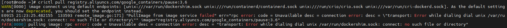

```cmd
cat > /etc/crictl.yaml <<EOF
runtime-endpoint: unix:///run/containerd/containerd.sock
image-endpoint: unix:///run/containerd/containerd.sock
timeout: 10
debug: false
EOF
```

## K8s集群管理

```cmd
kubectl cluster-info #查看集群信息
kubectl get nodes #查看所有节点信息
kubectl get nodes -o wide #查看节点详情
kubectl describe node master #描述指定节点详情
# 输出节点信息，包含标签
kubectl get node --show-labels

# 查看系统名称空间运行的pod(可以看到了所有集群组件的运行情况)
kubectl get pods -n kube-system
kubectl get pods -A 

kubectl get pod --all-namespaces -o wide #查看详细信息

# 查看所有命名空间
kubectl get namespaces
kubectl get ns

kubectl create ns name # 创建命名空间

# 给节点增加标签
kubectl label node node1 key=test
# 删除指定标签
kubectl label node node1 testkey-
# 存在标签就覆盖修改值，否则创建标签
kubectl label node node1 key=value --overwrite
# 标签信息仅输出指定key的值
kubectl get nodes -L key
# 使用-l表示使用标签选择器，可以使用 =,!=以及in {value,value2}三种关系来筛选标签 
kubectl get nodes -l key=test
kubectl get nodes -l "key in {test,value}"

# 添加注解
kubectl annotate pod mypod description="用于测试的pod"
```

**kubectl -o(output)作用**

| 选项                    | 说明                                                    | 示例                                                         |
| ----------------------- | ------------------------------------------------------- | ------------------------------------------------------------ |
| `-o yaml`               | 以 **YAML** 格式输出，完整展示资源定义（最常用）        | `kubectl get pod mypod -o yaml`                              |
| `-o json`               | 以 **JSON** 格式输出，适合和 `jq` 等工具配合            | `kubectl get pod mypod -o json`                              |
| `-o wide`               | 在默认表格的基础上，输出更多字段（比如 Pod 的 Node IP） | `kubectl get pod -o wide`                                    |
| `-o name`               | 只输出资源的名字，适合脚本处理                          | `kubectl get pod -o name`                                    |
| `-o jsonpath=...`       | 按照 JSONPath 表达式提取字段                            | `kubectl get pod mypod -o jsonpath='{.status.podIP}'`        |
| `-o custom-columns=...` | 自定义表格列                                            | `kubectl get pod -o custom-columns=NAME:.metadata.name,IP:.status.podIP` |


## Containerd

```cmd
crictl ps

crictl images

crictl pull mysql

crictl rmi docker.1ms.run/nginx docker.io/library/mysql

crictl exec -it 6e66ec1ba9a mysql -u root -p200210

# 查看容器详细信息
crictl inspect <container-id>

# 启动容器
crictl start <container-id>

# 停止容器
crictl stop <container-id>

# 删除容器
crictl rm <container-id>

# 访问容器
crictl exec -it 6e66ec1ba9a mysql -u root -p200210
```

配置镜像：

```cmd
vim /etc/containerd/config.toml
 [plugins."io.containerd.grpc.v1.cri".registry]
      [plugins."io.containerd.grpc.v1.cri".registry.mirrors]
        [plugins."io.containerd.grpc.v1.cri".registry.mirrors."docker.io"]
          endpoint = ["https://docker.1ms.run"]
        [plugins."io.containerd.grpc.v1.cri".registry.mirrors."docker.io/library"]
          endpoint = ["https://docker.1ms.run/library"]
        [plugins."io.containerd.grpc.v1.cri".registry.mirrors."registry.k8s.io"]
          endpoint=["https://registry.aliyuncs.com/google_containers","https://k8s.m.daocloud.io","https://docker.mirrors.ustc.edu.cn","https://hub-mirror.c.163.com"]

```

命名空间：

`docker` → `moby` namespace

`k8s` → `k8s.io` namespace

`ctr` 默认 → `default` namespace

## Pod

**pod配置示例：**

```yaml
apiVersion: v1
kind: Pod
metadata:
  name: mysql
  labels:
    app: mysql
spec:
  containers:
  - name: mysql
    image: mysql
    env:
    - name: MYSQL_ROOT_PASSWORD
      value: "200210"
    ports:
    - containerPort: 3306
    livenessProbe:
      exec:
      command: ["/bin/cat","/tmp/1.txt"]# 执行一个查看文件的命令
```

**pod管理：**

imagePullPolicy,用于设置镜像拉取策略,kubernetes支持配置三种拉取策略:

Always:总是从远程仓库拉取镜像

IfNotPresent:本地有则使用本地镜像,本地没有则从远程仓库拉取镜像

Never:只使用本地镜像,本地没有就报错

如果镜像tag为具体版本号, 默认策略是:IfNotPresent

如果镜像tag为:latest(最终版本) ,默认策略是always

```cmd
# 根据pod文件创建pod
kubectl apply -f pod1.yaml
#删除默认名称空间中的指定的pod
kubectl delete pod pod名称
# 添加标签
kubectl label pod pod1 region=huanai zone=A env=test bussiness=game
# 删除标签
kubectl label pod pod1 regionzone- env- bussiness-
# 查找具有指定标签的pod
kubectl get pods -l zone=A
# 查看pod的标签
kubectl get pods --show-labels
# 获取所有pod信息
kubectl get pods
# 查看指定pod的详细内容
kubectl describe pod pod名称 
# 查看指定资源的日志
kubectl logs 资源名称

# 命令式创建pod
kubectl run nginx02 --image=nginx --image-pull-policy=IfNotPresent --labels="app=nginx" --env="evn=test" --port=80 --
namespace=test

# 在pod某个容器中直接执行命令，-c选项指定容器，如果pod中只有一个容器则不需要该选项，有多个容器不使用-c默认使用第一个容器
kubectl exec pod1 -c nginx -- touch /111
# 交互式进入容器
kubectl exec -it pod1 -c nginx -- /bin/bash # 这里的 -- 推荐加上，用来分隔kubectl的参数和要在容器内执行的命令，没写可能造成歧义


```

**pod的生命周期**

pod的状态：

| Pod Phase   | 容器状态             | 说明                                              |
| ----------- | -------------------- | ------------------------------------------------- |
| Pending     | Waiting              | 容器未运行，可能在拉镜像或等待调度                |
| Running     | Running / Waiting    | Pod 至少有一个容器在运行                          |
| Succeeded   | Terminated           | 所有容器成功退出                                  |
| Failed      | Terminated           | 所有容器退出，至少一个失败                        |
| Terminating | Terminated / Running | Pod 正在被删除，容器可能仍在运行或关闭中          |
| Unknown     |                      | Node 状态无法确定，通常是 Node 与 API Server 断开 |

**健康检查**

探针类型：

1️⃣ **Liveness Probe**（存活探针）

- **作用**：判断容器是否“活着”。
- 如果探测失败，Kubelet 会 **杀死容器并重启**（遵循重启策略）。
- **适用场景**：
  - 应用卡死/死循环
  - 内存泄漏导致服务无法响应
- 重启策略：
  - Always:表示容器挂了总是重启,这是默认策略。这里存在一个重启回退机制（Backoff Delay），第一次探测失败会立即重启，第二次失败会延迟10s，第三次失败会延迟20s，以此类推，直到延迟时间达到300s，不再增加，如果容器运行 **超过 10 分钟**，则认为稳定，计数清零，下次挂掉又会从 **立即重启** 开始。
  - OnFailures:表容器状态为错误时才重启,也就是容器正常终止时不重启
  - Never:表示容器挂了不予重启

------

2️⃣ **Readiness Probe**（就绪探针）

- **作用**：判断容器是否“能接收流量”。
- 如果探测失败，Kubelet 会把 Pod **从 Service Endpoints 列表中移除**，但不会杀死容器。
- **适用场景**：
  - 应用还在加载配置或初始化
  - 服务依赖的下游未就绪
  - 临时性过载

------

3️⃣ **Startup Probe**（启动探针）

- **作用**：判断容器是否成功“启动”。
- 在探测成功前，其他探针（Liveness/Readiness）都不会生效。
- **适用场景**：
  - 启动特别慢的应用（如 JVM、数据库）
  - 避免在启动过程中被误判为存活失败

K8s 支持三种 **探测方法**：

| 类型                | 方式                                              | 示例               | 适用场景                   |
| ------------------- | ------------------------------------------------- | ------------------ | -------------------------- |
| **HTTP**            | 向容器内某个 HTTP 接口发请求，返回 2xx/3xx 为成功 | `/healthz`         | Web 应用                   |
| **TCP**             | 尝试 TCP 连接端口                                 | `3306`             | 数据库、无 HTTP 服务的应用 |
| **Command（exec）** | 在容器内执行命令，退出码为 0 则成功               | `cat /tmp/healthy` | 自定义逻辑                 |

```yaml
apiVersion: v1
kind: Pod
metadata:
  name: nginx
spec:
  containers:
  - name: nginx
    image: nginx:1.18
    ports:
    - name: nginx-port
      containerPort: 80
    livenessProbe: # readinessProbe: startupProbe:
      exec:
        command: 
        - "/bin/cat"
        - "/tmp/1.txt"  # 执行一个查看文件的命令
    
    livenessProbe:
      tcpSocket:
        port: 8080 # 尝试访问8080端口
        
    livenessProbe:
      httpGet: # 其实就是访问http://127.0.0.1:80/hello
        scheme: HTTP #支持的协议,http或者https
        port: 80 #端口号
        path: /hello #URI地址
```

`initialDelaySeconds`: 容器启动后多久开始探测 0s

`periodSeconds`: 探测周期 10s

`timeoutSeconds`: 探测超时时间 1s

`successThreshold`: 连续多少次成功才算健康 1

`failureThreshold`: 连续多少次失败才算不健康 3

**特殊的容器**

pause container：

**定义**：pause 容器是每个 Pod 中第一个被创建的、非常轻量的容器。

**作用**：它不做业务逻辑，只承担 **Pod 层面的基础职责**。挂载 Pod 需要共享的卷（Volume），业务容器加入时，通过同一个 mount namespace 使用这些卷，pause 容器是 **网络 namespace 的持有者**，当业务容器启动时，它们加入这个网络 namespace，就能共享同一个 IP 和端口。无论业务容器启动或退出，Pod 的 IP 不变。

**镜像**：通常是 `k8s.gcr.io/pause:3.6` 或类似版本。


init container：

**定义**：Init Container 是在 Pod 中 **业务容器（App Container）启动前运行的特殊容器**。

**特点**：

- 顺序执行：每个 Init Container 按顺序执行，前一个成功后才启动下一个。
- 必须成功完成：所有 Init Container 执行完成，主容器才会启动。
- 单次运行：Init Container 只运行一次，用于初始化任务。

作用：

1. **初始化数据或环境**
   - 下载依赖文件、配置模板、证书、脚本等。
   - 举例：`curl` 下载配置文件到共享卷，供主容器使用。
2. **依赖检查**
   - 等待数据库、消息队列、外部服务可用。
   - 示例：用 `initContainer` ping 数据库，确保主容器启动时依赖可用。

3. **顺序控制**
   - 可以确保多个初始化步骤按顺序执行，主容器无需处理初始化逻辑。

```yaml
apiVersion: v1
kind: Pod
metadata:
  name: myapp-pod
  labels:
    app: myapp
spec:
  initContainers:
    # 初始化容器
    - name: init-myservice
      image: busybox
      command:
        - sh
        - -c
        - until nslookup myservice; do echo waiting for myservice; sleep 2; done;
    - name: init-mydb
      image: busybox
      command:
        - sh
        - -c
        - until nslookup mydb; do echo waiting for mydb; sleep 2; done;
  containers:
    - name: myapp-container
      image: nginx
```

## 控制器

### **DaemonSet**

DaemonSet 控制器的工作逻辑大概是这样：

1. **遍历所有 Node**。
2. **判断能不能调度**：
   - Node 有没有被打上污点？
   - Pod 有没有容忍（tolerations）？
   - NodeSelector / NodeAffinity 是否匹配？
   - 资源是否足够？
3. **在符合条件的 Node 上创建 Pod**。
   - 每个 Node 至少有 1 个这样的 Pod。
4. **持续监听**：
   - 新增 Node → DaemonSet 会在新节点上自动补一个 Pod。
   - 删除 Node → DaemonSet 管理的 Pod 也会消失。
   - Pod 异常 → DaemonSet 会重建它。

```yaml
apiVersion: apps/v1
kind: DaemonSet
metadata:
  name: nginx-daemonset
spec:
  # 匹配的 Pod才会被DaemonSet管理，否则使用模板创建了也不会被管理；强制要求selector必须要匹配template中的标签，避免出现控制器创建的容器自己不管理的情况，不匹配在启动时会直接报错
  selector:
    matchLabels:
      name: nginx-test
  # DaemonSet 会在 每个合格的 Node 上运行一个 Pod，template 就是 Pod 的“生产模版”。
  template:
    metadata:
      # 这里的标签要和上面的selector相匹配
      labels:
        name: nginx-test
    spec:
      tolerations:
        # tolerations 代表 Pod 可以容忍某些污点
        - key: node-role.kubernetes.io/control-plane
          effect: NoSchedule
          # 允许调度到带有此污点的节点（通常是 master 节点）
      containers:
        - name: nginx
          image: nginx:1.15
          imagePullPolicy: IfNotPresent
```

### **Job**

```yaml
apiVersion: batch/v1
kind: Job
metadata:
  name: busybox-job
spec:
  completions: 10            # 需要完成的任务总数
  parallelism: 1             # 同时运行的 Pod 数量
  template:
    metadata:
      name: busybox-job-pod
    spec:
      containers:
      - name: busybox
        image: busybox
        imagePullPolicy: IfNotPresent
        command: ["nginx"]
      restartPolicy: Never   # 不能设置为 Always
  backoffLimit: 3 # failed次数达到4次，重试次数达到3次，这个Job就被标记为failed状态，不再执行
```

重启策略的说明:
如果设置为OnFailure,则Job会在Pod出现故障的时候重启容器,而不是创建Pod,failed次数不变
如果设置为Never,则Job会在Pod出现故障的时候创建新的Pod,并且故障Pod不会消失,也不会重启,failed次数+1
如果指定为Always的话,意味着Pod即使成功也会一直重启,意味着Pod任务会重复执行,这和Job的定义冲突,所以不能设置为Always。

### CronJob

```yaml
apiVersion: batch/v1
kind: CronJob
metadata:
  name: cronjob1
spec:
  schedule: "* * * * *"   # 分、时、日、月、周，这里是每分钟执行一次
  jobTemplate:            # 定义 CronJob 每次运行要创建的 Job 模板
    spec:
      template:           # Job 内 Pod 的定义
        spec:
          containers:
          - name: hello
            image: busybox
            args:
            - /bin/sh
            - -c
            - date; echo hello kubernetes
            imagePullPolicy: IfNotPresent
          restartPolicy: OnFailure
```

### StatefulSet

**StatefulSet 的核心特点：**

1. **稳定的 Pod 标识（Identity）**

   - 每个 Pod 都有唯一且固定的 **序号索引（ordinal index）**，如 `myapp-0`、`myapp-1`。
   - Pod 的名字不会因为重建而改变，保证了服务标识稳定。

2. **稳定的网络标识**

   - 每个 Pod 会分配一个 **稳定的 DNS 名称**，通常格式为：

     ```
     <pod-name>.<service-name>.<namespace>.svc.cluster.local
     ```

   - 即使 Pod 重建，其 DNS 名称也不变，方便客户端访问。

3. **稳定的存储卷**

   - 可以给每个 Pod 分配 **独立的 PersistentVolume**（通过 VolumeClaimTemplate）。
   - Pod 重建后仍会挂载原来的存储卷，保证数据不丢失。

4. **有序部署和缩放**

   - Pod 的创建、删除和滚动更新是 **有序的**：
     - 创建：从 `0` 到 `N-1` 顺序创建
     - 删除：从 `N-1` 到 `0` 顺序删除
   - 支持按顺序进行滚动更新，保证服务可用性。

5. **有序滚动升级**

   - StatefulSet 在升级时会按照 Pod 序号顺序更新，每次只更新一个 Pod。
   - 保证依赖顺序的应用（如数据库集群）升级安全。

6. **适合有状态服务**

   - 典型应用：数据库（MySQL、PostgreSQL）、Kafka、Zookeeper、Redis 集群等。
   - 需要固定标识和持久化存储的服务。

```yaml
apiVersion: v1
kind: Service
metadata:
  name: nginx
  labels:
    app: nginx
spec:
  ports:
    - port: 80
      name: web
  clusterIP: None   # Headless Service，不分配 Cluster IP
  selector:
    app: nginx

---

apiVersion: apps/v1
kind: StatefulSet
metadata:
  name: web
spec:
  serviceName: "nginx"  # 关联 Headless Service，提供稳定 DNS
  replicas: 2
  selector:
    matchLabels:
      app: nginx
  template:
    metadata:
      labels:
        app: nginx
    spec:
      containers:
        - name: nginx
          image: nginx:1.18
          ports:
            - containerPort: 80
              name: web

```

### ReplicationController(RC)

```yaml
apiVersion: v1
kind: ReplicationController
metadata:
  name: nginxrc
  labels:
    name: nginxrc
spec:
  replicas: 2
  selector:
    name: nginx18
  template:
    metadata:
      labels:
        name: nginx18
    spec:
      containers:
      - name: nginx18
        image: nginx:1.18
        ports:
        - containerPort: 80
```

临时调整Pod数量：`kubectl scale --replicas=3 rc/nginxrc`

通过配置文件删除rc：`kubectl delete -f rc.yaml`

### ReplicaSet(RS)

算是RC的升级版，但是和RS本质上也没什么区别，最大的区别在于`RC`的`selector`仅支持等值匹配，而RS支持表达式匹配（用表达式构建更丰富的匹配规则），此外，它们使用的API版本也不一样，RC使用v1，RS使用apps/v1。实际上，官方也不推荐直接使用RS，而是使用Deployment来创建并管理RS。

```yaml
apiVersion: apps/v1
kind: ReplicaSet
metadata:
  name: nginxrs
  labels:
    app: nginx
spec:
  replicas: 5   # 设置 Pod 副本数为 5
  selector:
    # 这种写法和RC的效果一致，但是更符合后面的规范
    matchLabels:
      app: nginx   # 匹配标签为 app=nginx 的 Pod
  # 下面这种是表达式匹配的写法
#  selector:
#    matchExpressions:
#    - key: app
#      operator: In
#      values:
#      - nginx
#      - nginx18      

  template:
    metadata:
      labels:
        app: nginx  # Pod 必须带这个标签才能被 RS 管理
    spec:
      containers:
      - name: nginx
        image: nginx:1.18
        ports:
        - containerPort: 80
```

### Deployment

```yaml
apiVersion: apps/v1
kind: Deployment
metadata:
  name: nginx-deployment   # Deployment 名称
  labels:
    app: nginx             # 给 Deployment 打标签
spec:
  replicas: 3              # 副本数，表示需要运行 3 个 Pod
  selector:
    matchLabels:
      app: nginx           # 选择标签为 app=nginx 的 Pod 进行管理
  template:                # Pod 模板（Deployment 会用它创建 Pod）
    metadata:
      labels:
        app: nginx         # Pod 的标签，必须和 selector 匹配
    spec:
      containers:
      - name: nginx
        image: nginx:1.17  # 容器镜像版本
        ports:
        - containerPort: 80 # 暴露容器 80 端口
```

**手动伸缩的方式：**

1. 直接修改配置文件，并使用`kubectl apply`重新应用，适用于正式环境、团队协作。

   > `kubectl apply`具备幂等性，通过`apiVersion` + `kind` + `metadata.name` + `metadata.namespace`这4个配置可以判断是新建资源还是更新资源，如果是更新资源，会找出存在的差异，对差异部分进行更新，不会全量替换；`kubectl replace`是对匹配的资源进行全量替换，相当于移除原来的资源再重建，存在风险；`kubectl create`只会新建资源，资源已存在会报错；

2. 使用`kubectl edit deploy nginx-deployment`交互式编辑资源配置，适用于临时调整或调试。

3. `kubectl scale --replicas=2 deployment/nginx-deployment`，适用于快速调整Pod副本数，最轻量。

**触发上线的方式**：`kubectl set image deployment/nginx-deployment nginx=nginx:1.18`

**发布方式**：

| 发布方式                             | Kubernetes 配置                                         | Pod 替换方式                                        | 服务可用性                               | 风险控制               | 使用场景                       | 备注                                                         |
| ------------------------------------ | ------------------------------------------------------- | --------------------------------------------------- | ---------------------------------------- | ---------------------- | ------------------------------ | ------------------------------------------------------------ |
| **滚动更新 (RollingUpdate)**         | `strategy.type: RollingUpdate`（默认）                  | 逐步替换旧 Pod → 创建新 Pod，循环直至完成           | 高，可配置 `maxUnavailable` 保证最低可用 | 中低，逐步替换，可监控 | 大多数应用、需要平滑升级       | 支持灰度发布/金丝雀发布                                      |
| **重建更新 (Recreate)**              | `strategy.type: Recreate`                               | 先删除所有旧 Pod → 再创建新 Pod                     | 暂时不可用                               | 高，服务停机           | 批处理任务、状态依赖强的应用   | 简单直接，但服务会中断                                       |
| **金丝雀发布 (Canary Release)**      | 手动创建新 Deployment 或修改副本比例 + Service 控制流量 | 少量新版本 Pod 上线 → 逐步增加副本 → 替换旧版本 Pod | 高，可部分用户先体验新版本               | 低，风险逐步扩展       | 高可用生产系统，需要验证新版本 | 不是 Kubernetes 内置策略，需要手动或借助流量控制工具（如 Istio、Argo Rollouts） |
| **蓝绿发布 (Blue-Green Deployment)** | 两个 Deployment + Service 切换 selector                 | 部署新环境 Pod（Green） → 测试 → Service 切换流量   | 几乎瞬时                                 | 低，回滚快速           | 大流量、零中断上线             | 需要双倍资源，Service 切换即可完成发布                       |
| **灰度发布 (Gray Release)**          | 基于标签 + Service 选择流量                             | 按用户/流量比例选择新版本 Pod                       | 高，可针对部分用户                       | 低，可监控和回滚       | 功能分阶段上线、AB 测试        | 金丝雀发布是灰度发布的一种实现方式                           |
| **A/B 测试**                         | Service + Ingress/流量控制                              | 按流量权重将用户分配到不同版本 Pod                  | 高，可选择性体验不同版本                 | 低，影响范围可控       | 新功能验证、用户体验优化       | 与灰度发布类似，但针对特定用户分组                           |

**发布相关参数**：

```yaml
spec:
  strategy:
    type: RollingUpdate       # 滚动更新策略（默认）
    rollingUpdate:
      maxUnavailable: 25%    # 最大不可用 Pod 数量，也可以是具体的数值
      maxSurge: 25%          # 最大新增 Pod 数量

```

**回滚**

```cmd
# 1、查看修订版本记录
kubectl rollout history deployment deployment_name
# 2、查看某个历史记录的详细信息
kubectl rollout history deployment deployment_name --revision=2
# 3、回滚到上一个版本
kubectl rollout undo deployment deployment_name
# 4、回滚到指定版本
kubectl rollout undo deployment deployment_name --to-revision=2
# 5、查看更新状态
kubectl rollout status deployment/nginx-deployment
```

**更新版本留下记录的方法**：

1.  使用`--record=true`，`--record` 选项的作用是 **记录执行命令到 Deployment / DaemonSet / StatefulSet 的 `kubernetes.io/change-cause` 注解**，便于后续通过 `kubectl rollout history` 查看
   - `kubectl set image deployment/nginx nginx=nginx:1.18 --record`
   - `kubectl apply -f nginx.yaml --record`
   - `kubectl patch deployment nginx -p '{"spec":{"replicas":3}}' --record`

2. 使用yaml配置文件，更新时用注解记录

   ```yaml
   metadata:
     annotations:
       kubernetes.io/change-cause: v2 to v1 ,nginx:1.18(自定义更新说明信息)
   ```

### HPA

Horizontal Pod Autoscaling

**安装**

```cmd
kubectl apply -f https://github.com/kubernetes-sigs/metrics-server/releases/latest/download/high-availability-1.21+.yaml

kubectl get pod -n kube-system -o wide

kubectl top node

# 如果只有Master和一个Node，这里会启动失败，因为metrics-server 的 Deployment 配置了反亲和性（anti-affinity），要求两个 Pod 不要调度到同一个节点，但集群中只有 2 个节点（master + node），其中 master 被 taint 了，Pod 就只能调度到 node 上 → 第二个 Pod 找不到合适节点。
# 可以让metrics-server容忍污点或者去掉反亲和性，如果不想修改配置（比较复杂），可以直接缩容，这样虽然没有高可用性，但是不影响学习使用
kubectl scale deployment metrics-server -n kube-system --replicas=1

# 默认 metrics-server和kubelet通信会校验证书，而 kubelet 使用的是自签名证书，大多数情况下校验失败 → 导致Readiness probe一直探测失败，所以要配置和kubelet通信不要使用证书验证
      containers:
      - args:
        - --cert-dir=/tmp
        - --secure-port=10250 
        - --kubelet-insecure-tls # 加上这一行
        - --kubelet-preferred-address-types=InternalIP,ExternalIP,Hostname
        - --kubelet-use-node-status-port
        - --metric-resolution=15s

kubectl api-versions | grep autoscal
```

**HPA使用**

```yaml
apiVersion: apps/v1
kind: Deployment
metadata:
  name: apache
spec:
  replicas: 2                     # 副本数，这里只有一个 Pod
  selector:
    matchLabels:
      app: apache                 # Deployment 会管理带有这个 label 的 Pod
  template:
    metadata:
      labels:
        app: apache               # Pod 上的标签
    spec:
      containers:
      - name: apache
        image: httpd               # 使用官方 httpd 镜像
        ports:
        - containerPort: 80        # 容器监听的端口
        resources:
          requests:
            cpu: 50m               # 容器请求的 CPU，50 毫核
          limits:
            cpu: 50m               # 容器允许的最大 CPU，50 毫核

---
apiVersion: v1
kind: Service
metadata:
  name: myapp-svc
  labels:
    app: myapp
  namespace: default
spec:
  selector:
    app: apache                   # 选择有这个 label 的 Pod
  ports:
  - name: http
    port: 80                      # Service 对外暴露端口
    targetPort: 80                # 转发到 Pod 的端口
  type: NodePort                  # 在每个节点上分配一个端口，使集群外可以访问
  
---
apiVersion: autoscaling/v2
kind: HorizontalPodAutoscaler
metadata:
  name: apache-hpa
  namespace: default
spec:
  scaleTargetRef:
    apiVersion: apps/v1
    kind: Deployment
    name: apache              # 关联的 Deployment
  minReplicas: 2               # 最小副本数
  maxReplicas: 5               # 最大副本数
  metrics:
  - type: Resource
    resource:
      name: cpu
      target:
        type: Utilization
        averageUtilization: 50 # CPU 利用率超过 50% 时扩容
  behavior:
    scaleUp:
      stabilizationWindowSeconds: 0
      policies:
      - type: Percent
        value: 100
        periodSeconds: 15           # 每 15 秒最多增加 100% Pod
    scaleDown:
      stabilizationWindowSeconds: 300  # 缩容窗口 5 分钟，防止频繁缩容
      policies:
      - type: Percent
        value: 50
        periodSeconds: 60           # 每 60 秒最多减少 50% Pod

# 使用命令也可以创建HPA
# kubectl autoscale deployment apache --cpu-percent=50 --min=1 --max=5
```


```cmd
# 压力测试工具
yum install -y httpd-tools

# 模拟同时有100个客户端，访问50000次
ab -c 100 -n 50000 http://10.102.122.84:80/index.html

kubectl get pods -l app=httpd
# 持续观察指标变化
kubectl get hpa -w
```


## Service

Service可以将一组提供相同服务的Pod通过标签进行聚合，作为一个整体向外提供服务，Service会根据负载均衡策略将流量转发到Pod集群中，并且还具有服务发现功能，如果新增Pod或Pod不可用，都会进行动态调整。

### 基本使用

```cmd
kubectl get services # 使用svc也可以

# 默认 --type=ClusterIP
kubectl expose deployment apache --port=80 --target-port=80 --protocol=TCP
```

```yaml
apiVersion: v1
kind: Service
metadata:
  name: myapp-svc
  labels:
    app: myapp
  namespace: default
spec:
  selector:
    app: apache                   # 选择有这个 label 的 Pod
  ports:
  - name: http
    port: 80                      # Service 对外暴露端口
    targetPort: 80                # 转发到 Pod 的端口
    nodePort: 32334               # 绑定的 Node 端口, 如果不指定,会随机分配(取值范围:30000-32767)
    protocol: TCP
  type: NodePort                  # 在每个节点上分配一个端口，使集群外可以访问
```

### kube-proxy工作原理

kube-proxy的两种工作模式：

1. **iptables 模式**
   - **工作机制**：
     - kube-proxy 监控 Service 和 Endpoints 对象变化，然后生成一堆 iptables 规则。
     - 当请求到达 Node 时，通过 iptables 规则进行 **DNAT**（目标地址转换），把 Service IP（ClusterIP）转换成某个 Pod 的 IP。
     - Pod 的选择是 **随机 + 轮询**（iptables 的 `statistic` 模块实现）。
   - **特点**：
     - 请求转发逻辑依赖 **规则链**，规则一多就要从上到下顺序匹配。
     - Service/Pod 数量很大时，规则会暴增，效率明显下降。

2.  **ipvs 模式**
   - **工作机制**：
     - ipvs（IP Virtual Server）是基于内核的四层负载均衡器，比 iptables 更专业。
     - kube-proxy 监控 Service 和 Endpoints，然后调用 **ipvs 内核模块** 建立转发表。
     - 转发时直接查内核哈希表，O(1) 复杂度，比 iptables 的 O(n) 链式查找快很多。
   - **特点**：
     - 性能更高，特别是 Service/Pod 数量上万时依然稳定。
     - 支持更多负载均衡算法（轮询、最少连接、最短延迟、基于哈希等）。
     - 连接状态感知更强，可以保持连接一致性。

修改kube-proxy配置：`kubectl edit configmap kube-proxy -n kube-system`

```yaml
apiVersion: v1
data:
  config.conf: |-
    apiVersion: kubeproxy.config.k8s.io/v1alpha1
    bindAddress: 0.0.0.0
    bindAddressHardFail: false
    iptables:
      localhostNodePorts: null
      masqueradeAll: false
      masqueradeBit: null
      minSyncPeriod: 0s
      syncPeriod: 0s
    ipvs:
      excludeCIDRs: null
      minSyncPeriod: 0s
      scheduler: "" # 这里可以配置ipvs模式下的负载均衡算法，默认值为空，使用rr（轮询）
      strictARP: false
      syncPeriod: 0s
      tcpFinTimeout: 0s
      tcpTimeout: 0s
      udpTimeout: 0s
    mode: "" # 默认值为空，表示使用iptables，可以取值 ipvs
```


### ClusterIP

- **作用**：给 Service 分配一个集群内部虚拟 IP（ClusterIP），只在集群内部可访问。

- **场景**：集群内微服务之间的调用。

- **特点**：

  - 默认类型，如果不写 `type` 就是它，不配置 ClusterIP 会自动分配一个。

  - 配合 DNS 服务（CoreDNS），可以用 `svc-name.namespace.svc.cluster.local` 域名访问。

###  Headless Service

- **作用**：不分配 ClusterIP，而是直接返回后端 Pod 的 IP 列表。
- **场景**：需要客户端自己做负载均衡或服务发现的情况，比如 **StatefulSet**（数据库集群、Kafka、ZooKeeper）。
- **特点**：
  - 算是 ClusterIP 的一种特殊情况，配置 `spec.clusterIP: None`。
  - DNS 查询时返回 Pod IP 列表。

### NodePort

- **作用**：在每个 Node 上开一个端口，把流量转发到 Service。
- **场景**：外部用户访问集群里的服务（适合测试或小规模对外）。
- **特点**：
  - `nodePort` 范围默认是 **30000–32767**。
  - 可以通过 `http://NodeIP:NodePort` 访问。
  - 负载均衡由 kube-proxy 完成。

### LoadBalancer

- **作用**：在云环境下（如 AWS、GCP、阿里云），自动申请一个外部负载均衡器，把外部流量转发到 NodePort/ClusterIP。
- **场景**：生产环境常用，直接对外提供服务。
- **特点**：
  - 依赖云厂商的 LB 资源。
  - 外部访问使用云 LB 的公网 IP 或域名。
- **和NodePort模式核心区别：**多加了一层Node层面的负载均衡

| 特性            | NodePort          | LoadBalancer             |
| --------------- | ----------------- | ------------------------ |
| 外部访问        | NodeIP:Port       | LB EXTERNAL-IP:Port      |
| 流量分发        | 自己控制或单 Node | 自动分发到多个 Node      |
| 公网 IP         | 需要手动 NAT      | LB 自动分配              |
| 依赖 kube-proxy | 必须              | 必须（内部 DNAT 到 Pod） |

### ExternalName

- **作用**：把 Service 映射到一个外部域名，而不是转发流量。
- **场景**：访问集群外的服务（比如外部数据库、第三方 API）。
- **特点**：
  - 不分配 ClusterIP，也不做流量代理。
  - 直接通过 DNS CNAME 把 `svc-name` 解析为外部域名。

### Service代理外部服务

想要将一个集群外部的服务集成到内部，当做内部服务进行使用时，可以使用Service进行代理。

**做法：**

1. 创建一个 **没有 selector 的 Service**（不会自动生成 Endpoints）。
2. 自己创建一个 **和 Service 同名并且端口信息和协议都一致的 Endpoints**，里面写上外部服务的 IP:Port。
3. Service 就会把流量转发到这个手工指定的 Endpoints。

要注意，这种方式和 `ExternalName` 的区别是：

- `ExternalName` 是 DNS CNAME 转发，不能写死 IP，只能写域名。
- `Service + Endpoints` 可以直接指定外部的 IP 和端口，适合外部数据库、API 之类的场景。

> 既然是配置IP+端口，为什么不直接通过配置DNS去做？通过访问服务的方式，可以统一访问接口，而且还能利用Service的强大特性，比如负载均衡。

```yaml
apiVersion: v1
kind: Service
metadata:
  name: external-nginx
spec:
  ports:
    - port: 80
      protocol: TCP
      name: nginx
---
apiVersion: v1
kind: Endpoints
metadata:
  name: external-nginx
subsets:
  - addresses:
      - ip: 192.168.6.1
    ports:
      - port: 80
        protocol: TCP
        name: nginx
```


## Ingress

Service用于聚合一个项目中的多个Pod统一对外提供接口，但是k8s集群中很可能不止一个项目，这时候就需要使用Ingress作为整个k8s集群的流量入口，Ingress可以实现七层负载均衡，根据访问的域名、路径等信息来分发流量，这是基于四层负载均衡的Service无法做到的。

Ingress本身只是配置反向代理的规则，不处理流量，实际上处理流量的是Ingress controller，可以使用多种方式来实现，如：nginx、HProxy。

### 使用示例

```yaml
apiVersion: apps/v1
kind: Deployment
metadata:
  name: nginx-deploy
  labels:
    app: nginx-deploy
spec:
  replicas: 1
  selector:
    matchLabels:
      app: nginx-deploy
  template:
    metadata:
      labels:
        app: nginx-deploy
    spec:
      containers:
      - name: nginx
        image: nginx:1.20
        ports:
        - containerPort: 80
---
apiVersion: v1
kind: Service
metadata:
  name: nginx-svc
  labels:
    app: nginx-deploy
spec:
  type: ClusterIP
  selector:
    app: nginx-deploy
  ports:
  - port: 80
    targetPort: 80
    protocol: TCP

---
apiVersion: apps/v1
kind: Deployment
metadata:
  name: http-deploy
  labels:
    app: http-deploy
spec:
  replicas: 1
  selector:
    matchLabels:
      app: http-deploy
  template:
    metadata:
      labels:
        app: http-deploy
    spec:
      containers:
      - name: http
        image: httpd
        ports:
        - containerPort: 80
---
apiVersion: v1
kind: Service
metadata:
  name: http-svc
  labels:
    app: http-deploy
spec:
  type: ClusterIP
  selector:
    app: http-deploy
  ports:
  - port: 80
    targetPort: 80
    protocol: TCP

---
apiVersion: networking.k8s.io/v1
kind: Ingress
metadata:
  name: ingress01
spec:
  ingressClassName: nginx   # 指定用 nginx ingress controller
  rules:
  - host: www.nginx.com
    http:
      paths:
      - path: /
        pathType: Prefix
        backend:
          service:
            name: nginx-svc
            port:
              number: 80
  - host: www.http.com
    http:
      paths:
      - path: /
        pathType: Prefix
        backend:
          service:
            name: http-svc
            port:
              number: 80
```


## ConfigMap


### 创建ConfigMap

```cmd
kubectl create configmap testcm --from-literal=ip=10.1.1.16 --from-literal=hostname=web01

# 从名为 env-vars.env 的环境变量文件中创建名为 my-cf 的 ConfigMap
kubectl create cm my-cf --from-env-file=env-vars.env

# 创建名为 my-config 的 ConfigMap,并将 config-files/ 目录中的所有文件添加到其中
kubectl create configmap my-config --from-file=config-files/
# 也可以指定某个文件，有个默认的key是文件名
kubectl create configmap my-config --from-file=nginx.conf

# 如果要通过配置文件来为某个文件创建ConfigMap，是做不到的，只能将文件内容copy到配置文件中（如下一个代码块所示），或者可以这样做：
kubectl create configmap nginx-cm --from-file=/etc/nginx/nginx.conf --dry-run=client -o yaml > nginx-cm.yaml
# 含义为：用nginx.conf去创建一个ConfigMap，但是只在本地执行，不发送到kube-apiService中执行，而且输出内容为整个配置并重定向到文件中，这样可以避免从大文件中复制内容
kubectl apply -f nginx-cm.yaml

# 从配置文件中创建 ConfigMap
kubectl create -f configMap1.yaml
```

**通过配置文件创建ConfigMap**

```yaml
# 存储键值对，注入到环境变量中
apiVersion: v1
kind: ConfigMap
metadata:
  name: my-cm02
data:
  MY_K8S_MASTER_HOSTNAME: k8s-b-master
  MY_K8S_MASTER_IP: 192.168.11.100

---
# 这里创建了两个可以被Pod挂载的配置文件，这里的 | 表示 多行文本字面量，后面缩进的部分就是文件的内容。
apiVersion: v1
kind: ConfigMap
metadata:
  name: my-cm01
data:
  db.yaml: |
    db:
      dbname: cmdb
      dbhost: 10.1.1.19
  default.yaml: |
    web:
      domain: test.noblameops.local
      ip: 10.1.1.10

```

### 使用ConfigMap

```yaml
apiVersion: v1
kind: ConfigMap
metadata:
  name: special-config
  namespace: default
data:
  special.how: very
  special.type: charm

---
apiVersion: v1
kind: ConfigMap
metadata:
  name: env-config
data:
  MY_K8S_MASTER_HOSTNAME: k8s-b-master
  MY_K8S_MASTER_IP: 192.168.11.100
  
---
apiVersion: v1
kind: Pod
metadata:
  name: test-pod
spec:
  containers:
  - name: test-container
    image: busybox
    command: ["/bin/sh", "-c", "env"]
    env:
      - name: SPECIAL_LEVEL_KEY       # 取ConfigMap中的变量值设置为这个环境变量的值
        valueFrom:
          configMapKeyRef:
            name: special-config      # 从名为 special-config 的 ConfigMap 获取
            key: special.how          # 取 ConfigMap 中 key 为 special.how 的值
      - name: SPECIAL_TYPE_KEY
        valueFrom:
          configMapKeyRef:
            name: special-config
            key: special.type
    envFrom:
      - configMapRef:
          name: env-config            # 将 env-config ConfigMap 中的所有 key 直接作为环境变量注入
  restartPolicy: Never

```

```yaml
# kubectl create configmap nginx-cm --from-file=nginx.conf
apiVersion: v1
kind: Pod
metadata:
  name: nginx-cm-test
spec:
  containers:
  - name: nginx
    image: "nginx:latest"
    imagePullPolicy: IfNotPresent
    ports:
    - containerPort: 80
    volumeMounts:
    - name: nginx-config
      # 这样子写会出现问题，这样会直接将ConfigMap中的目录直接覆盖挂载点，导致其它文件丢失，在这里显然不是为了覆盖整个目录，而是替换配置文件
      mountPath: /etc/nginx 
      
      # 如果只需要替换一个配置文件，可以使用如下写法：
      mountPath: /etc/nginx/nginx.conf # 这里不能写目录，因为subPath是一个文件，挂载点也必须是一个文件，这个文件会被替换掉
      subPath： nginx.conf             # 这里指定ConfigMap中的一个key值，将对应的文件挂载到挂载点
      
  volumes:
  - name: nginx-config
    configMap:
      name: nginx-cm
```


## Secret

Secret与ConfigMap的作用类似，都是用于存放配置，区别在于secret是专门用于存放敏感信息，如：密码、证书、密钥等。

### Secret 的创建方式

Kubernetes 提供几种常用方式创建 Secret，对应不同用途：

| 类型                | 用途说明                                                     |
| ------------------- | ------------------------------------------------------------ |
| **generic**         | 通用类型，适合存储任意敏感数据，例如数据库密码、API key 等。通常通过 `--from-literal` 或 `--from-file` 创建。 |
| **tls**             | 专门用于存储 **证书（cert）和私钥（key）**，比如 HTTPS 的 TLS 证书。通常通过 `--from-file=cert=xxx.crt --from-file=key=xxx.key` 创建。 |
| **docker-registry** | 用于保存 Docker 私有仓库的认证信息（用户名、密码、邮箱、token），方便 Kubernetes 拉取私有镜像。 |

> 🔑 区分：这些是 **创建 Secret 时的方式/参数**，决定了 Secret 的用途和内容结构。

------

### Secret 的类型

每个 Secret 对象都有一个 `type` 字段，用来标识 Secret 的用途，Kubernetes 内部会根据类型做不同处理：

| 类型                               | 用途说明                                                     |
| ---------------------------------- | ------------------------------------------------------------ |
| **ServiceAccountToken**            | 用于 ServiceAccount，Pod 使用 ServiceAccount 时会自动挂载到 `/run/secrets/kubernetes.io/serviceaccount`。 |
| **Opaque**                         | 通用类型，内容是 base64 编码的任意数据（例如密码、秘钥等）。安全性弱，因为 base64 易解码。 |
| **kubernetes.io/dockerconfigjson** | 用于存储 Docker 私有仓库认证信息，对应 `docker-registry` 创建方式生成的 Secret。 |
| **kubernetes.io/tls**              | 用于存储证书和私钥，对应 `tls` 创建方式生成的 Secret。       |

> 🔑 区分：类型是 **Secret 对象本身的标识**，Kubernetes 根据类型决定如何处理它，例如自动挂载或供某些组件使用。

### 创建Secret

```cmd
# 和ConfigMap用法类似，该有的用法都有
kubectl create secret generic mysql-password --from-literal=password=abc123456
kubectl create secret generic env-mysql --from-env-file=./env-mysql.txt
# 这样查看并不能看到Secret的内容
kubectl describe secret mysql-password
# 查看Secret内容
kubectl get secret mysql-password -o yaml
# 解码base64编码后的密钥内容
kubectl get secret mysql-password -o jsonpath='{.data.password}' | base64 --decode
```


```yaml
apiVersion: v1
kind: Secret
metadata:
  name: secret
type: Opaque
# 使用data需要自己先进行base64编码，如果使用stringData可以写明文，应用这个配置后会自动进行编码，查询到的也是编码后的内容
data:
  username: YWRtaW4=
  password: MTIzNDU2

```


### 使用Secret

**通过文件挂载的方式使用**：

```yaml
apiVersion: v1
kind: Pod
metadata:
  name: pod-secret   # Pod 名字
spec:
  containers:
  - name: nginx
    image: nginx:1.18
    volumeMounts:
      # 将名为 config 的 Volume 挂载到容器内的 /secret/config 目录
      - name: config
        mountPath: /secret/config
  volumes:
    - name: config
      secret:
        secretName: secret  # 使用名为 "secret" 的 Secret 对象作为数据源
```

**通过环境变量的方式使用**：

```yaml
apiVersion: v1
kind: Pod
metadata:
  name: mysql-pod
spec:
  containers:
  - name: mysql
    image: mysql
    imagePullPolicy: IfNotPresent
    env:
    - name: MYSQL_ROOT_PASSWORD
      valueFrom:
        secretKeyRef:
          name: env-mysql
          key: MYSQL_ROOT_PASSWORD
```


## 存储

基本存储:EmptyDir、HostPath、NFS
高级存储:PV、PVC
配置存储:ConfigMap、Secret

### EmptyDir

Pod 启动时创建一个空目录，Pod 内所有容器共享。Pod 删除时数据也会被删除。适合临时数据、缓存、日志等。

```yaml
apiVersion: v1
kind: Pod
metadata:
  name: volume-emptydir
spec:
  containers:
    - name: nginx
      image: nginx:1.18
      ports:
        - containerPort: 80
      volumeMounts:
        # 将 logs-volume 挂载到 nginx 容器中，对应目录为 /var/log/nginx
        - name: logs-volume
          mountPath: /var/log/nginx

    - name: busybox
      image: busybox:1.30
      command: ["/bin/sh", "-c", "tail -f /logs/access.log"]
      # 初始命令，动态读取指定文件中内容
      volumeMounts:
        # 将 logs-volume 挂载到 busybox 容器中，对应目录为 /logs
        - name: logs-volume
          mountPath: /logs

  volumes:
    # 声明 volume，name 为 logs-volume，类型为 emptyDir
    - name: logs-volume
      emptyDir: {}
      
      # 上面这种形式表示使用默认空目录，也可以对目录进行一些配置
      emptyDir:
        medium: Memory        # 使用 tmpfs 存储在内存中
        sizeLimit: 1Gi        # 限制容量

```


### HostPath

HostPath就是挂载宿主机文件或目录到 Pod 内。适合调试或访问宿主机资源，但不适合生产环境的持久存储。

```yaml
apiVersion: v1
kind: Pod
metadata:
  name: volume-hostpath       # Pod 名称
spec:
  containers:
  - name: nginx
    image: nginx:1.17.1
    ports:
    - containerPort: 80
    volumeMounts:
    - name: logs-volume
      mountPath: /var/log/nginx   # 挂载宿主机的 /root/logs 到容器内 /var/log/nginx

  - name: busybox
    image: busybox:1.30
    command: ["/bin/sh","-c","tail -f /logs/access.log"]
    volumeMounts:
    - name: logs-volume
      mountPath: /logs            # 同一个卷，挂载到另一个容器的 /logs

  volumes:
  - name: logs-volume
    hostPath:                     # 使用宿主机目录
      path: /root/logs            # 宿主机的目录路径
      type: DirectoryOrCreate     # 如果不存在则创建
```

**`hostPath.type`的取值：**

| **Type**                    | **是否必须存在** | **是否自动创建** | **要求的资源类型** | **典型用途**                    |
| --------------------------- | ---------------- | ---------------- | ------------------ | ------------------------------- |
| `""`                        | 否               | 否               | 任意（不检查）     | 最宽松，直接挂载路径            |
| `DirectoryOrCreate`（默认） | 否               | 是（创建目录）   | 目录               | 日志目录、缓存目录              |
| `Directory`                 | 是               | 否               | 目录               | 系统配置目录 `/etc/localtime`   |
| `FileOrCreate`              | 否               | 是（创建文件）   | 文件               | 应用日志文件、配置文件          |
| `File`                      | 是               | 否               | 文件               | 已有配置文件 `/etc/resolv.conf` |
| `Socket`                    | 是               | 否               | Unix Socket        | `/var/run/docker.sock`          |
| `CharDevice`                | 是               | 否               | 字符设备           | `/dev/random`、`/dev/tty`       |
| `BlockDevice`               | 是               | 否               | 块设备             | `/dev/sdb` 等磁盘设备           |


### NFS

```yaml
apiVersion: v1
kind: Pod
metadata:
  name: volume-nfs
  namespace: dev
spec:
  containers:
    - name: nginx
      image: nginx:1.17.1
      ports:
        - containerPort: 80
      volumeMounts:
        # 将 NFS 挂载到 nginx 的 /var/log/nginx
        - name: logs-volume
          mountPath: /var/log/nginx

    - name: busybox
      image: busybox:1.30
      command: ["/bin/sh", "-c", "tail -f /logs/access.log"]
      volumeMounts:
        # 将同一个 NFS 挂载到 busybox 的 /logs
        - name: logs-volume
          mountPath: /logs

  volumes:
    - name: logs-volume
      nfs:
        server: 192.168.100.100   # NFS 服务器地址
        path: /data/nfs           # NFS 共享目录路径

```


### PV

**创建NFS类型的PV**

```cmd
yum install -y nfs-utils 
 
mkdir -p /data/nfs{1,2,3}

cat >>/etc/exports<<EOF
/data/nfs1 *(rw)
/data/nfs2 *(rw)
/data/nfs3 *(rw)
EOF

setfacl -R -m u:nobody:rwx /data
systemctl restart nfs-server.service
```


```yaml
apiVersion: v1
kind: PersistentVolume
metadata:
  name: pv-nfs-demo            # PV 的名字，全局唯一
  labels:
    type: nfs
spec:
  capacity:
    storage: 5Gi               # 声明的存储容量（不会真正限制 NFS 的大小）
  accessModes:
    - ReadWriteMany            # 多节点可读写（NFS 常用）
  persistentVolumeReclaimPolicy: Retain   # 回收策略：PVC 删除后，数据保留
  storageClassName: nfs-storage           # 存储类别（需与 PVC 匹配），自定义配置
  mountOptions:                # 挂载时额外参数（可选）
    - hard                     # 硬挂载，失败会重试
    - nfsvers=4.1              # 指定 NFS 协议版本
    - rsize=1048576            # 读缓冲区大小
    - wsize=1048576            # 写缓冲区大小
  nfs:
    server: 192.168.6.6    # NFS 服务器地址
    path: /data/nfs1           # 共享目录路径（必须在 NFS 服务器上存在）
    readOnly: false            # 是否只读挂载

```


### PVC

**创建PVC使用PV**

```yaml
apiVersion: v1
kind: PersistentVolumeClaim
metadata:
  name: pvc-nfs-demo
spec:
  accessModes:
    - ReadWriteMany
  resources:
    requests:
      storage: 2Gi                # 请求 2Gi（必须 <= PV 声明的 5Gi）
  storageClassName: nfs-storage   # 必须和 PV 的 storageClassName 匹配
```

**使用PVC**

```yaml
apiVersion: v1
kind: Pod
metadata:
  name: pvc-demo
spec:
  containers:
  - name: busybox
    image: busybox:1.30
    command:  ["/bin/sh","-c","while true;do echo pvc >> /root/out.txt; sleep 10; done;"]
    volumeMounts:
    - name: pvc-vol
      mountPath: /root 

  volumes:
  - name: pvc-vol
    persistentVolumeClaim:
      claimName: pvc-nfs-demo  
```


### StorageClass

StorageClass是创建PV的模板，设置好后使用PVC申请PV时k8s可以根据模板自动创建PV给PVC使用，从而避免总是需要管理员手动创建PV。

**权限配置**

```yaml
---
apiVersion: v1
kind: ServiceAccount
metadata:
  name: nfs-provisioner

---
apiVersion: rbac.authorization.k8s.io/v1
kind: ClusterRoleBinding
metadata:
  name: nfs-provisioner-clusterrolebinding
subjects:
  - kind: ServiceAccount
    name: nfs-provisioner         # ServiceAccount 名称
    namespace: default            # ServiceAccount 所属的 namespace
roleRef:
  kind: ClusterRole
  name: cluster-admin             # 绑定的 ClusterRole 名称
  apiGroup: rbac.authorization.k8s.io
```

**Provisioner配置**

```yaml
---
apiVersion: apps/v1
kind: Deployment
metadata:
  name: nfs-provisioner   # Deployment 名称
  labels:
    app: nfs-provisioner
spec:
  replicas: 1             # 副本数
  strategy:
    type: Recreate        # 更新策略（每次更新先删再建）
  selector:
    matchLabels:
      app: nfs-provisioner
  template:
    metadata:
      labels:
        app: nfs-provisioner
    spec:
      serviceAccount: nfs-provisioner   # 指定运行的 ServiceAccount
      containers:
      - name: nfs-provisioner
        image: registry.cn-beijing.aliyuncs.com/mydlq/nfs-subdir-external-provisioner:v4.0.0
        imagePullPolicy: IfNotPresent
        env:
        - name: PROVISIONER_NAME
          value: example.com/nfs         # NFS Provisioner 的名字（StorageClass 会引用）
        - name: NFS_SERVER
          value: 192.168.6.6            # NFS 服务端地址
        - name: NFS_PATH
          value: /data/nfs1/          # NFS 服务端共享目录
        volumeMounts:
        - name: nfs-client-root
          mountPath: /persistentvolumes  # 将 NFS 共享目录挂载到容器内部路径
      volumes:
      - name: nfs-client-root
        nfs:
          server: 192.168.6.6           # NFS 服务端地址
          path: /data/nfs1/           # NFS 共享目录路径
```

**SC配置**

```yaml
---
apiVersion: storage.k8s.io/v1
kind: StorageClass
metadata:
  name: nfs-sc
provisioner: example.com/nfs
reclaimPolicy: Delete
volumeBindingMode: Immediate
```

**使用SC**

```yaml
---
apiVersion: v1
kind: PersistentVolumeClaim
metadata:
  name: nfs-pvc
spec:
  accessModes:
    - ReadWriteMany           # 多节点可读写
  resources:
    requests:
      storage: 1Gi            # 请求 1Gi 存储
  storageClassName: nfs-sc    # 使用上面创建的 StorageClass
```

> 当使用 NFS 动态 Provisioner + StorageClass 时，**为了保证PV的目录隔离**， NFS Provisioner 会在 NFS 共享根目录下为每个 PVC 创建一个唯一的子目录，目录名格式为：<namespace>-<pvc-name>-<pv-name>


## Pod调度机制

### 定向调度

**指定调度到某个Node**

```yaml
apiVersion: v1
kind: Pod
metadata:
  name: nginx
spec:
  containers:
  - name: nginx
    image: nginx:1.18
    ports:
    - name: nginx-port
      containerPort: 80
  # 指定将Pod调度到某个Node上
  nodeName: node2
```

**通过选择器筛选Node**

```cmd
# 添加标签
kubectl label nodes node2 env=dev
```

```yaml
apiVersion: v1
kind: Pod
metadata:
  name: nginx
spec:
  containers:
  - name: nginx
    image: nginx:1.18
    ports:
    - name: nginx-port
      containerPort: 80
  # 指定将Pod调度到带有标签的Node上
  nodeSelector:
    env: dev
```

### 污点与容忍

污点的管理：

```cmd
# 查询污点
kubectl describe node
kubectl get node <node-name> -o jsonpath='{.spec.taints}'

# 增加污点
kubectl taint nodes <node> key=value:effect

# 删除指定污点
kubectl taint nodes <node> key=value:effect-
# 删除所有污点
kubectl taint nodes <node> key-
```

污点的三种 effect：

| effect               | 含义                                                         |
| -------------------- | ------------------------------------------------------------ |
| **NoSchedule**       | 不会调度新 Pod 上来（除非 Pod 容忍）。但已经在运行的 Pod 不受影响。 |
| **PreferNoSchedule** | 尽量不要调度（弱约束），但不是绝对禁止，其它Node都不合适的情况下仍然会调度到这里。 |
| **NoExecute**        | 不仅不允许新 Pod 上来，还会驱逐掉现有 Pod（除非 Pod 容忍）。 |

**内置污点**

| 分类           | 污点键 (Key)                                                 | 效果 (Effect)              | 触发条件                             | 说明                                       |
| -------------- | ------------------------------------------------------------ | -------------------------- | ------------------------------------ | ------------------------------------------ |
| **控制面隔离** | `node-role.kubernetes.io/control-plane`  *(旧版本: `node-role.kubernetes.io/master`)* | `NoSchedule`               | kubeadm 初始化 master 节点时自动添加 | 防止普通 Pod 调度到控制面节点              |
| **节点不可用** | `node.kubernetes.io/not-ready`                               | `NoSchedule` / `NoExecute` | 节点状态 `Ready=False`               | 节点 kubelet 未就绪，Pod 不会调度/会被驱逐 |
|                | `node.kubernetes.io/unreachable`                             | `NoSchedule` / `NoExecute` | 节点失联（心跳丢失）                 | APIServer 无法与 kubelet 通信              |
|                | `node.kubernetes.io/network-unavailable`                     | `NoSchedule`               | 节点网络未初始化                     | 常见于 CNI 网络插件未就绪                  |
| **资源压力**   | `node.kubernetes.io/memory-pressure`                         | `NoSchedule`               | 节点内存紧张                         | 新 Pod 无法调度，已有 Pod 可能被驱逐       |
|                | `node.kubernetes.io/disk-pressure`                           | `NoSchedule`               | 节点磁盘可用空间不足                 | 阻止新 Pod 调度                            |
|                | `node.kubernetes.io/pid-pressure`                            | `NoSchedule`               | 节点可用 PID 数不足                  | 避免新 Pod 无法分配进程号                  |
| **人工设置**   | `node.kubernetes.io/unschedulable`                           | `NoSchedule`               | 手动执行 `kubectl cordon`            | 使节点不可调度                             |


**容忍的管理**

```yaml
apiVersion: apps/v1
kind: DaemonSet
metadata:
  name: nginx-daemonset
spec:
  selector:
    matchLabels:
      name: nginx-test
  template:
    metadata:
      labels:
        name: nginx-test
    spec:
      tolerations:
          # 键名，如果为空表示匹配所有键
        - key: node-role.kubernetes.io/control-plane
          value: "test"
          effect: NoSchedule
          # Equal 表示要3个值完全一致才能匹配，Exists（默认值）表示只需要key和effect二者一致，value字段要使用空值。
          operator: "Equal"
          #tolerationSeconds:容忍时间，effect为NoExecute时生效，容忍时间结束后会被驱逐
      containers:
        - name: nginx
          image: nginx:1.15
          imagePullPolicy: IfNotPresent
```


### 亲和性

根据是否具有强制性，亲和性分为两种：

**requiredDuringSchedulingIgnoredDuringExecution**， 强制约束，必须满足条件才能调度。

**preferredDuringSchedulingIgnoredDuringExecution**，软约束，尽量满足，但不强制。


**节点亲和性 (Node Affinity)**

作用：约束 Pod 必须/尽量 调度到哪些节点。

关键字段：`spec.affinity.nodeAffinity`

```yaml
# 必须调度在 node1 或 node2；如果有 zone-a 节点，优先选择。
affinity:
  # 如果在Pod运行期间，Node的条件发生改变，导致不再符合Pod的亲和性条件，系统会忽略此变化，不会影响Pod
  nodeAffinity:
    requiredDuringSchedulingIgnoredDuringExecution:
      nodeSelectorTerms:  # 如果有多个，只需要满足一个就能匹配成功
      - matchExpressions: # 如果有多个，必须全部满足才能匹配成功
        - key: kubernetes.io/hostname
          operator: In
          values:
          - node1
          - node2
     # - matchFields： 另一个取值，比较少用，一般用于直接通过nodeName来指定Node，而不是通过label
    preferredDuringSchedulingIgnoredDuringExecution:
    - weight: 1
      preference:
        matchExpressions:
        - key: topology.kubernetes.io/zone
          operator: In
          values:
          - zone-a          
```


 **Pod 亲和性 (Pod Affinity)**

作用：希望 Pod 必须/尽量 调度在和 **某些 Pod 相同拓扑域** 的节点上。

关键字段：`spec.affinity.podAffinity`

```yaml
# 当前 Pod 只能调度到有 app=frontend Pod 的 相同 zone 上。
affinity:
  podAffinity:
    requiredDuringSchedulingIgnoredDuringExecution:
    #podAffinityTerm:     注意，这里省略了一个层级，硬约束可以省略这个层级，k8s会自动转换为标准写法
    - labelSelector:
        matchExpressions:
        - key: app
          operator: In
          values:
          - frontend
      topologyKey: topology.kubernetes.io/zone
      namespace: default
    preferredDuringSchedulingIgnoredDuringExecution:
    - weight: 80
      podAffinityTerm: # 软约束必须要显式使用这个层级，因为其和weight是一个层级的，省略会导致语法错误
        labelSelector:
          matchExpressions:
          - key: app
            operator: In
            values:
            - frontend
```


**Pod 反亲和性 (Pod Anti-Affinity)**

作用：希望 Pod 避免和某些 Pod 调度到同一拓扑域。

关键字段：`spec.affinity.podAntiAffinity`

```yaml
# 不能和 app=backend 的 Pod 调度到同一个节点，多副本 Pod 需要分散在不同节点，避免单点故障。
affinity:
  podAntiAffinity:
    requiredDuringSchedulingIgnoredDuringExecution:
    - labelSelector:
        matchLabels:
          app: backend
      topologyKey: kubernetes.io/hostname
```

**Operator 常见取值**

在 `matchExpressions` 中常见的 operator 有：

- `In`：key 的值必须在指定 values 列表中。
- `NotIn`：key 的值不能在指定 values 列表中。
- `Exists`：节点/Pod 上必须有这个 label。
- `DoesNotExist`：节点/Pod 上不能有这个 label。

- `Gt/Lt`:大于/小于

**完整示例：将Pod1调度到Pod2所在节点上**

```yaml
apiVersion: v1
kind: Pod
metadata:
  name: pod2
  labels: 
    podName: pod2
spec:
  containers:
  - name: nginx
    image: nginx:1.18
    ports:
    - name: nginx-port
      containerPort: 80

---
apiVersion: v1
kind: Pod
metadata:
  name: pod1
spec:
  containers:
  - name: nginx
    image: nginx:1.18
    ports:
    - name: nginx-port
      containerPort: 80
  affinity:
    podAffinity:
      requiredDuringSchedulingIgnoredDuringExecution:
      - labelSelector:
          matchExpressions:
          - key: podName
            operator: In
            values:
            - pod2
        topologyKey: kubernetes.io/hostname      
```


### 拓扑调度

亲和性主要关注Pod之间的位置关系或是逻辑关系，而拓扑调度主要关注在一个拓扑域中Pod集群的分布情况。

```yaml
# 整体效果为硬条件保证了 frontend 和 redis 的业务亲近性。软条件和拓扑分布保证了 frontend 自身的高可用性和资源利用率。
apiVersion: apps/v1
kind: Deployment
metadata:
  name: frontend
spec:
  replicas: 4
  selector:
    matchLabels:
      app: frontend
  template:
    metadata:
      labels:
        app: frontend
    spec:
      containers:
      - name: frontend
        image: nginx
      affinity:
        podAffinity:
          # 硬性条件：frontend 必须和 redis 在同一个 zone
          requiredDuringSchedulingIgnoredDuringExecution:
          - labelSelector:
              matchExpressions:
              - key: app
                operator: In
                values:
                - redis
            topologyKey: topology.kubernetes.io/zone
        podAntiAffinity:
          # 软性条件：尽量避免 frontend 的多个副本挤在同一节点
          preferredDuringSchedulingIgnoredDuringExecution:
          - weight: 100
            podAffinityTerm:
              labelSelector:
                matchExpressions:
                - key: app
                  operator: In
                  values:
                  - frontend
              topologyKey: kubernetes.io/hostname
      topologySpreadConstraints:
      - maxSkew: 1                          # 每个拓扑域中Pod数量最多相差多少个
        topologyKey: kubernetes.io/hostname # 拓扑域
        whenUnsatisfiable: ScheduleAnyway   # 如果条件无法满足，选择什么调度策略，这里是仍然进行调度；默认 DoNotSchedule ，不进行调度
        labelSelector:
          matchLabels:
            app: frontend
```


## 访问控制机制

ApiServer是访问及管理资源对象的唯一入口。任何一个请求访问ApiServer,都要经过下面三个流程:

1. Authentication(认证):身份鉴别,只有正确的账号才能够通过认证

2. Authorization(授权): 判断用户是否有权限对访问的资源执行特定的动作
3. Admission Control(准入控制):用于补充授权机制以实现更加精细的访问控制功能。

### RBAC

RBAC(Role-Based Access Control) 基于角色的访问控制,主要是在描述一件事情:给哪些对象授予了哪些权限。
其中涉及到了下面几个概念:

- 对象：User、Groups、ServiceAccount
- 角色：代表着一组定义在资源上的可操作动作(权限)的集合
- 绑定：将定义好的角色跟用户绑定在一起

**RBAC 的核心对象**

1. **Role**
   - 定义在 **命名空间内**的权限集合。
   - 例子：允许读取 `Pods`、`ConfigMaps`。
2. **ClusterRole**
   - 定义在 **集群范围**的权限集合。
   - 例子：允许管理所有命名空间的 `Nodes`、`PersistentVolumes`。
3. **RoleBinding**
   - 将 Role 绑定到某个用户/组/ServiceAccount。
   - 权限仅在指定命名空间内有效。
4. **ClusterRoleBinding**
   - 将 ClusterRole 绑定到用户/组/ServiceAccount。
   - 权限在整个集群范围有效。

**配置示例**

```yaml
# 定义 Role，作用在某个 namespace
apiVersion: rbac.authorization.k8s.io/v1
kind: Role
metadata:
  namespace: test       # 作用的命名空间
  name: test-role
rules:
- apiGroups: [""]       # 空字符串表示核心 API 组（如 Pod、Service）
  resources: ["pods"]   # 资源类型，这里是 Pod
  verbs: ["get", "list", "watch"]  # 允许的操作

---
# 绑定 Role 到某个用户
apiVersion: rbac.authorization.k8s.io/v1
kind: RoleBinding
metadata:
  name: test-role-binding
  namespace: test	
subjects:
- kind: User            # 对象类型，可以是 User/Group/ServiceAccount
  name: zhangsan        # 用户名（必须和认证系统中一致）
  apiGroup: rbac.authorization.k8s.io
roleRef:
  kind: Role            # 引用上面定义的 Role
  name: test-role
  apiGroup: rbac.authorization.k8s.io

# 对于RoleCluster和RoleClusterBinding用法也是一样的，只是权限的范围是整个集群，不需要指定namespace
```

**apiGroups配置项可选值**

| 值                          | 说明                                              |
| --------------------------- | ------------------------------------------------- |
| `""`                        | 核心 API 组（Pod、Service、ConfigMap、Node 等）   |
| `apps`                      | Deployment、DaemonSet、StatefulSet、ReplicaSet 等 |
| `batch`                     | Job、CronJob                                      |
| `extensions`                | 旧版 API（已逐步废弃，历史兼容）                  |
| `networking.k8s.io`         | Ingress、NetworkPolicy                            |
| `rbac.authorization.k8s.io` | Role、RoleBinding、ClusterRole 等 RBAC 资源       |
| `"*"`                       | 所有 API 组                                       |

**resource配置项可选值**

| 值            | 说明                                   |
| ------------- | -------------------------------------- |
| `pods`        | Pod                                    |
| `pods/log`    | Pod 的日志                             |
| `deployments` | Deployment                             |
| `services`    | Service                                |
| `configmaps`  | ConfigMap                              |
| `secrets`     | Secret                                 |
| `nodes`       | Node（需要 ClusterRole 才能操作）      |
| `namespaces`  | Namespace（需要 ClusterRole 才能操作） |
| `"*"`         | 所有资源                               |

**verbs配置项可选值**

| 值                 | 说明         |
| ------------------ | ------------ |
| `get`              | 获取单个对象 |
| `list`             | 列出所有对象 |
| `watch`            | 监听对象变化 |
| `create`           | 创建对象     |
| `update`           | 更新对象     |
| `patch`            | 局部更新对象 |
| `delete`           | 删除对象     |
| `deletecollection` | 删除一组对象 |
| `"*"`              | 所有操作     |


**User account**

```yaml
cd /etc/kubernetes/pki/

# 创建私钥
umask 077; openssl genrsa -out zhangsan.key 2048

# 创建证书签名请求 (CSR)
openssl req -new -key zhangsan.key -out zhangsan.csr -subj "/CN=zhangsan/O=test"

# 用 Kubernetes 的 CA 签署证书
openssl x509 -req -in zhangsan.csr \
  -CA ca.crt -CAkey ca.key -CAcreateserial \
  -out zhangsan.crt -days 365

# 把用户证书写入 ~/.kube/config，让 kubectl 可以使用
kubectl config set-cluster kubernetes \
  --embed-certs=true \
  --certificate-authority=/etc/kubernetes/pki/ca.crt \
  --server=https://192.168.6.5:6443

# 定义用户 zhangsan：用 zhangsan.crt + zhangsan.key 来证明身份。
kubectl config set-credentials zhangsan \
  --embed-certs=true \
  --client-certificate=/etc/kubernetes/pki/zhangsan.crt \
  --client-key=/etc/kubernetes/pki/zhangsan.key

# 定义上下文（context）
kubectl config set-context zhangsan@kubernetes \
  --cluster=kubernetes \
  --user=zhangsan

# 切换用户
kubectl config use-context kubernetes-admin@kubernetes
```

**配置Dashboard**

```yaml
wget https://raw.githubusercontent.com/kubernetes/dashboard/v2.5.0/aio/deploy/recommended.yaml

# 修改Service的类型为NodePort，以便可以外部访问
vim recommended.yaml
	---
	
	kind: Service
	apiVersion: v1
	metadata:
	  labels:
	    k8s-app: kubernetes-dashboard
	  name: kubernetes-dashboard
	  namespace: kubernetes-dashboard
	spec:
	  ports:
	    - port: 443
	      targetPort: 8443
	  selector:
	    k8s-app: kubernetes-dashboard
	  type: NodePort

kubectl apply -f recommended.yaml

# 通过使用该账号的Token，等效于在客户端以该账号的身份访问API Server
kubectl -n kubernetes-dashboard create token kubernetes-dashboard
```


```yaml
cd /etc/kubernetes/pki/

# 用集群的秘钥签发证书
# 1. 生成私钥
(umask 077; openssl genrsa -out user01.key 2048)

# 2. 创建 CSR (证书签名请求)，CN=用户名，O=用户组
openssl req -new -key user01.key -out user01.csr -subj "/CN=user01/O=dev"

# 3. 用 Kubernetes CA 签发证书
openssl x509 -req -in user01.csr \
  -CA ca.crt -CAkey ca.key -CAcreateserial \
  -out user01.crt -days 365

# 将账户添加到k8s中
# 1. 添加集群信息
kubectl config set-cluster kubernetes \
  --embed-certs=true \
  --certificate-authority=/etc/kubernetes/pki/ca.crt \
  --server=https://192.168.6.5:6443

# 2. 添加用户 user01，指定证书和私钥
kubectl config set-credentials user01 \
  --embed-certs=true \
  --client-certificate=/etc/kubernetes/pki/user01.crt \
  --client-key=/etc/kubernetes/pki/user01.key

# 3. 创建上下文
kubectl config set-context user01@kubernetes \
  --cluster=kubernetes \
  --user=user01 \
  --namespace=test   # 默认直接指向 test 命名空间

# 创建角色，并授权
cat>role-pod-reader.yaml<<EOF
apiVersion: rbac.authorization.k8s.io/v1
kind: Role
metadata:
  namespace: test
  name: pod-reader
rules:
- apiGroups: [""]
  resources: ["pods"]
  verbs: ["get", "list", "watch"]

---
apiVersion: rbac.authorization.k8s.io/v1
kind: RoleBinding
metadata:
  name: pod-reader-binding
  namespace: test
subjects:
- kind: User
  name: user01       # 必须和证书 CN 对应
  apiGroup: rbac.authorization.k8s.io
roleRef:
  kind: Role
  name: pod-reader
  apiGroup: rbac.authorization.k8s.io
EOF
kubectl apply -f role-pod-reader.yaml

# 切换到 user01
kubectl config use-context user01@kubernetes
```


### NetworkPolicy

```cmd
cat >pod.yaml<<EOF
---
apiVersion: v1
kind: Pod
metadata:
  name: podtest
  labels: 
    test: podtest
  namespace: test
spec:
  containers:
  - name: nginx
    image: nginx:1.18
    ports:
    - name: nginx-port
      containerPort: 80
EOF

# -f 选项后使用 - 表示从标准输入中获取内容
sed 's/podtest/pod1/' pod.yaml | kubectl apply -f -
sed 's/podtest/pod2/' pod.yaml | kubectl apply -f -

kubectl exec -it pod1 -n test -- sh -c "echo web1 >/usr/share/nginx/html/index.html"
kubectl exec -it pod2 -n test -- sh -c "echo web2 >/usr/share/nginx/html/index.html"

kubectl expose --name=pod1svc pod pod1 --port=80 -n test
kubectl expose --name=pod2svc pod pod2 --port=80 -n test

# 运行一个带有curl工具的Pod并进入交互式sh，--rm表示退出后删除容器，用于临时测试
kubectl run podclient --image=yauritux/busybox-curl:latest -n test -it --rm --image-pull-policy=IfNotPresent -- sh
# 使用两个不同命名空间的Pod进行访问测试
kubectl run podclient --image=yauritux/busybox-curl:latest -it --rm --image-pull-policy=IfNotPresent -- sh
```


```yaml
apiVersion: networking.k8s.io/v1
kind: NetworkPolicy
metadata:
  name: my-network-policy
  # 指定网络策略的命名空间，网络策略只对同一个命名空间的Pod生效
  namespace: test 
spec:
  # 1. podSelector：指定策略作用的 Pod，如果这里没有筛选，则会对同一个命名空间的所有Pod生效
  podSelector:
    matchLabels:
      role: db

  # 2. policyTypes：定义策略类型（入站/出站）
  policyTypes:
  - Ingress
  - Egress

  # 3. ingress（入站规则）
  ingress:
  - from:
    # 允许来自某个 IP 段的流量（排除子网 172.17.1.0/24）
    - ipBlock:
        cidr: 172.17.0.0/16
        except:
        - 172.17.1.0/24

    # 允许来自特定 namespace 的流量
    - namespaceSelector:
        matchLabels:
          project: myproject

    # 允许来自同 namespace 内 label=role:frontend 的 Pod
    - podSelector:
        matchLabels:
          role: frontend
          
    # 允许来自特定 namespace 并且 label=role:frontend 的 Pod 的流量访问     
    - namespaceSelector:
        matchLabels:
          project: myproject
    # 注意这里的语法变化，同一个数组定义了两个规则，需要两个规则同时满足才能访问
      podSelector:
        matchLabels:
          role: frontend

    # 上述来源只允许访问 TCP 6379 端口，如果不指定port，表示允许访问所有端口
    ports:
    - protocol: TCP
      port: 6379

  # 4. egress（出站规则），配置出站规则时要注意，要允许访问DNS服务，否则无法通过域名访问其它服务
  egress:
  - to:
    # 允许访问 10.0.0.0/24 网段
    - ipBlock:
        cidr: 10.0.0.0/24

    # 出站端口限制为 TCP 5978
    ports:
    - protocol: TCP
      port: 5978

  # 如果访问的port不一样，需要配置多个to，from也一样   
  - to:
    - podSelector:
        matchLabels:
        test: pod3
    ports:
    - protocol: TCP
      # Kubernetes v1.22版本的新特性，可以开放端口范围
      port: 32000
      endPort: 32768
  
  # 允许访问DNS服务
  - to:
    - namespaceSelector:
        matchLabels:
        # 注意这里的写法，不是直接写命名空间的名字，而是通过命名空间的标签来间接选择的，这个标签就是记录了命名空间的名字（命名空间创建时系统自动添加的）
        kubernetes.io/metadata.name: kube-system
    ports:
      - protocol: UDP
      port: 53
```


```yaml
apiVersion: v1
kind: NameSpace
metadata:
  name: corp-net
---
apiVersion: networking.k8s.io/v1
kind: NetworkPolicy
metadata:
  name: allow-port-from-namespace
  # 指定网络策略的命名空间，网络策略只对同一个命名空间的Pod生效
  namespace: corp-net 
spec:

  # 2. policyTypes：定义策略类型（入站/出站）
  policyTypes:
  - Egress
  
  egress:
  - to:
    - namespaceSelector:
        matchLabels:
          kubernetes.io/metadata.name: corp-net
          
    ports:
    - protocol: TCP
      port: 9200
      
---
apiVersion: v1
kind: Pod
metadata:
  name: nginx-9200
  namespace: corp-net
  labels:
    app: nginx-9200
spec:
  containers:
  - name: nginx
    image: nginx:latest
    ports:
    - containerPort: 9200
    command: ["/bin/sh", "-c"]
    args:
    - |
      sed -i 's/listen       80;/listen 9200;/' /etc/nginx/conf.d/default.conf && \
      nginx -g 'daemon off;'

```


**几种特殊的网络策略**

```yaml
# 默认情况，允许所有流量
apiVersion: networking.k8s.io/v1
kind: NetworkPolicy
metadata:
  name: allow-all-ingress
spec:
  podSelector: {}     # 选中了 namespace 中的所有 Pod
  policyTypes:
  - Ingress
  - Egress
  ingress:
  - {}
  egress:
  - {}
# 可以看出k8s的默认规则，如果规则为空{}，表示选择所有


# 拒绝所有流量，白名单模式起点
podSelector: {}
policyTypes:
- Ingress
- Egress

# 只允许 namespace 内部通信
ingress:
- from:
  - podSelector: {} # 如果是选择了特定的标签那就只能和携带特定标签的Pod通信，空表示选择所有标签，再加上这是对某一个命名空间的Pod进行选择，结果就是只允许同一个命名空间的Pod互相通信
```

## K8s监控

### prometheus 

**部署**

```yaml
git clone https://github.com/prometheus-operator/kube-prometheus.git -b release-0.12
cd kube-prometheus/

# 创建一些自定义资源和命名空间
kubectl apply --server-side -f manifests/setup

# 等待上一条命令执行完成， CRD (CustomResourceDefinition) 生效
until kubectl get servicemonitors -A ; do date; sleep 1; echo ""; done

kubectl apply -f manifests
 
kubectl get pod -n monitoring

# 如果无法访问grafana，可能是以下原因：

# 网络策略只允许携带某标签的Pod访问，需要配置允许IP访问

# Service转发依赖 bridge+ iptables，默认情况下，bridge 模块并不会把通过网桥的数据包交给 iptables 做过滤/转发，需要开启br_netfilter 模块
modprobe -a br_netfilter
# 可能是规则有问题，导致无法访问
iptables -F
cat /etc/sysctl.d/k8s.conf


```


## Helm

### 作用

- Helm 把一组 Kubernetes YAML（Deployment、Service、ConfigMap 等）打包成一个 **Chart**，通过chart可以快速部署和卸载应用；
- 版本控制：一个chart可以有多个版本，可以方便地对应用进行升级、回滚；
- 具备远程仓库，便于分享资源；
- 参数化配置，chart中的配置可以在外部进行修改，而不需要直接修改yaml文件，便于在多环境中进行部署。

### 常用命令

**基础命令**

| 命令           | 作用           | 示例           |
| -------------- | -------------- | -------------- |
| `helm version` | 查看 Helm 版本 | `helm version` |
| `helm help`    | 查看帮助信息   | `helm help`    |

------

**Chart 管理**

| 命令                       | 作用                            | 示例                             |
| -------------------------- | ------------------------------- | -------------------------------- |
| `helm create <chart-name>` | 创建一个新的 Chart              | `helm create mychart`            |
| `helm lint <chart>`        | 检查 Chart 语法是否正确         | `helm lint mychart`              |
| `helm package <chart>`     | 将 Chart 打包为 `.tgz` 文件     | `helm package mychart`           |
| `helm show values <chart>` | 查看 Chart 的默认 `values.yaml` | `helm show values bitnami/mysql` |
| `helm show chart <chart>`  | 查看 Chart 的 `Chart.yaml` 信息 | `helm show chart bitnami/mysql`  |
| `helm show all <chart>`    | 查看所有信息                    | `helm show all bitnami/mysql`    |

------

**仓库管理**

| 命令                         | 作用                   | 示例                                                       |
| ---------------------------- | ---------------------- | ---------------------------------------------------------- |
| `helm repo add <name> <url>` | 添加 Chart 仓库        | `helm repo add bitnami https://charts.bitnami.com/bitnami` |
| `helm repo list`             | 查看已添加的仓库       | `helm repo list`                                           |
| `helm repo update`           | 更新仓库索引           | `helm repo update`                                         |
| `helm search repo <keyword>` | 在仓库中搜索 Chart     | `helm search repo mysql`                                   |
| `helm search hub <keyword>`  | 在 Helm Hub 搜索 Chart | `helm search hub nginx`                                    |

------

**安装、升级、卸载**

| 命令                                            | 作用                       | 示例                                               |
| ----------------------------------------------- | -------------------------- | -------------------------------------------------- |
| `helm install <release> <chart>`                | 安装 Chart                 | `helm install mydb bitnami/mysql`                  |
| `helm install -f values.yaml <release> <chart>` | 使用自定义 values 文件安装 | `helm install -f myvalues.yaml mydb bitnami/mysql` |
| `helm upgrade <release> <chart>`                | 升级应用                   | `helm upgrade mydb bitnami/mysql`                  |
| `helm upgrade -f values.yaml <release> <chart>` | 使用新 values 升级         | `helm upgrade -f myvalues.yaml mydb bitnami/mysql` |
| `helm uninstall <release>`                      | 卸载应用                   | `helm uninstall mydb`                              |
| `helm rollback <release> <revision>`            | 回滚到指定版本             | `helm rollback mydb 1`                             |

------

 **查询和调试**

| 命令                                  | 作用                          | 示例                                   |
| ------------------------------------- | ----------------------------- | -------------------------------------- |
| `helm list`                           | 查看已安装的 release          | `helm list -A`（查看所有命名空间）     |
| `helm status <release>`               | 查看 release 状态             | `helm status mydb`                     |
| `helm get all <release>`              | 获取 release 的所有信息       | `helm get all mydb`                    |
| `helm get values <release>`           | 获取 release 的 values        | `helm get values mydb`                 |
| `helm history <release>`              | 查看 release 的历史版本       | `helm history mydb`                    |
| `helm template <chart>`               | 渲染模板并输出 YAML（不安装） | `helm template mydb bitnami/mysql`     |
| `helm diff upgrade <release> <chart>` | （需插件）查看升级前后的差异  | `helm diff upgrade mydb bitnami/mysql` |

------

**插件管理**

| 命令                           | 作用           | 示例                                                         |
| ------------------------------ | -------------- | ------------------------------------------------------------ |
| `helm plugin list`             | 查看已安装插件 | `helm plugin list`                                           |
| `helm plugin install <url>`    | 安装插件       | `helm plugin install https://github.com/databus23/helm-diff` |
| `helm plugin update <name>`    | 更新插件       | `helm plugin update diff`                                    |
| `helm plugin uninstall <name>` | 卸载插件       | `helm plugin uninstall diff`                                 |


### 部署和使用

```cmd
# 安装Helm
wget https://get.helm.sh/helm-v3.11.3-linux-amd64.tar.gz
tar -xf helm-v3.11.3-linux-amd64.tar.gz
mv linux-amd64/helm /usr/local/bin/helm

# 部署WordPress

# 通过查看Chart的配置，可知部署WP需要一个PV，至少10GB，模式为ReadWriteOnce，可以通过SC自动创建也可以手动创建
helm inspect values bitnami/wordpress --version 19.1.0
cat >wordPress-pv.yaml<<EOF
apiVersion: v1
kind: PersistentVolume
metadata:
  name: pv-nfs-demo            # PV 的名字，全局唯一
  labels:
    type: nfs
spec:
  capacity:
    storage: 10Gi               # 声明的存储容量（不会真正限制 NFS 的大小）
  accessModes:
    - ReadWriteOnce         
  persistentVolumeReclaimPolicy: Retain   # 回收策略：PVC 删除后，数据保留
  nfs:
    server: 192.168.6.6    # NFS 服务器地址
    path: /data/nfs1           # 共享目录路径（必须在 NFS 服务器上存在）
    readOnly: false            # 是否只读挂载
kubectl apply -f wordPress-pv.yaml

helm install wordpress \
--set wordpressUsername=wpuser \
--set wordpressPassword='wp123456' \
--set mariadb.auth.rootPassword=dbpassword \
--version 19.1.0 \
bitnami/wordpress

```


## K8s升级

### 注意事项

1. **版本跨度**：K8s 不支持跨多个次版本升级（只能跨一个次版本，比如 1.24 → 1.25，可以，1.24 → 1.26 不行，要逐级升级）。
2. **CNI 插件**：升级后，CNI 插件可能需要更新。
3. **API 变更**：新版本可能废弃旧 API（比如 `extensions/v1beta1` 的 Deployment 已经废弃）。
4. **etcd 版本**：随 Kubernetes 升级而升级。
5. 升级流程的核心是：**先升级 kubeadm（二进制）→ 在 control-plane 上执行 `kubeadm upgrade plan` / `kubeadm upgrade apply` → 升级 kubelet/kubectl 并重启 kubelet → 逐节点升级 worker**。


### 升级过程

```cmd
# 查看当前版本以及可用版本
yum list --showduplicates kubeadm --disableexcludes=kubernetes
kubeadm version
# 查看集群组件状态
kubectl get cs
# 集群健康和资源检查，主要看kube-system中的Pod是否正常，有问题先解决掉再升级
kubectl get nodes -o wide
kubectl get pods -A -o wide

# 1. 备份etcd
ETCDCTL_API=3 etcdctl \
  --endpoints=https://127.0.0.1:2379 \
  --cacert=/etc/kubernetes/pki/etcd/ca.crt \
  --cert=/etc/kubernetes/pki/etcd/server.crt \
  --key=/etc/kubernetes/pki/etcd/server.key \
  snapshot save /root/etcd-snapshot-$(date +%F).db

# 恢复数据库，参数必须和初始化时的配置一致
etcdutl snapshot restore /root/etcd-snapshot-2025-09-29.db \
  --data-dir=/var/lib/etcd \
  --name=master \
  --initial-cluster=master=https://192.168.6.5:2380 \
  --initial-advertise-peer-urls=https://192.168.6.5:2380
# 老版本恢复命令 
#ETCDCTL_API=3 etcdctl snapshot restore 2023-11-11.db --data-dir=/var/lib/etcd

# 2. 下载新版本kubeadm
yum install -y kubeadm-1.26.4 --disableexcludes=kubernetes

# 3. 对升级版本进行评估，K8s内置了工具可以给出升级建议
kubeadm upgrade plan

# 4. 保证集群的可用性，驱逐master节点的Pod，并且设置为不可调度
kubectl drain master --ignore-daemonsets

# 5. 升级kubeadm
# 先升级kubeadm的版本才能升级集群组件，这里可能会遇到镜像源没有对应版本的情况，得自己去找到合适的镜像源
yum install -y kubeadm-1.26.15
kubeadm upgrade apply v1.26.15
# 如果有某个组件不想升级，可以使用：kubeadm upgrade apply v1.26.15 --etcd-upgrade=false
# 如果是高可用集群，逐个升级master节点，升级过程一致

# 6. 升级kubectl和kubelet
yum install -y kubelet-1.26.15 kubectl-1.26.15
systemctl daemon-reload
systemctl restart kubelet

# 7. 取消master不可调度状态
kubectl uncordon master

# 8. 升级worker节点，和升级master节点基本上一致，不过需要使用 kubeadm upgrade node ，而不是 kubeadm upgrade apply
# 如果升级失败，使用 kubeadm upgrade undo 可以回滚到之前的版本
```


## K8s高可用集群


# Prometheus

```cmd
# 在所有Node中执行，启动命令中加上这两个参数：--authentication-token-webhook=true --authorization-mode=Webhook
vim /etc/systemd/system/multi-user.target.wants/kubelet.service
systemctl daemon-reload
systemctl restart kubelet


git clone https://github.com/prometheus-operator/kube-prometheus.git
cd kube-prometheus

# Prometheus用到了大量的自定义资源，首先要创建这些资源再去部署组件
kubectl apply --server-side -f ./manifests/setup
# 等待资源创建完成
kubectl wait --namespace=monitoring --for condition=Established --all CustomResourceDefinition
# 开始部署组件
kubectl apply -f ./manifests

# 开启端口转发，用于临时外部访问
kubectl wait --namespace=monitoring --for condition=Ready --all pod
nohup kubectl -n monitoring port-forward --address 0.0.0.0 svc/prometheus-k8s 9090 &
nohup kubectl -n monitoring port-forward --address 0.0.0.0 svc/alertmanager-main 9093 &
nohup kubectl -n monitoring port-forward --address 0.0.0.0 svc/grafana 3000 &
```


# 阿里云服务


